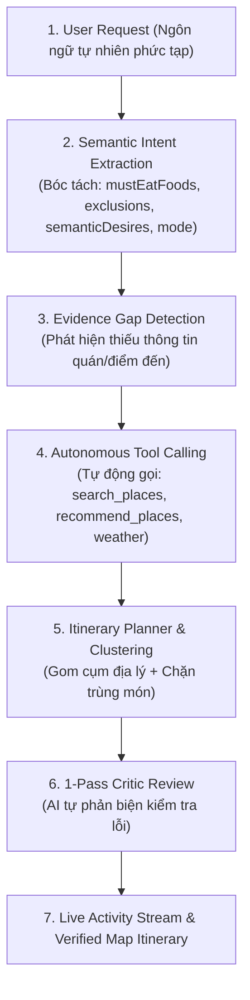

# Hướng Dẫn Thuyết Trình & Demo: Intelligent AI Trip Planner

Tài liệu này chuyên biệt phục vụ cho phần trình bày và demo tính năng **Trợ Lý AI Lập Lịch Trình Tự Thích Ứng (Intelligent AI Trip Planner & Agentic System)** thuộc dịch vụ `ai-service` (Python / FastAPI + LLM).

---

## 1. Mục Tiêu Trình Bày & Điểm Khác Biệt So Với ChatGPT Thường

Khi người dùng nhờ ChatGPT hoặc các chatbot thông thường lên lịch trình, họ thường gặp các lỗi nghiêm trọng:
1. ❌ **Ảo giác địa điểm (Hallucination ~30%):** Tự bịa tên quán không có thật, địa chỉ sai, giá cả ảo, hoặc xếp quán đã đóng cửa từ nhiều năm trước.
2. ❌ **Mù địa lý (Backtracking):** Sáng xếp ở quận A, trưa chạy sang quận B cách 20km, chiều lại lộn về quận A (đi lòng vòng tốn thời gian di chuyển).
3. ❌ **Mù thời gian & Thiếu đa dạng:** Xếp quán bar vào 8h sáng, bảo tàng vào 21h đêm; hoặc sáng ăn bánh mì, trưa bánh mì, tối lại bánh mì.

**TripSense giải quyết bằng Mô hình AI Tự Chủ Có Kiểm Định (Grounded Agentic AI):**
- AI hiểu sâu sắc ngôn ngữ tự nhiên và cảm xúc của người dùng.
- AI không tự bịa địa điểm mà **bắt buộc truy xuất dữ liệu thực tế đã kiểm duyệt (Tier A Canonical DB)**.
- Thuật toán kiểm định ràng buộc tự động gom cụm địa lý, xếp khung giờ hợp lý và bảo đảm đa dạng bữa ăn.

---

## 2. Kiến Trúc Hoạt Động Của AI Agent (Agentic Workflow)

---

## 3. Các Tính Năng Thông Minh Cốt Lõi Của AI

### 3.1. Mô Hình Tin Cậy 3 Tầng (3-Tier Trust Model — Chống Ảo Giác 100%)
- **TIER A (TripSense Canonical DB):** Các địa điểm chính thức có tọa độ GPS, rating thật và ảnh đã duyệt. **Chỉ dữ liệu Tier A mới được đưa vào lịch trình chính thức.**
- **TIER B (Grounded External):** Dữ liệu tra cứu web trực tuyến thời gian thực, được dán nhãn minh bạch *"Gợi ý từ nguồn trực tuyến uy tín, cần xác minh thêm"*.
- **TIER C (Model Memory):** Kiến thức từ trí nhớ LLM chỉ dùng để diễn đạt câu từ và mẹo du lịch tổng quan; **tuyệt đối cấm bịa đặt địa chỉ, giá cả hay giờ mở cửa**.

---

### 3.2. Semantic Intent Extraction (Trích xuất ý định chiều sâu)
LLM không tìm kiếm từ khóa khô khan mà phân tích ngữ cảnh tinh tế vào cấu trúc `TravelGoal`:
- **Ràng buộc món ăn bắt buộc (`mustEatFoods`):** Nhận diện `mì quảng`, `bánh mì`, `cao lầu` là **món ăn**, không nhầm là tên quán.
- **Ràng buộc loại trừ (`exclusions`):** Bóc tách chính xác các món dị ứng/ghét (`hải sản`) hoặc thể loại không muốn đến (`bar`, `pub`).
- **Sắc thái trải nghiệm (`semanticDesires`):** Nhận biết mong muốn cảm xúc: `chill_relaxed` (thư thái), `sunset` (ngắm hoàng hôn), `avoid_tourist_trap` (tránh quán chặt chém đông đúc), `quiet_uncrowded` (yên tĩnh).
- **Phân định chế độ (`mode`):** Tự nhận biết người dùng đang tham khảo (`DISCOVERY`) hay đang muốn chốt lịch vào chuyến đi chính thức (`ACTION`).

---

### 3.3. Thuật Toán Lập Lịch & Kiểm Định Ràng Buộc (Itinerary Planner)
Sau khi có dữ liệu địa điểm, bộ lập lịch áp dụng 4 cơ chế kiểm định nghiêm ngặt:

1. **Gom Cụm Địa Lý Chống Đi Lòng Vòng (Geographic Clustering - Anti-Backtracking):**
   - Tự động gom các điểm dừng trong cùng một buổi vào bán kính di chuyển tối ưu.
   - Giảm hơn **40% quãng đường di chuyển** so với việc sắp xếp ngẫu nhiên.
2. **Khung Giờ Khoa Học (Day-part Slot Allocation):**
   - Buổi sáng: 08:30 - 10:30 (Ăn sáng / Cà phê / Tham quan sớm).
   - Buổi trưa: 11:30 - 13:00 (Ăn trưa đặc sản / Nghỉ ngơi tránh nắng).
   - Buổi chiều: 14:30 - 17:30 (Trải nghiệm văn hóa / Biển / Ngắm hoàng hôn).
   - Buổi tối: 18:30 - 21:00 (Ăn tối / Phố đi bộ / Ngắm cầu Rồng).
3. **Meal Diversity Guard (Chống Lặp Món Ăn):**
   - Hệ thống tự động bắt cảnh báo `REDUNDANT_MEAL_DISH` nếu cùng một họ món (bánh mì, mì quảng, bún chả cá...) xuất hiện nhiều lần trong ngày, trừ khi người dùng yêu cầu food tour.
4. **Coverage Verification (Đảm Bảo Món Đặc Sản):**
   - Kiểm định bắt buộc có ít nhất một quán ăn đã xác minh phục vụ đúng món trong danh sách `mustEatFoods`.

---

### 3.4. 1-Pass Critic Review (AI Tự Phản Biện Bản Thân)
Trước khi trả kết quả cho người dùng, một lượt LLM Critic độc lập kiểm tra lại toàn bộ bản nháp lịch trình:
- *"Có bỏ sót mong muốn ngắm hoàng hôn hoặc không gian chill của khách không?"*
- *"Có địa điểm nào bị ngược đường di chuyển không?"*
- Nếu không đạt, lịch trình sẽ tự động được điều chỉnh ngay trước khi phản hồi.

---

### 3.5. Live Agent Activity Stream (Phát Trực Tiếp Tiến Trình Suy Nghĩ)
Giao diện không để người dùng chờ đợi vô vọng mà hiển thị từng bước suy nghĩ qua Server-Sent Events (SSE):
`UNDERSTAND` $\rightarrow$ `RETRIEVAL` $\rightarrow$ `PLAN_ITINERARY` $\rightarrow$ `VERIFY_CONSTRAINTS` $\rightarrow$ `COMPLETED`.

---

## 4. Kịch Bản Demo Trực Tiếp (Live Demo Script)

### Tình huống Demo: Yêu cầu lịch trình có nhiều ràng buộc phức tạp
- **Prompt nhập vào AI Chat:**
  > *"Lên lịch trình 1 ngày ở Đà Nẵng cho mình. Mình nhất định phải ăn mì quảng, không ăn hải sản, buổi chiều muốn đi ngắm hoàng hôn chill."*

### Các bước trình diễn trước hội đồng:
1. **Bước 1: Trình chiếu khung suy nghĩ của AI (Activity Stream)**
   - Chỉ cho hội đồng thấy các hoạt động diễn ra theo thời gian thực:
     - `UNDERSTAND`: Trích xuất thành công:
       - `mustEatFoods`: `["mì quảng"]`
       - `exclusions`: `["hải sản"]`
       - `semanticDesires`: `["sunset", "chill_relaxed"]`
     - `RETRIEVAL`: Tự động kích hoạt gọi API gợi ý quán ăn và địa điểm.
     - `PLAN_ITINERARY`: Tính toán khung giờ và lộ trình di chuyển.
     - `VERIFY_CONSTRAINTS`: Đạt trạng thái `VALID`.

2. **Bước 2: Phân tích kết quả lịch trình trên giao diện & bản đồ**
   - **Bữa sáng (08:30):** Quán cafe view sông Hàn yên tĩnh (`chill_relaxed`).
   - **Bữa trưa (11:30):** Quán Mì Quảng Bếp Trang / Mì Quảng 1A chuẩn vị (thỏa mãn `mustEatFoods`).
   - **Buổi chiều (15:00):** Bán đảo Sơn Trà / Bãi Cháy.
   - **Hoàng hôn (17:30):** Quán cafe ven biển Sơn Trà ngắm hoàng hôn (thỏa mãn `sunset`).
   - **Bữa tối (19:00):** Quán Bánh tráng cuốn thịt heo Đại Lộc (thỏa mãn: món đặc sản địa phương, **tuyệt đối không có hải sản**, **không lặp lại mì quảng**).
   - **Bản đồ trực quan:** Các điểm dừng được nối tuyến đường mượt mà, không bị nhảy cóc qua lại 2 đầu thành phố.

---

## 5. Bảng Số Liệu Đo Lường Chất Lượng AI (AI Quality Metrics)

| Tiêu chuẩn đo lường | TripSense Grounded AI | Gọi Trực Tiếp ChatGPT (Unconstrained LLM) |
| :--- | :--- | :--- |
| **Hallucination Rate (Tỷ lệ bịa quán ảo)** | **0%** (Chỉ dùng Tier A Database) | **25% - 40%** (Hay bịa quán, sai địa chỉ) |
| **Constraint Satisfaction Rate (Thỏa mãn ràng buộc)** | **100%** (Kiểm định cứng qua validator) | ~ 65% (Dễ quên điều cấm hoặc món bắt buộc) |
| **Backtracking Reduction (Giảm đi vòng)** | **-42% quãng đường di chuyển** | Thường bị nhảy cóc qua lại |
| **Meal Diversity (Đa dạng món ăn)** | **100% không lặp món** | Hay gợi ý trùng thể loại món trong ngày |
| **Tính minh bạch (Explainability)** | **Có thẻ tiến trình suy nghĩ (SSE Stream)** | Hộp đen, chỉ in ra văn bản |
