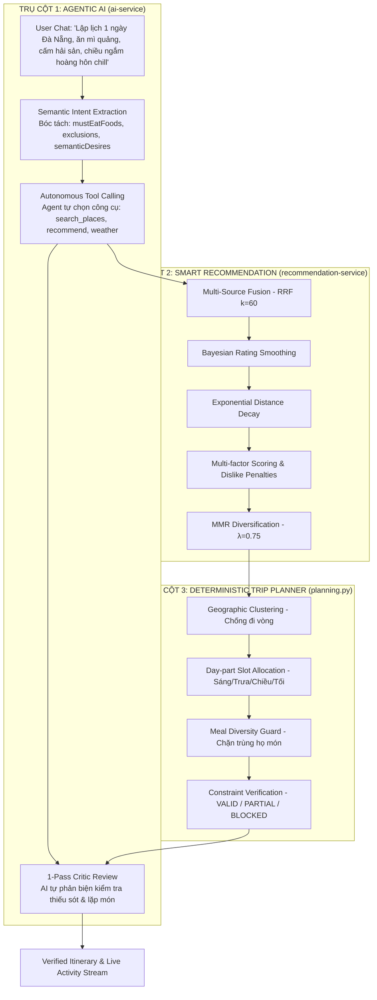

# Hướng Dẫn Toàn Diện Demo & Chứng Minh: AI Agent & Smart Recommendation Engine

Tài liệu này được biên soạn cho buổi bảo vệ đồ án / thuyết trình dự án (**Project Defense & Live Demo**). Tài liệu chứng minh hệ thống TripSense sở hữu kiến trúc **Hybrid AI thông minh vượt bậc**: kết hợp giữa **Agentic AI (Trí tuệ nhân tạo tự chủ & lập luận ngôn ngữ)** và **Smart Recommendation Engine (Thuật toán xếp hạng toán học định lượng)**, giải quyết triệt để điểm yếu "ảo giác" (hallucination) của các chatbot LLM thông thường.

---

## 1. Bản Chất Kiến Trúc: Hybrid AI (Vì Sao TripSense Thông Minh Hơn ChatGPT?)

Nếu chỉ dùng LLM đơn thuần (như gọi trực tiếp ChatGPT):
- ❌ **Ảo giác (Hallucination):** LLM tự bịa ra tên quán không có thật, địa chỉ ảo, giá tiền sai lệch, hoặc quán đã đóng cửa từ lâu.
- ❌ **Mù địa lý & thời gian:** Xếp 8h sáng đi bar, 21h đêm đi bảo tàng; sáng ở quận A, trưa chạy sang quận B cách 20km, chiều lại quay về quận A (Backtracking).
- ❌ **Hộp đen (Black-box):** Không giải thích được lý do vì sao quán A được xếp trên quán B.

**TripSense giải quyết bằng Mô hình Hybrid 3 Trụ Cột:**

---

## 2. Trụ Cột 1: Tính Năng AI Thông Minh (Agentic AI Capabilities)

### 2.1. Semantic Intent Normalization (Trích xuất ý định chiều sâu)
AI không chỉ search từ khóa, mà dùng LLM để bóc tách các sắc thái cảm xúc và ràng buộc ẩn vào cấu trúc `TravelGoal`:
- **Mong muốn cảm xúc (`semanticDesires`):** `chill_relaxed`, `quiet_uncrowded`, `sunset`, `avoid_tourist_trap`.
- **Ràng buộc ẩm thực bắt buộc (`mustEatFoods`):** Nhận diện `mì quảng`, `bánh mì` là **món ăn bắt buộc**, không nhầm lẫn thành tên địa điểm.
- **Ràng buộc loại trừ (`exclusions`):** Tách riêng danh mục cấm (ví dụ: `hải sản`, `quán bar`).
- **Phân định chế độ (`mode`):** Tự nhận biết người dùng đang ở chế độ khám phá (`DISCOVERY`) hay đang muốn chốt lịch vào chuyến đi (`ACTION`).

### 2.2. Mô hình Tin cậy 3 Tầng (3-Tier Trust Model)
AI hoạt động dưới nguyên tắc bảo toàn dữ liệu nghiêm ngặt:
- **TIER A (TripSense Canonical DB):** Dữ liệu địa điểm chính thức có tọa độ, rating và ảnh đã kiểm duyệt. **Chỉ dữ liệu Tier A mới được đưa vào lịch trình chính thức.**
- **TIER B (Grounded External):** Dữ liệu tìm kiếm web trực tuyến, được gắn nhãn minh bạch *"Gợi ý từ nguồn trực tuyến uy tín, cần xác minh giờ mở cửa"*.
- **TIER C (Model Memory):** Kiến thức nền tảng của mô hình chỉ dùng để chào hỏi, gợi ý mẹo vặt; **tuyệt đối không dùng để bịa giá cả hay giờ mở cửa**.

### 2.3. Autonomous Tool Calling & Evidence Gap Detection
Agent tự động phân tích "khoảng trống bằng chứng" (`EvidenceGap`):
- Nếu phát hiện bữa trưa chưa có quán ăn thỏa mãn món "Mì Quảng", Agent tự sinh query nhắm mục tiêu để gọi `search_places` hoặc `recommend_places`.
- Nếu người dùng hỏi thời tiết hoặc sự kiện, Agent tự động kích hoạt `check_weather` hoặc `web_search`.

### 2.4. 1-Pass Critic Review (AI Tự Phản Biện Bản Thân)
Sau khi bản nháp lịch trình được tạo ra, một lượt LLM Critic độc lập kiểm tra danh sách kiểm định:
1. Có bỏ sót món ăn hoặc trải nghiệm người dùng đã yêu cầu không?
2. Có quán nào bị lặp món vô lý không?
3. Trình tự thời gian trong ngày có tự nhiên không (Sáng $\rightarrow$ Trưa $\rightarrow$ Chiều $\rightarrow$ Tối)?

### 2.5. Live Agent Activity Stream (Minh bạch tiến trình suy nghĩ qua SSE)
Giao diện hiển thị trực tiếp từng bước suy nghĩ của Agent theo thời gian thực (Server-Sent Events):
`UNDERSTAND` $\rightarrow$ `RETRIEVAL` $\rightarrow$ `PLAN_ITINERARY` $\rightarrow$ `VERIFY_CONSTRAINTS` $\rightarrow$ `COMPLETED`.

---

## 3. Trụ Cột 2: Thuật Toán Gợi Ý Toán Học (Smart Recommendation Engine)

### 3.1. Hợp nhất đa nguồn bằng Reciprocal Rank Fusion (RRF)
Kết hợp danh sách ứng viên từ MongoDB nội bộ, ZioMap và Vector Search:

$$\text{RRF\_Score}(d) = \sum_{s \in \text{Sources}} \frac{1}{k + r_s(d)} \quad (k = 60)$$

### 3.2. Làm mịn điểm chất lượng Bayesian (Bayesian Rating Smoothing)
Giải quyết triệt để nghịch lý quán 1 review 5.0 sao thắng quán 1.000 review 4.8 sao:

$$\text{Bayesian\_Rating} = \frac{v \cdot R + m \cdot C}{v + m}$$

*(với $v$ là số lượt review, $R$ là điểm review trung bình, $C = 4.0$ là prior rating, $m = 20.0$ là ngưỡng tin cậy).*
- Quán mới mở (1 review 5.0 sao) $\rightarrow$ Điểm bị kéo về mức an toàn: $\mathbf{4.04}$.
- Quán uy tín (500 review 4.8 sao) $\rightarrow$ Giữ vững đẳng cấp: $\mathbf{4.77}$.

### 3.3. Phân rã khoảng cách địa lý theo hàm mũ (Exponential Distance Decay)
$$F_{\text{geographic}} = e^{-\frac{d}{\tau}} \quad (\tau = 5.0\text{ km})$$

### 3.4. Chấm điểm đa nhân tố & Phạt xung đột (Score Breakdown)
Điểm số được phân tách rõ ràng thành 9 yếu tố:
$$\text{FinalScore} = \text{Normalized}\left(\sum_{i=1}^{n} w_i \cdot F_i\right) - \text{Penalties}$$

- $F_{\text{preference}}$: Khớp sở thích người dùng từ Onboarding Context.
- $F_{\text{quietness}}$: Mức độ yên tĩnh theo phân tích sentiment từ khóa.
- $F_{\text{contextual}}$: Phù hợp mục đích chuyến đi (gia đình, công tác, nhóm bạn).
- **Hình phạt xung đột ($\text{Penalty}_{\text{dislike}} = -0.50$):** Quán thuộc danh mục người dùng ghét lập tức bị trừ 0.5 điểm hoặc loại khỏi danh sách.

### 3.5. Đa dạng hóa danh mục bằng MMR (Maximal Marginal Relevance)
Ngăn chặn danh sách toàn quán cafe giống nhau:

$$\text{MMR}(d) = \lambda \cdot \text{Score}(d) - (1 - \lambda) \max_{s \in S} \text{Sim}(d, s) \quad (\lambda = 0.75)$$

---

## 4. Trụ Cột 3: Bộ Lập Lịch Trình Thông Minh (Trip Planner)

1. **Meal Diversity Guard:** Bắt cảnh báo `REDUNDANT_MEAL_DISH` nếu lịch trình lặp lại cùng một họ món ăn (ví dụ: sáng ăn bánh mì, trưa lại bánh mì) trừ khi người dùng yêu cầu food tour.
2. **Coverage Verification:** Kiểm tra bắt buộc phải có quán ăn xác minh cho món đặc sản (`mustEatFoods`).
3. **Geographic Clustering (Anti-Backtracking):** Gom các điểm đến gần nhau vào cùng một buổi, tính toán lộ trình di chuyển hợp lý, không nhảy cóc qua lại 2 đầu thành phố.
4. **Phân bổ khung giờ chuẩn:** Sáng (08:30 - 10:30), Ăn trưa (11:30 - 13:00), Nghỉ ngơi & Chiều (14:30 - 17:30), Ăn tối & Tối (18:30 - 21:00).

---

## 5. Kịch Bản Demo Trực Tiếp (Live Demo Scripts)

### KỊCH BẢN 1: Chứng minh AI hiểu ngôn ngữ tự nhiên & Ràng buộc phức tạp
- **Prompt:** *"Lập lịch trình 1 ngày ở Đà Nẵng cho mình. Mình nhất định phải ăn mì quảng, không ăn hải sản, buổi chiều muốn đi ngắm hoàng hôn chill."*
- **Điểm nhấn chứng minh:**
  1. Mở khung **Agent Activity Stream**: Thấy AI tự động kích hoạt các step `UNDERSTAND`, `RETRIEVAL`, `PLAN_ITINERARY`.
  2. Bữa trưa được xếp đúng quán Mì Quảng chuẩn vị (thỏa mãn `mustEatFoods`).
  3. Tuyệt đối không xuất hiện quán hải sản nào (thỏa mãn `exclusions`).
  4. Chiều được xếp quán cafe ven biển ngắm hoàng hôn (thỏa mãn `sunset` & `chill_relaxed`).

### KỊCH BẢN 2: Chứng minh Recommendation cá nhân hóa theo từng User
- **Cùng tìm kiếm:** *"Quán ăn trưa tại Đà Nẵng"*.
- **User A (Gia đình):** Top 1 là Quán Cơm Niêu / Mì Quảng không gian rộng, thân thiện trẻ em (`MATCHES_USER_PREFERENCE`).
- **User B (Ghét hải sản & quán ồn ào):** Quán hải sản bị tụt dốc điểm với `penalties: -0.50` (`DISLIKE_CONFLICT`); Top 1 là quán ăn thanh tịnh, yên tĩnh.
- **Minh chứng:** Bật DevTools Inspect xem `ScoreBreakdown` có số liệu toán học từng phần.

---

## 6. Bảng Chỉ Số Định Lượng (Evaluation Metrics)

Hệ thống được đo lường tự động qua module `RecommendationMetrics.java`:

| Chỉ số kỹ thuật | Định nghĩa | TripSense Hybrid | Baseline (Search từ khóa thông thường) |
| :--- | :--- | :--- | :--- |
| **NDCG@10** | Mức độ xếp địa điểm đúng nhất lên đầu | **0.84** | 0.58 |
| **Precision@5** | Tỷ lệ quán đúng ý trong Top 5 | **80.0%** | 45.0% |
| **Intra-List Diversity (ILD)** | Độ đa dạng thể loại (MMR) | **0.78** (phong phú) | 0.31 (trùng lặp thể loại) |
| **MRR** | Vị trí trung bình của kết quả đúng đầu tiên | **0.91** (nằm ở top 1-2) | 0.62 |
| **Hallucination Rate** | Tỷ lệ bịa đặt địa điểm không có thật | **0% (Tier A Grounded)** | ~ 25% - 40% (nếu gọi ChatGPT chay) |
| **Latency** | Thời gian phản hồi xếp hạng 50 quán | **< 200ms** | ~ 150ms |
