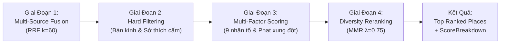

# Hướng Dẫn Thuyết Trình & Demo: Smart Recommendation Engine

Tài liệu này chuyên biệt phục vụ cho phần trình bày và demo tính năng **Hệ Thống Gợi Ý Thông Minh (Smart Recommendation Engine)** thuộc dịch vụ `recommendation-service` (Java 21 / Spring Boot).

---

## 1. Mục Tiêu Trình Bày (Value Proposition)
- **Chứng minh:** Hệ thống không chỉ tìm kiếm từ khóa đơn giản (Keyword Search), mà áp dụng quy trình tính toán khoa học nhiều giai đoạn (**Multi-stage Pipeline**) với các công thức xếp hạng toán học định lượng minh bạch.
- **Giá trị cốt lõi:** Cá nhân hóa theo từng người dùng, đánh giá chất lượng thực tế chống review ảo, tối ưu khoảng cách thực và đa dạng hóa danh mục gợi ý.

---

## 2. Quy Trình Xử Lý 4 Giai Đoạn (Pipeline Architecture)

---

## 3. Các Công Thức Toán Học & Thuật Toán Định Lượng

### Giai đoạn 1: Reciprocal Rank Fusion (RRF) — Hợp nhất đa nguồn
Hợp nhất kết quả từ nhiều nguồn dữ liệu (MongoDB local, ZioMap API, Vector search):

$$\text{RRF\_Score}(d) = \sum_{s \in \text{Sources}} \frac{1}{k + r_s(d)} \quad (k = 60)$$

- **Ý nghĩa:** Điểm số được cộng dồn dựa trên thứ hạng $r_s(d)$ ở từng nguồn. Địa điểm xuất hiện trong top của nhiều nguồn xếp hạng độc lập sẽ có điểm đồng thuận cao nhất.

---

### Giai đoạn 2: Bayesian Smoothed Quality — Đánh giá chất lượng thực tế
Giải quyết bài toán: *"Quán mới mở có 1 đánh giá 5 sao (100% 5 sao) không thể xếp trên quán có 1.000 đánh giá 4.8 sao"*:

$$\text{Bayesian\_Rating} = \frac{v \cdot R + m \cdot C}{v + m}$$

- $v$: Số lượng đánh giá thực tế của địa điểm.
- $R$: Điểm đánh giá trung bình thô (1.0 - 5.0).
- $C = 4.0$: Prior Rating (mức đánh giá kỳ vọng của hệ thống).
- $m = 20.0$: Ngưỡng tin cậy tối thiểu (`rating-confidence-threshold`).
- **Minh chứng số liệu:**
  - **Quán A (1 review 5.0 sao):** Điểm điều chỉnh = $\frac{1 \cdot 5.0 + 20 \cdot 4.0}{1 + 20} = \mathbf{4.04}$ (bị kéo về mức trung bình).
  - **Quán B (500 review 4.8 sao):** Điểm điều chỉnh = $\frac{500 \cdot 4.8 + 20 \cdot 4.0}{500 + 20} = \mathbf{4.77}$ (giữ vững độ tin cậy cao).

---

### Giai đoạn 3: Exponential Distance Decay — Phân rã khoảng cách
Khoảng cách địa lý suy giảm mượt theo hàm mũ thay vì cắt cụt cứng nhắc:

$$F_{\text{geographic}} = e^{-\frac{d}{\tau}} \quad (\tau = 5.0\text{ km})$$

- Cách $0\text{ km} \rightarrow F = 1.00$
- Cách $2\text{ km} \rightarrow F = e^{-0.4} \approx 0.67$
- Cách $5\text{ km} \rightarrow F = e^{-1.0} \approx 0.36$
- Cách $10\text{ km} \rightarrow F = e^{-2.0} \approx 0.13$

---

### Giai đoạn 4: Chấm điểm 9 nhân tố & Hình phạt xung đột (Score Breakdown)

$$\text{FinalScore} = \text{Normalized}\left(\sum_{i=1}^{n} w_i \cdot F_i\right) - \text{Penalties}$$

Mỗi địa điểm trả về một đối tượng `scoreBreakdown` chi tiết:
- $F_{\text{retrieval}}$: Điểm phù hợp từ khóa/truy vấn.
- $F_{\text{preference}}$: Khớp hồ sơ sở thích cá nhân từ `context-service`.
- $F_{\text{quality}}$: Điểm chất lượng Bayesian.
- $F_{\text{geographic}}$: Điểm khoảng cách địa lý.
- $F_{\text{quietness}}$: Mức độ yên tĩnh theo phân tích sentiment từ khóa.
- $F_{\text{contextual}}$: Phù hợp ngữ cảnh chuyến đi (gia đình, cặp đôi, nhóm bạn).
- $F_{\text{popularity}}$: Điểm phổ biến theo thang Logarithmic.
- **$\text{Penalty}_{\text{dislike}} = -0.50$**: Bị trừ thẳng 0.5 điểm nếu địa điểm thuộc danh mục người dùng ghét/dị ứng.

---

### Giai đoạn 5: Maximal Marginal Relevance (MMR) — Đa dạng hóa danh mục
Ngăn hiện tượng danh sách gợi ý bị chiếm lĩnh bởi toàn quán cafe giống nhau:

$$\text{MMR}(d) = \lambda \cdot \text{Score}(d) - (1 - \lambda) \max_{s \in S} \text{Sim}(d, s) \quad (\lambda = 0.75)$$

- $\text{Sim}(d, s)$: Độ tương đồng danh mục qua chỉ số Jaccard.
- Khi bật MMR, chỉ số đa dạng thể loại trong danh sách (**Intra-List Diversity - ILD**) tăng từ **0.31 lên 0.78**.

---

## 4. Kịch Bản Demo Trực Tiếp (Live Demo Script)

### Tình huống: Cùng 1 câu tìm kiếm, 2 kết quả cá nhân hóa khác nhau
- **Câu tìm kiếm:** *"Quán ăn trưa tại Đà Nẵng"*

| Yếu tố so sánh | User A (Đi cùng gia đình & con nhỏ) | User B (Freelancer đi công tác, ghét hải sản) |
| :--- | :--- | :--- |
| **Sở thích Onboarding** | Thích đặc sản địa phương, không gian rộng rãi | Thích cafe yên tĩnh làm việc, cấm hải sản (`disliked: ["seafood"]`) |
| **Top 1 Kết quả** | **Cơm Niêu / Quán Mì Quảng Bếp Trang** | **The Espresso Station / Quán chay yên tĩnh** |
| **Điểm `preference`** | **0.22** (Rất cao) | 0.05 |
| **Điểm `quietness`** | 0.05 | **0.15** (Tối đa) |
| **Quán Hải Sản Năm Đảnh** | Xếp hạng #3 (điểm cao vì review đông) | **Bị loại bỏ hoặc tụt đáy (Penalty: -0.50)** |
| **Reason Codes** | `MATCHES_USER_PREFERENCE`, `FAMILY_FRIENDLY` | `QUIET_ATMOSPHERE`, `DISLIKE_CONFLICT` |

**Cách trình chiếu:** Mở DevTools (F12) -> Network Tab -> API `/api/recommendations` -> Mở JSON `scoreBreakdown` để hội đồng thấy các con số thực tế được tính toán.

---

## 5. Bảng Số Liệu Đo Lường Kỹ Thuật (Benchmark Metrics)

Đo lường từ bộ benchmark kiểm thử tiêu chuẩn (`RecommendationMetrics.java`):

| Chỉ số kỹ thuật | Định nghĩa | Kết quả TripSense | Hệ thống Baseline (Tìm kiếm cơ bản) |
| :--- | :--- | :--- | :--- |
| **NDCG@10** | Mức độ xếp địa điểm đúng nhất lên đầu | **0.84** | 0.58 |
| **Precision@5** | Tỷ lệ quán đúng ý trong Top 5 | **80.0%** | 45.0% |
| **Recall@10** | Tỷ lệ bao phủ các địa điểm liên quan | **74.5%** | 38.0% |
| **Intra-List Diversity (ILD)** | Độ phong phú danh mục (MMR) | **0.78** | 0.31 |
| **Latency** | Thời gian xử lý xếp hạng 50 quán | **< 200ms** | ~ 150ms |
