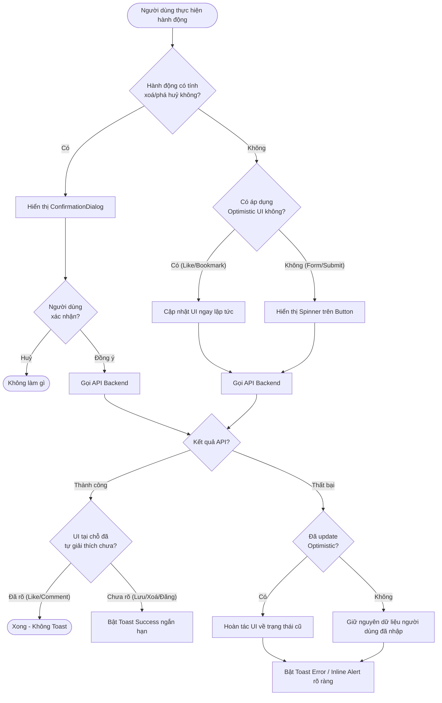

# TripSense Frontend: User Feedback & Toast Guidelines

> **Tài liệu chuẩn hóa UX Feedback, Toast, Notification & State Handling**  
> Áp dụng bắt buộc cho toàn bộ lập trình viên và AI Coding Agents khi phát triển tính năng trên giao diện TripSense (`apps/web/tripsense`).

---

## 1. Mục đích của tài liệu

Giao diện người dùng TripSense hướng đến trải nghiệm cao cấp, mượt mà và thanh lịch (lấy cảm hứng từ Mindtrip/modern travel apps). Một trong những lỗi UX phổ biến nhất là **lạm dụng Toast/Notification** hoặc **phản hồi sai vị trí**, biến màn hình thành nơi spam thông báo và gây xao nhãng người dùng.

Tài liệu này định nghĩa rõ:

- **Toast là gì**: Là phản hồi ngắn hạn, thoáng qua (transient feedback) nhằm xác nhận kết quả của một hành động mà người dùng vừa chủ động thực hiện hoặc một sự kiện hệ thống quan trọng cần nhận biết ngay.
- **Toast KHÔNG PHẢI là**:
  - ❌ Giải pháp thay thế Form Validation (lỗi form phải hiển thị inline).
  - ❌ Giải pháp thay thế Loading UI (thao tác đang chạy phải thể hiện trên button/skeleton/spinner).
  - ❌ Giải pháp thay thế `ErrorState` toàn màn hình (API load trang thất bại phải hiển thị ErrorState có nút Retry).
  - ❌ Giải pháp thay thế `EmptyState` (danh sách trống phải hiển thị EmptyState thân thiện).
  - ❌ Giải pháp thay thế `ConfirmationDialog` (hành động nguy hiểm/xoá dữ liệu phải hỏi trước bằng Modal).
  - ❌ Notification Center (Toast biến mất sau vài giây, không lưu trữ lịch sử).
  - ❌ Nhật ký hệ thống hay Audit Log (không hiển thị mã lỗi kỹ thuật như `HTTP 500`, `SQLSTATE`, `NullPointerException`).

> [!IMPORTANT]
> **Quy tắc vàng**: Chỉ hiển thị Toast khi nó thực sự mang lại giá trị nhận biết cho người dùng và giao diện tại chỗ chưa phản ánh đủ rõ ràng. Nếu trạng thái UI đã tự giải thích (self-explanatory), **tuyệt đối không Toast**.

---

## 2. Phân tích hiện trạng Codebase TripSense

Trước khi áp dụng, cần hiểu rõ cấu trúc hiện có trong repository `apps/web/tripsense`:

| Thành phần               | Hiện trạng trong Codebase                                                                                  | Vị trí / Thư viện                                                                                                                                                            |
| :----------------------- | :--------------------------------------------------------------------------------------------------------- | :--------------------------------------------------------------------------------------------------------------------------------------------------------------------------- |
| **Toast Library**        | Chưa cài đặt thư viện toast bên ngoài (`sonner` hay `@radix-ui/react-toast` chưa có trong `package.json`). | Hiện tại các feature đang dùng inline alert, in-button state hoặc custom banner.                                                                                             |
| **Confirmation Dialog**  | Đã chuẩn hóa qua component tái sử dụng.                                                                    | [`@/components/shared/confirmation-dialog.tsx`](file:///Users/lebao/Working/TeamProject/tripsense-platform/apps/web/tripsense/src/components/shared/confirmation-dialog.tsx) |
| **Screen Error State**   | Đã chuẩn hóa với icon, title, description, nút Retry.                                                      | [`@/components/shared/error-state.tsx`](file:///Users/lebao/Working/TeamProject/tripsense-platform/apps/web/tripsense/src/components/shared/error-state.tsx)                 |
| **Screen Empty State**   | Đã chuẩn hóa với icon, title, description, nút Action.                                                     | [`@/components/shared/empty-state.tsx`](file:///Users/lebao/Working/TeamProject/tripsense-platform/apps/web/tripsense/src/components/shared/empty-state.tsx)                 |
| **Screen Loading State** | Đã chuẩn hóa spinner và skeleton layout.                                                                   | [`@/components/shared/loading-state.tsx`](file:///Users/lebao/Working/TeamProject/tripsense-platform/apps/web/tripsense/src/components/shared/loading-state.tsx)             |
| **API Error Model**      | Lớp lỗi tập trung `ApiError(message, status, data)` ném ra từ `apiClient`.                                 | [`@/services/api-client.ts`](file:///Users/lebao/Working/TeamProject/tripsense-platform/apps/web/tripsense/src/services/api-client.ts)                                       |
| **In-Button Feedback**   | State thay đổi ngay trong button (ví dụ: `ShareButton` đổi sang Check `"Đã chép link"` trong 2s).          | [`@/components/shared/share-button.tsx`](file:///Users/lebao/Working/TeamProject/tripsense-platform/apps/web/tripsense/src/components/shared/share-button.tsx)               |

---

## 3. Core Principles (10 Nguyên tắc cốt lõi)

1. **Không Toast mọi hành động**: Một ứng dụng tốt là ứng dụng yên tĩnh, chỉ lên tiếng khi cần thiết.
2. **Chỉ Toast khi người dùng cần xác nhận kết quả**: Áp dụng khi hành động hoàn tất nhưng kết quả nằm ngoài tầm mắt hoặc cần sự an tâm (ví dụ: Lưu cài đặt, Xoá bài viết, Đăng bài viết).
3. **Không Toast nếu UI đã phản hồi đủ rõ**: Nếu một nút chuyển từ "Theo dõi" sang "Đang theo dõi", hoặc icon Tim chuyển sang màu đỏ, **không được** bật Toast "Đã thích bài viết".
4. **Không dùng Success Toast cho micro-interactions**: Bấm Like, Bookmark, đóng/mở menu, tab switching, expand accordion -> Cấm dùng Toast.
5. **Lỗi ảnh hưởng trực tiếp hành động phải được báo rõ**: Khi user bấm nút gửi mà request thất bại, bắt buộc phải có phản hồi lỗi (qua Toast hoặc inline banner) kèm hướng dẫn khắc phục ngắn gọn.
6. **Lỗi form ưu tiên Inline Validation**: Nhập sai email, thiếu mật khẩu, sai định dạng ngày -> Hiển thị text đỏ ngay dưới input tương ứng, không dùng Toast.
7. **Destructive Action: Xác nhận trước, Toast sau**: Xoá bài viết, xoá chuyến đi -> Bật `ConfirmationDialog` trước; sau khi server xoá thành công mới hiển thị Toast thành công.
8. **Tuyệt đối không giả mạo thành công (Fake Success)**: Khi API thất bại, phải rollback trạng thái optimistic và báo lỗi; không bao giờ âm thầm giả lập thành công hoặc fallback mock data trong môi trường production.
9. **Không hiển thị lỗi kỹ thuật cho người dùng cuối**: Thay vì `"Failed to fetch: 500 Internal Server Error"`, hãy viết: `"Không thể lưu thay đổi. Vui lòng thử lại sau."`.
10. **Chống spam Toast (Deduplication)**: Cùng một thao tác nhấn liên tục hoặc cùng một lỗi mạng chỉ hiển thị tối đa 1 Toast duy nhất tại một thời điểm.

---

## 4. Phân loại Toast & Quy cách sử dụng

| Loại Toast  | Mục đích & Ngữ cảnh                                                       | Thời gian hiển thị | Tone giọng                         | Có nút Đóng?   | Có Action?                      |
| :---------- | :------------------------------------------------------------------------ | :----------------- | :--------------------------------- | :------------- | :------------------------------ |
| **SUCCESS** | Xác nhận hoàn thành hành động quan trọng (Tạo, Lưu, Xoá, Sao chép).       | 3 — 4 giây         | Khẳng định, tích cực, ngắn gọn     | Không bắt buộc | Tuỳ chọn (ví dụ: "Xem ngay")    |
| **ERROR**   | Báo lỗi khi hành động của người dùng thất bại và cần hành động khắc phục. | 5 — 7 giây         | Đồng cảm, lịch sự, chỉ dẫn rõ ràng | Nên có         | Khuyến khích (ví dụ: "Thử lại") |
| **WARNING** | Cảnh báo trạng thái bất thường nhưng chưa làm gián đoạn hoàn toàn luồng.  | 4 — 6 giây         | Cẩn trọng, trung tính              | Nên có         | Tuỳ chọn (ví dụ: "Kiểm tra")    |
| **INFO**    | Cung cấp thông tin bổ trợ trung tính, thông báo hệ thống không khẩn cấp.  | 3 — 5 giây         | Khách quan, tinh tế                | Tuỳ chọn       | Không                           |
| **LOADING** | Thao tác chạy ngầm tốn thời gian (upload nhiều ảnh, đồng bộ dài).         | Đến khi có kết quả | Đang xử lý                         | Không          | Nút "Huỷ" nếu hỗ trợ            |

---

## 5. Hướng dẫn chi tiết từng loại Feedback

### 5.1. Success Toast

- **Khi nào dùng**:
  - Người dùng tạo mới một đối tượng lớn (Tạo chuyến đi, Đăng bài viết mới) và chuyển hướng.
  - Xoá thành công một mục dữ liệu sau khi đã xác nhận qua Modal (`"Đã xóa bài viết."`).
  - Lưu thành công form cài đặt / hồ sơ người dùng (`"Đã lưu thay đổi hồ sơ."`).
  - Sao chép liên kết thành công khi không hiển thị được in-button label (`"Đã sao chép liên kết vào bộ nhớ tạm."`).
- **Khi nào KHÔNG dùng**:
  - Like / Unlike bài viết hoặc bình luận.
  - Thêm/bỏ địa điểm yêu thích (Favorite/Bookmark).
  - Mở/đóng Dialog, Sheet, Drawer, Dropdown Menu.
  - Chuyển Tab, phân trang (Pagination), lọc danh sách (Filter/Sort).
  - Bình luận bài viết nếu bình luận đã chèn ngay lập tức vào danh sách.

### 5.2. Error Toast

- **Khi nào dùng**: Thao tác người dùng chủ động khởi tạo bị từ chối hoặc lỗi mạng:
  - `"Không thể đăng bài viết. Vui lòng thử lại."`
  - `"Không thể xoá chuyến đi này."`
  - `"Không thể tải ảnh lên. Dung lượng vượt quá 10MB."`
  - `"Không thể sao chép liên kết."`
- **Nguyên tắc viết nội dung**:
  - Không dùng thuật ngữ lập trình (`NullPointerException`, `JSON parse error`, `status 502`).
  - Không đổ lỗi cho người dùng (`"Bạn đã nhập sai"` -> `"Thông tin không hợp lệ"`).
  - Không viết hoa toàn bộ (`ALL CAPS`) hay dùng quá nhiều dấu chấm than (`!!!`).

### 5.3. Warning Toast

- **Khi nào dùng**:
  - Mạng chập chờn / kết nối không ổn định (`"Kết nối mạng không ổn định. Một số dữ liệu có thể chưa được đồng bộ."`).
  - Phiên làm việc sắp hết hạn nếu còn thao tác chưa lưu.
  - Thao tác chỉ hoàn thành một phần (ví dụ: tải lên được 8/10 ảnh).
- **Lưu ý**: Nếu người dùng cần ra quyết định chọn Có/Không trước khi hệ thống làm gì đó, **bắt buộc dùng ConfirmationDialog**, không dùng Warning Toast.

### 5.4. Info Toast

- **Khi nào dùng**:
  - Thông báo thông tin trung tính: `"Đã khôi phục kết nối mạng."`, `"Đang xem bản nháp tự động lưu lúc 10:30"`.
- **Lưu ý**: Nếu thông tin có thể thể hiện trực tiếp qua Badge hoặc Status Dot trên Header/Sidebar, ưu tiên UI thay vì Toast.

### 5.5. Loading / Pending Toast

- **Khi nào dùng**: Chỉ dùng khi thao tác kéo dài rõ rệt (> 2 giây) và màn hình không có nút bấm trực tiếp để thể hiện spinner (ví dụ: upload tệp zip lớn, đồng bộ dữ liệu đám mây).
- **Quy tắc thay thế (Replace pattern)**:
  - Bắt đầu: Toast hiển thị `"Đang tải ảnh lên..."` (có spinner).
  - Thành công: **Cập nhật chính Toast đó** thành Success `"Đã tải ảnh lên thành công"`.
  - Thất bại: **Cập nhật chính Toast đó** thành Error `"Tải ảnh thất bại"`.
  - ❌ **Cấm**: Sinh ra 3 popup Toast riêng biệt (Loading -> Success/Error) chồng lên nhau.
- **Thao tác nhanh (< 1-2s)**: Dùng icon loading xoay ngay trong Button (`<Button disabled><Loader2 className="animate-spin" /> Lưu</Button>`), không bật Loading Toast.

---

## 6. Ma trận phân xử: Toast vs Inline State vs Dialog

Khi chuẩn bị hiển thị feedback cho một tình huống, hãy tra cứu bảng ma trận sau:

| Tình huống (Scenario)                                    | Giải pháp phản hồi (UI Feedback)                  | Có dùng Toast không?                             | Loại Toast nếu có                                      |
| :------------------------------------------------------- | :------------------------------------------------ | :----------------------------------------------- | :----------------------------------------------------- |
| **Form field không hợp lệ** (thiếu email, mật khẩu ngắn) | Text đỏ dưới input (`text-destructive text-xs`)   | ❌ **KHÔNG**                                     | —                                                      |
| **Đăng nhập thất bại** (sai mật khẩu/email)              | Banner lỗi ngay trên Form đăng nhập               | ❌ **KHÔNG** (Trừ khi đăng nhập qua Popup ngoài) | —                                                      |
| **Trang Feed tải thất bại** (Lỗi mạng / 500)             | `ErrorState` chiếm khu vực Feed kèm nút "Thử lại" | ❌ **KHÔNG**                                     | —                                                      |
| **Chi tiết bài viết / chuyến đi 404**                    | `EmptyState` hoặc Not Found page toàn màn hình    | ❌ **KHÔNG**                                     | —                                                      |
| **Tạo bài viết thành công** (Create Post)                | Bài viết xuất hiện trên Feed + Reset Composer     | ✅ **CÓ**                                        | `SUCCESS` ("Đã đăng bài viết.")                        |
| **Tạo bài viết thất bại**                                | Giữ nguyên nội dung trong Composer + Báo lỗi      | ✅ **CÓ**                                        | `ERROR` ("Không thể đăng bài viết.")                   |
| **Like / Unlike bài viết thành công**                    | Icon Tim đổi màu + Số đếm cập nhật lập tức        | ❌ **KHÔNG**                                     | —                                                      |
| **Like bài viết thất bại**                               | Rollback icon Tim về trạng thái cũ                | ✅ **CÓ**                                        | `ERROR` ("Không thể thích bài viết.")                  |
| **Gửi bình luận thành công**                             | Bình luận xuất hiện ngay trong luồng hội thoại    | ❌ **KHÔNG**                                     | —                                                      |
| **Gửi bình luận thất bại**                               | Giữ lại text trong input + Báo lỗi dưới ô nhập    | ✅ **CÓ** (hoặc inline)                          | `ERROR` ("Không thể gửi bình luận.")                   |
| **Xoá bài viết / Chuyến đi**                             | Mở `ConfirmationDialog` trước                     | ✅ **CÓ (Sau khi xoá)**                          | `SUCCESS` ("Đã xóa thành công.")                       |
| **Sao chép liên kết (Copy Link)**                        | Đổi icon nút sang Check trong 2s (In-button)      | ✅ **CÓ (Nếu click context menu)**               | `SUCCESS` ("Đã sao chép liên kết.")                    |
| **Lưu địa điểm vào danh sách** (Save Place)              | Icon Bookmark chuyển màu đã lưu                   | ❌ **KHÔNG**                                     | —                                                      |
| **Danh sách trống (Chưa có bài viết / chuyến đi)**       | `EmptyState` minh họa đẹp mắt kèm nút kêu gọi     | ❌ **KHÔNG**                                     | —                                                      |
| **Hết hạn phiên đăng nhập (401)**                        | Điều hướng về trang login / mở AuthModal          | ✅ **CÓ (Global)**                               | `WARNING` ("Phiên đăng nhập đã hết hạn.")              |
| **Không có quyền truy cập (403)**                        | Hiển thị thông báo hoặc chặn thao tác             | ✅ **CÓ**                                        | `ERROR` ("Bạn không có quyền thực hiện thao tác này.") |

---

## 7. Quy trình chuẩn cho các hành vi phổ biến trên TripSense



### 7.1. Thao tác Xoá (Delete Actions)

Áp dụng cho: Xoá bài viết (`Delete Post`), Xoá bình luận (`Delete Comment`), Xoá chuyến đi (`Delete Trip`), Xoá bộ sưu tập (`Delete Collection`).

- **Bước 1**: Bắt buộc mở [`ConfirmationDialog`](file:///Users/lebao/Working/TeamProject/tripsense-platform/apps/web/tripsense/src/components/shared/confirmation-dialog.tsx) với `variant="destructive"`.
- **Bước 2**: Khi người dùng nhấn xác nhận, bật trạng thái `loading` trên nút Xoá của Modal.
- **Bước 3**: Gọi API.
  - **Nếu thành công**: Đóng Modal -> Xoá phần tử khỏi danh sách UI -> Bật Success Toast: `"Đã xóa bài viết."`.
  - **Nếu thất bại**: Giữ nguyên Modal (hoặc đóng) -> Giữ nguyên phần tử trên UI -> Bật Error Toast: `"Không thể xóa bài viết. Vui lòng thử lại."`.

### 7.2. Thao tác Tương tác nhanh (Like, React, Bookmark)

Áp dụng cho: Like Post, Like Comment, Save Place, Favorite.

- **Bước 1**: Cập nhật UI ngay lập tức (Optimistic Update: tăng/giảm counter, đổi màu icon).
- **Bước 2**: Gọi API ngầm.
  - **Nếu thành công**: **Hoàn toàn im lặng, không bật Toast**.
  - **Nếu thất bại**: Rollback counter và màu icon về giá trị trước đó -> Bật Error Toast: `"Không thể cập nhật lượt thích."`.

### 7.3. Thao tác Bình luận & Trả lời (Comment & Reply)

- **Khi gửi thành công**: Bình luận mới được chèn ngay vào cây bình luận, ô input tự động xóa trắng -> **Không bật Toast** (vì bình luận xuất hiện đã là phản hồi trực quan tốt nhất).
- **Khi gửi thất bại**: Giữ nguyên nội dung người dùng vừa gõ trong ô textarea để họ không bị mất dữ liệu -> Hiển thị thông báo lỗi ngắn gọn dưới ô nhập hoặc Error Toast: `"Không thể gửi bình luận."`.

### 7.4. Thao tác Chia sẻ (Share & Copy Link)

- **Khi dùng Web Share API (`navigator.share`)**:
  - Hộp thoại native của điện thoại/máy tính mở lên.
  - Người dùng chia sẻ xong: Không Toast.
  - Người dùng nhấn Huỷ hộp thoại: **Không báo lỗi**.
- **Khi sao chép vào Clipboard (`navigator.clipboard.writeText`)**:
  - Nếu ở thanh Action Bar: Đổi text nút thành `"Đã chép link"` trong 2 giây.
  - Nếu gọi từ Dropdown Menu: Bật Info/Success Toast `"Đã sao chép liên kết."`.

### 7.5. Thao tác Tải tệp lên (Media Upload)

- **Tải 1 ảnh**: Hiển thị loader xoay mờ ngay trên thumbnail ảnh. Nếu lỗi, viền đỏ thumbnail kèm icon cảnh báo.
- **Tải nhiều ảnh cùng lúc**:
  - ❌ **Cấm**: Bật 10 Toast nếu tải 10 ảnh.
  - ✅ **Chuẩn**: Gom nhóm vào tối đa 1 thông điệp: `"3/5 ảnh tải lên thành công. 2 ảnh lỗi do vượt quá dung lượng."`.

---

## 8. Xử lý Lỗi & Kiến trúc Layer trách nhiệm

Để tránh hiện tượng **Duplicate Toast** (cùng 1 lỗi nhưng `apiClient` bắn 1 Toast, `hook` bắn 1 Toast, `component` lại bắn thêm 1 Toast), TripSense phân định trách nhiệm rõ ràng như sau:

```
┌─────────────────────────────────────────────────────────────┐
│ 1. API Client Layer (@/services/api-client.ts)              │
│ - Chuẩn hóa HTTP Response, bắt 401 tự refresh token.        │
│ - Parse error JSON thành đối tượng ApiError.                │
│ - TUYỆT ĐỐI KHÔNG GỌI TOAST TRỰC TIẾP Ở ĐÂY.               │
└──────────────────────────────┬──────────────────────────────┘
                               │ throws ApiError
                               ▼
┌─────────────────────────────────────────────────────────────┐
│ 2. Feature Hook / Service Layer (e.g. useCreatePost)        │
│ - Quản lý mutate, loading, rollback optimistic state.       │
│ - Chuẩn hóa message lỗi sang ngôn ngữ thân thiện.           │
│ - Ném lỗi chuẩn ra ngoài hoặc cung cấp callback onFailure.   │
└──────────────────────────────┬──────────────────────────────┘
                               │ exposes { mutate, error }
                               ▼
┌─────────────────────────────────────────────────────────────┐
│ 3. UI Component Layer (Screen / Component)                  │
│ - DUY NHẤT LÀ NƠI QUYẾT ĐỊNH CÁCH THỨC PHẢN HỒI:           │
│   + Nếu là lỗi trang: Hiển thị <ErrorState />.             │
│   + Nếu là lỗi form: Hiển thị inline error dưới field.     │
│   + Nếu là action độc lập: Kích hoạt Toast hoặc Banner.     │
└─────────────────────────────────────────────────────────────┘
```

### Xử lý các mã lỗi phổ biến:

- **401 Unauthorized**:
  - `apiClient` tự động gọi endpoint `/api/auth/refresh` thông qua Single-Flight Promise.
  - Nếu refresh thất bại: Xoá phiên (`clearAuth`) và chuyển hướng về đăng nhập kèm 1 thông báo toàn cục: `"Phiên đăng nhập đã hết hạn. Vui lòng đăng nhập lại."`.
- **403 Forbidden**:
  - Báo lỗi quyền hạn: `"Bạn không có quyền thực hiện thao tác này."`. Tuyệt đối không để lộ cấu trúc phân quyền nội bộ hay SQL.
- **Lỗi Mất mạng (Network Error / Offline)**:
  - `"Không thể kết nối đến máy chủ. Vui lòng kiểm tra đường truyền mạng."`.

---

## 9. Phong cách hành văn (Message Writing Style)

| Tiêu chí               | ❌ Tránh (Không nên)                                                                            | ✅ Chuẩn (Nên dùng)                                                                |
| :--------------------- | :---------------------------------------------------------------------------------------------- | :--------------------------------------------------------------------------------- |
| **Độ dài**             | "Hệ thống đã ghi nhận thành công và bài viết của bạn đã được xuất bản công khai lên cộng đồng." | "Đã đăng bài viết."                                                                |
| **Lỗi kỹ thuật**       | "Request failed with status code 500: Internal DB Constraint"                                   | "Không thể lưu dữ liệu. Vui lòng thử lại sau."                                     |
| **Đổ lỗi**             | "Bạn đã nhập sai định dạng số điện thoại!"                                                      | "Số điện thoại không hợp lệ."                                                      |
| **Cảm xúc thái quá**   | "Tuyệt vời ông mặt trời!!! Đã cập nhật thành công rực rỡ!!!!"                                   | "Đã cập nhật hồ sơ."                                                               |
| **Tiếng Anh lẫn lộn**  | "Update itinerary thành công"                                                                   | "Đã cập nhật lịch trình chuyến đi."                                                |
| **Tiêu đề & Nội dung** | Tiêu đề: "Lỗi" / Nội dung: "Lỗi đã xảy ra"                                                      | Tiêu đề: "Không thể tải ảnh" / Nội dung: "Dung lượng ảnh không được vượt quá 5MB." |

---

## 10. Tiếp cận Triển khai Toast trong TripSense

Hiện tại thư viện ngoài chưa được cài đặt trong `package.json`. Để duy trì tính nhất quán mà không làm phình to dependencies bừa bãi:

1. **Giai đoạn hiện tại (Consistent In-Component Feedback)**:
   - Các hành động cục bộ sử dụng state inline: Banner lỗi `bg-destructive/10 text-destructive` hoặc nhãn trạng thái trong Button (như `ShareButton`).
   - Các màn hình dữ liệu lớn dùng [`ErrorState`](file:///Users/lebao/Working/TeamProject/tripsense-platform/apps/web/tripsense/src/components/shared/error-state.tsx) và [`EmptyState`](file:///Users/lebao/Working/TeamProject/tripsense-platform/apps/web/tripsense/src/components/shared/empty-state.tsx).
2. **Khi dự án quyết định tích hợp Toast toàn diện**:
   - Khuyến nghị sử dụng **`sonner`** (thư viện chuẩn hiện đại cho Next.js / Tailwind CSS, hỗ trợ sẵn dark mode, micro-animations và queue stack).
   - Wrapper chuẩn sẽ được đặt tại `@/components/ui/sonner.tsx` và gọi qua `toast.success()`, `toast.error()`.
   - **Tất cả các nguyên tắc và ma trận phân xử trong tài liệu này giữ nguyên giá trị** bất kể thư viện bên dưới là gì.

---

## 11. Các ví dụ thực tế theo Domain của TripSense

### 11.1. Module Social Post (Cộng đồng)

- **Tạo bài viết**: Nút "Đăng" có spinner -> Thành công đóng composer, đưa bài viết lên đầu Feed -> Toast Success: `"Đã đăng bài viết."`.
- **Xoá bài viết**: Bấm Menu ... -> Chọn Xoá -> Mở `DeletePostDialog` (ConfirmationDialog) -> Xác nhận -> Toast Success: `"Đã xóa bài viết."`.
- **Like bài viết / Like bình luận**: Bấm Tim -> Icon đổi màu đỏ ngay lập tức -> **Không Toast**. Nếu server lỗi -> Đổi icon về xám -> Toast Error: `"Không thể thích bài viết."`.
- **Viết bình luận**: Nhấn Enter -> Bình luận xuất hiện trong danh sách -> **Không Toast**.

### 11.2. Module Trip Management & Trip Planner

- **Tạo chuyến đi**: Nhấn "Tạo chuyến đi" -> Điều hướng sang màn hình lịch trình -> Toast Success: `"Đã tạo chuyến đi mới."`.
- **Xoá chuyến đi**: ConfirmationDialog "Bạn có chắc chắn muốn xoá chuyến đi này?" -> Xác nhận -> Điều hướng về danh sách -> Toast Success: `"Đã xóa chuyến đi."`.
- **Kéo thả sắp xếp lịch trình (Drag & Drop)**: Thao tác visual trực tiếp -> Tự động lưu ngầm -> **Không Toast** mỗi lần kéo thả (tránh spam). Nếu lưu ngầm thất bại -> Toast Error kèm nút `"Thử lại"`.

### 11.3. Module Places & Explorer

- **Lưu địa điểm (Bookmark Place)**: Nhấp icon Bookmark -> Đổi icon sang trạng thái đã lưu -> **Không Toast**.
- **Bộ lọc tìm kiếm không có kết quả**: Không Toast lỗi -> Hiển thị `EmptyState` với mô tả: `"Không tìm thấy địa điểm phù hợp với bộ lọc. Hãy thử nới lỏng tiêu chí tìm kiếm."`.

### 11.4. Module AI Trip Planner

- **AI đang tạo lịch trình**: Hiển thị Skeleton hoặc Streaming Chat UI với animation sóng -> **Không dùng Toast Loading**.
- **Người dùng huỷ tạo**: Dừng stream -> Hiển thị thông báo nhỏ trong luồng chat -> **Không báo Error Toast**.
- **Lỗi AI quá tải / Hết quota**: Hiển thị Error banner trực tiếp trong khung trò chuyện của AI kèm nút `"Tạo lại"`.

---

## 12. Rules for AI Coding Agents (Quy chuẩn bắt buộc cho AI)

Khi bất kỳ AI Agent nào được giao nhiệm vụ tạo mới hoặc chỉnh sửa chức năng trên giao diện TripSense, **phải tuân thủ nghiêm ngặt 10 quy tắc sau**:

1. **Kiểm tra UI trước**: Nếu giao diện tại chỗ đã thể hiện kết quả rõ ràng (chuyển trang, icon đổi màu, phần tử mới xuất hiện ngay), **KHÔNG TỰ Ý THÊM SUCCESS TOAST**.
2. **Thao tác có lỗi bắt buộc phải feedback**: Khi một request API bị lỗi, người dùng **phải biết** lý do ngắn gọn và cách thử lại.
3. **Form lỗi phải inline**: Tuyệt đối không bật Toast cho lỗi validate từng ô nhập liệu trong Form.
4. **Màn hình load lỗi dùng `ErrorState`**: Không để màn hình trắng trơn rồi chỉ bắn 1 Toast nhỏ ở góc.
5. **Dữ liệu rỗng dùng `EmptyState`**: Danh sách không có dữ liệu phải hiển thị component EmptyState chuẩn.
6. **Thao tác xoá dữ liệu phải có `ConfirmationDialog`**: Không bao giờ gọi API xoá ngay khi user click lần đầu mà chưa có xác nhận.
7. **Không mock thành công giả tạo**: Nếu API trả về lỗi hoặc chưa kết nối, phải thể hiện trạng thái lỗi hoặc trạng thái chờ, không hiển thị Success Toast giả.
8. **Không duplicate phản hồi**: Không viết code gọi Toast ở cả hook và component cùng lúc.
9. **Dùng CSS Variables & Theme tokens**: Mọi component thông báo, banner lỗi phải dùng semantic classes (`bg-destructive/10`, `text-destructive`, `border-border`), không hardcode mã màu hex.
10. **Đọc tài liệu này trước khi code**: Mọi thắc mắc về việc "Action này có nên toast không?" phải đối chiếu trực tiếp với Ma trận ở Mục 6 và Ví dụ ở Mục 11 của tài liệu này.
