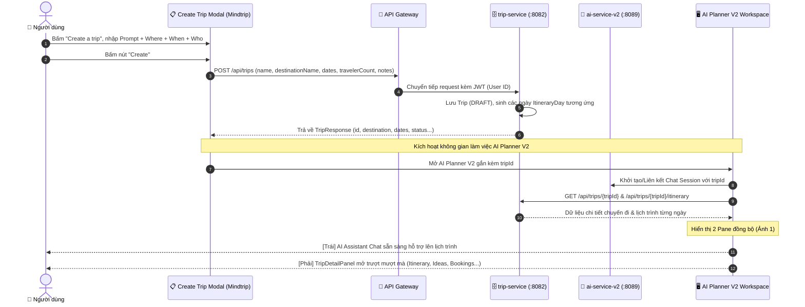

# AI Planner Trip Detail Panel & Mindtrip Create Trip Flow — Specification & Implementation Plan

`STATUS: APPROVED`

- **Owner Service**: `apps/web/tripsense`
- **Affected Services**: `apps/web/tripsense`, `services/trip-service`, `services/ai-service-v2`, `services/api-gateway`
- **Created Date**: 2026-09-30
- **User Confirmed Decisions**:
  1. **Prompt & Notes**: Phương án A — Đoạn prompt người dùng nhập ở modal (ví dụ: *"5-day Tokyo trip this October"*) vừa được lưu vào trường `notes` của `trip-service`, vừa được tự động gửi thành tin nhắn người dùng đầu tiên cho AI ở pane bên trái để kích hoạt AI chào và lên lịch trình.
  2. **Tên Chuyến Đi (AI Auto-Naming)**: AI trong response đầu tiên sẽ tự động đề xuất và đặt tên chuẩn xác cho chuyến đi (đồng thời cập nhật tên qua `PATCH /api/trips/{id}`).
  3. **Xác thực người dùng**: Người dùng chưa đăng nhập bắt buộc phải đăng nhập mới được tạo chuyến đi (`AuthModal` bật lên chặn thao tác chưa xác thực).
- **Target PR Boundaries**: [Phase 1: Mindtrip Create Trip Modal & `trip-service` API Integration, Phase 2: Trip Detail Right Panel Overlay Architecture, Phase 3: Itinerary & Ideas Rich Tabs, Phase 4: Bi-directional Sync between Chat & Trip Detail Panel]

---

## 1. Goal & Requirements

### 1.1 Problem Statement & User Goal
Hiện tại trong `ai-planner-v2` (`apps/web/tripsense/src/components/chat/`):
1. **Thiếu cơ chế lưu thông tin**: Khi người dùng nhập các tiêu chí chuyến đi (*Where, When, Who, Budget*), thông tin chỉ tồn tại trong `useState` tạm thời phía client của `shell.tsx`. Khi tải lại trang hoặc tạo cuộc trò chuyện mới, toàn bộ dữ liệu này biến mất, chưa hề được lưu vào cơ sở dữ liệu của `trip-service`. Nút *"Create a trip"* trên thanh header chỉ là liên kết điều hướng sang `/trips/new` mở dialog tạo trip cũ tách biệt.
2. **Thiếu panel Trip Detail bên phải**: Trong giao diện chuẩn Mindtrip (Ảnh 1 người dùng cung cấp), sau khi nhập thông tin tạo chuyến đi (Ảnh 2), không gian làm việc được chia đôi:
   - **Bên trái**: Trợ lý AI du lịch tương tác (*"What else do we need for this trip?"*).
   - **Bên phải**: Panel **Trip Detail** hiển thị chi tiết chuyến đi vừa tạo (*Trip to China*), hoạt động với cơ chế đóng/mở/thu gọn trượt mượt mà tương tự như `PlaceDetailOverlay` đã được kiểm chứng ở `/places`.

### 1.2 User Flows & Journey



### 1.3 Scope Boundaries

- **In-Scope**:
  - **Create Trip Modal (Chuẩn Mindtrip - Ảnh 2)**:
    - Textarea prompt: *"5-day Tokyo trip this October"* kèm microphone icon & bộ đếm ký tự `0/2000`.
    - 3 hàng tiêu chí nhanh: *Where* (Chọn điểm đến), *When* (Chọn ngày), *Who* (Chọn số người).
    - Nút *"Create"*: Kích hoạt tạo Trip vào `trip-service` và mở giao diện AI Planner với Trip Detail Panel.
  - **Trip Detail Right Panel (Chuẩn Mindtrip - Ảnh 1)**:
    - Cơ chế hoạt động: Tương đồng 1:1 với kiến trúc của `PlaceDetailOverlay` (`apps/web/tripsense/src/features/places/components/place-detail-overlay.tsx`), trượt mượt mà từ bên phải, hỗ trợ nút đóng `(X)` và nút thu gọn/mở rộng `(← / →)`.
    - Sticky Header Bar: Nút Đóng `X`, Nút Thu gọn `←`, Nút `Go to trip` (link đến trang `/trips/{id}` đầy đủ), Nút `Invite`, Nút Share, Nút menu tùy chọn `...`.
    - Title Section: Tiêu đề chuyến đi (ví dụ: *"Trip to China"*) cho phép sửa tên inline.
    - Tags / Attributes Row: `[China]` `[19 – 21 thg 10]` `[5 travelers]` `[Budget]` `[Preferences]`.
    - Horizontal Tabs: `Itinerary` (active), `Ideas`, `Bookings`, `Calendar`, `Chats`, `Media`, Map Icon toggle.
    - Tab Itinerary Content:
      - Khối `Ideas` (0 items, nút `+ Add` bo tròn).
      - Khối `Itinerary`: Banner *"Start shaping your trip. Lay out your days by adding places you plan to visit."* có ảnh xếp chồng & nút X.
      - Accordion các ngày: `Day 1 Thứ 2, 19 thg 10`, `Day 2...` hiển thị danh sách hoạt động từ `ItineraryDayResponse`.
  - **Không ảnh hưởng các tính năng khác (Zero Regressions)**:
    - Giữ nguyên toàn bộ logic của `/trips`, `/places`, `/chat`, và luồng chat thông thường của `ai-service-v2`.

- **Out-of-Scope**:
  - Sửa đổi cơ sở dữ liệu `trip-service` (API và schema của `trip-service` đã có đầy đủ bảng `trips`, `itinerary_days`, `itinerary_items`).
  - Thanh toán đặt vé cho tab `Bookings` (sẽ dùng stub UI hoặc tích hợp ở giai đoạn booking riêng).

### 1.4 Acceptance Criteria

- [x] **AC-1 (Lưu trữ dữ liệu chuẩn vào trip-service)**: Khi bấm "Create" tại Create Trip Modal, hệ thống gửi request `POST /api/trips` tới `trip-service` qua Gateway, lưu đầy đủ điểm đến, ngày đi/về, số khách, ghi chú người dùng và sinh các ngày lịch trình tự động.
- [x] **AC-2 (Mở Trip Detail Panel bên phải)**: Sau khi tạo chuyến đi thành công, panel bên phải mở trượt mượt mà hiển thị dữ liệu chuyến đi tương ứng (Ảnh 1), panel bên trái là giao diện AI Chat.
- [x] **AC-3 (Cơ chế hoạt động y đúc Place Detail)**: Nút đóng `(X)` cho phép đóng panel; nút `(← / →)` cho phép thu gọn/mở rộng panel mà không giật cục; nội dung bên trong cuộn độc lập (`overflow-y-auto`).
- [x] **AC-4 (Giao diện 1:1 theo Ảnh 1)**: Hiển thị đúng title chuyến đi, hàng tag thuộc tính, danh sách tab (`Itinerary`, `Ideas`, `Bookings`, `Calendar`, `Chats`, `Media`), khối Ideas và danh sách ngày Itinerary.
- [x] **AC-5 (Bảo toàn các tính năng hiện tại)**: Không làm hỏng trang Quản lý chuyến đi `/trips`, không làm gián đoạn luồng chat AI thông thường khi chưa gắn chuyến đi.

---

## 2. Architecture & Service Boundaries

### 2.1 Sơ đồ phân vùng trách nhiệm (Data Ownership)

```text
┌────────────────────────────────────────────────────────────────────────┐
│                        Next.js Web (Client)                            │
│  [CreateTripModal] ──(Tạo chuyến đi)──┐                                │
│  [ChatShell (Trái)]                   │                                │
│  [TripDetailPanel (Phải)] ◄───────────┤                                │
└───────────────────────┬───────────────┴────────────────────────────────┘
                        │
                        ▼ (HTTP REST qua API Gateway :8080)
┌───────────────────────────────────────┬────────────────────────────────┐
│      trip-service (PostgreSQL)        │    ai-service-v2 (PostgreSQL)  │
│  - Bảng: trips                        │  - Bảng: chats (thêm trip_id)  │
│  - Bảng: itinerary_days               │  - Bảng: messages              │
│  - Bảng: itinerary_items              │  - Bảng: proposals             │
│  - Bảng: trip_members                 │                                │
│  (Chịu trách nhiệm lưu Trip thực tế)  │  (Chịu trách nhiệm lưu Chat AI)│
└───────────────────────────────────────┴────────────────────────────────┘
```

### 2.2 Quy tắc kiến trúc (Guardrails)
1. **Dữ liệu chuyến đi do `trip-service` sở hữu độc quyền**: Tuyệt đối không lưu bản sao bảng `trips` trong `ai-service-v2`. `ai-service-v2` chỉ lưu khóa ngoại logic `trip_id: uuid` để biết phòng chat này gắn với chuyến đi nào.
2. **Giao tiếp liên dịch vụ qua ID và API Contract**: Giao diện web sử dụng `trip-management-api.ts` để đọc/ghi dữ liệu trip với `trip-service`, và sử dụng SSE với `ai-service-v2` để sinh gợi ý.
3. **An toàn IDOR**: Mọi thao tác đọc/ghi vào `trip-service` đều kiểm tra quyền sở hữu (`ownerUserId` hoặc `tripMemberRepository`).

---

## 3. API & Data Contracts

### 3.1 Tạo chuyến đi (`trip-service`)
- **Endpoint**: `POST /api/trips`
- **Headers**: `Authorization: Bearer <JWT>`
- **Request Body (`CreateTripRequest`)**:
```json
{
  "name": "Trip to China",
  "destinationName": "China",
  "destinationPlaceId": null,
  "startDate": "2026-10-19",
  "endDate": "2026-10-21",
  "travelerCount": 5,
  "notes": "5-day Tokyo trip this October",
  "budgetAmount": null,
  "budgetCurrency": null
}
```
- **Response (`ApiResponse<TripResponse>`)**:
```json
{
  "success": true,
  "data": {
    "id": "c1f7a2b3-...",
    "name": "Trip to China",
    "destinationName": "China",
    "startDate": "2026-10-19",
    "endDate": "2026-10-21",
    "status": "DRAFT",
    "travelerCount": 5,
    "notes": "5-day Tokyo trip this October",
    "createdAt": "2026-09-30T14:30:00Z"
  }
}
```

### 3.2 Lấy chi tiết lịch trình (`trip-service`)
- **Endpoint**: `GET /api/trips/{tripId}/itinerary`
- **Response (`ApiResponse<ItineraryResponse>`)**:
```json
{
  "success": true,
  "data": {
    "tripId": "c1f7a2b3-...",
    "days": [
      {
        "id": "day-1-uuid",
        "date": "2026-10-19",
        "dayNumber": 1,
        "items": []
      },
      {
        "id": "day-2-uuid",
        "date": "2026-10-20",
        "dayNumber": 2,
        "items": []
      },
      {
        "id": "day-3-uuid",
        "date": "2026-10-21",
        "dayNumber": 3,
        "items": []
      }
    ]
  }
}
```

---

## 4. Kế hoạch triển khai kỹ thuật (Phased Implementation)

### Giai đoạn 1: Mindtrip Create Trip Modal (`create-trip-modal.tsx`)
- Tạo modal mới chuẩn Mindtrip (Ảnh 2) đặt tại `apps/web/tripsense/src/components/chat/modals/create-trip-modal.tsx`.
- Gồm: Textarea (prompt & notes), 3 ô chọn Where / When / Who, nút "Create".
- Khi bấm "Create": Gọi hàm `createTrip()` trong `trip-management-api.ts`.
- Mở URL: `/ai-planner-v2/[chatId]?tripId=[newTripId]`.

### Giai đoạn 2: Trip Detail Right Panel Component (`trip-detail-panel.tsx`)
- Tạo component `TripDetailPanel` tại `apps/web/tripsense/src/components/chat/trip-detail-panel.tsx`.
- Tái sử dụng cơ chế animation và layout overlay của `PlaceDetailOverlay`:
  - `absolute inset-0 z-30` hoặc `w-1/2 flex-1 border-l border-border/70 bg-background overflow-y-auto`.
  - Nút đóng `X` và nút thu gọn/mở rộng `SidebarCollapseButton`.
  - Nút `Go to trip`, `Invite`, `Share`, `...`.

### Giai đoạn 3: Hệ thống Tabs & Itinerary Day Accordion (Ảnh 1)
- Header: Tên chuyến đi (*"Trip to China"*), hàng tag `[China]` `[19 - 21 thg 10]` `[5 travelers]`.
- Navigation Tabs: `Itinerary`, `Ideas`, `Bookings`, `Calendar`, `Chats`, `Media`.
- Khối `Ideas`: `+ Add`.
- Khối `Itinerary`: Banner *"Start shaping your trip."*, danh sách ngày lấy từ `ItineraryDayResponse`.

### Giai đoạn 4: Tích hợp vào `ChatShell` & Kiểm thử Hồi quy
- Cập nhật `apps/web/tripsense/src/components/chat/shell.tsx`:
  - Đọc `tripId` từ URL searchParams hoặc state.
  - Khi có `tripId` hoặc người dùng mở xem trip: hiển thị `TripDetailPanel` ở bên phải thay cho `ChatArtifact` cũ.
  - Kiểm thử tương thích: Kiểm tra luồng chat thường, luồng tạo trip, chạy toàn bộ test suite.

---

## 5. Trạng thái hoàn thành (Implementation Status)

Toàn bộ các giai đoạn (Phase 1, 2, 3, 4) đã được triển khai hoàn tất, TypeScript không có lỗi (`tsc --noEmit`), ESLint đạt 0 warnings, và 49/49 test files (261/261 tests) passed:

`STATUS: IMPLEMENTED`
