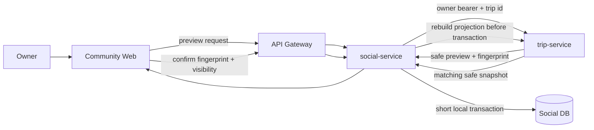

# Architecture

## Decision

Keep the existing services. Detailed sharing crosses the Trip/Social boundary through a deliberate `PublicTripSnapshot`, never through canonical trip entities.

- `trip-service`: owns the private trip, ownership checks, publication revision and deterministic public projection.
- `social-service`: owns the Community post, visibility, immutable snapshot versions, summary projection, reactions, comments and later report/follow/save data.
- `user-service`: owns profiles; Community must use an email-free public author projection.
- `place-service`: owns canonical place identity. V1 uses display labels only because Place uses opaque string IDs while Trip currently persists UUIDs and no public/private POI classification exists.
- API Gateway: sole public ingress.
- Web: renders preview and published responses; it is not a privacy boundary.

No new microservice, Kafka flow, cross-service database access or cross-service JPA relationship is introduced.

## Share flow



`social-service` publicly orchestrates preview so the web has one Community publishing workflow. `trip-service` remains the authority for trip ownership and public projection.

## Read paths

```text
GET /api/social/posts
  -> post + PublicTripSummary only
  -> never reads snapshot JSON
  -> never calls Trip, Place or User per card

GET /api/social/trip-shares/{postId}
  -> authorize publication
  -> load current PublicTripSnapshot
  -> return detail timeline
```

Generic post detail returns a standard post or typed post summary. The web detects `TRIP_SHARE` and uses the typed detail endpoint for the public itinerary.

## Snapshot semantics

- Preview and final snapshot come from the same deterministic mapper and canonical serialization.
- Snapshot V1 is immutable. Refresh appends V2 and atomically changes the publication head pointer.
- Source edits do not live-sync; source deletion/archive does not automatically delete the Community publication.
- Viewer APIs never expose source-trip navigation. Owner-only management can retain the source reference.
- Feed summary columns always describe the published subset, not the private source trip.

## Frontend composition

```text
CommunityHubScreen
├── CommunityHero
├── CommunityComposer
│   ├── UpdateComposer
│   └── TripShareComposer
│       ├── OwnedTripPicker
│       ├── PublicTripPreview
│       ├── DisclosureNotice
│       └── VisibilitySelector
├── CommunityFeedToolbar
├── CommunityFeed
│   ├── StandardPostCard
│   └── TripSharePostCard
│       └── PublicTripSummaryCard
└── CommunityRail
    ├── CommunityGuidelinesCard
    └── SharingTipsCard

TripShareDetailView
├── TripShareHero
├── TripSummaryStats
├── PublicItineraryTimeline
├── PostActions
└── CommentSection
```

Existing modal/deep-link routing, media gallery, reactions, comments/replies, deletion, link sharing and design-system primitives are reused. Legacy `formatContentWithTrip()` creation, per-card `useUserProfile`, client map reconstruction and `/chat` as the canonical sharing workspace are retired.

## Route migration

- `/community` becomes the canonical composer entry.
- Existing trip-detail share actions open the Community Trip Share composer with the trip preselected.
- `/chat`, which currently mounts `TripSharingWorkspace`, redirects to `/community?composer=trip` during the compatibility window; navigation labels are updated.
- Existing `/community/posts/{postId}` and intercepted modal URLs remain stable.

## Phased rollout

### Phase A — containment

Patch readers/writers, scrub unsafe legacy JSON, enforce visibility and production configuration. Old shares become `SUMMARY_ONLY_REPUBLISH_REQUIRED`.

### Phase B — shell

Ship the supported `test.html` composition with standard creation, typed summary cards, server-side type filters and static rail guidance. No detailed legacy republish is implied yet.

### Phase C — detailed publication

Add snapshot table, preview/fingerprint, publish/republish, typed detail endpoint and timeline UI. V1 map remains absent pending the Place contract.

### Phase D — public readiness

Add minimum post reporting and audited moderator removal, then broadly enable detailed `PUBLIC` publication.

## Rejected alternatives

- Returning canonical Trip/Day/Item DTOs directly: leaks private/internal state and couples services.
- Storing the detailed snapshot in every feed response: creates unbounded payloads.
- Client-authored snapshot JSON or legacy `TRIP_METADATA`: cannot prove ownership or integrity.
- Live trip hydration on reads: adds N+1, latency and availability coupling.
- Automatic migration of old raw JSON into V1: owners never previewed or approved that public contract.
- Creating new Follow/Weather/Discovery services merely to fill the prototype rail.
