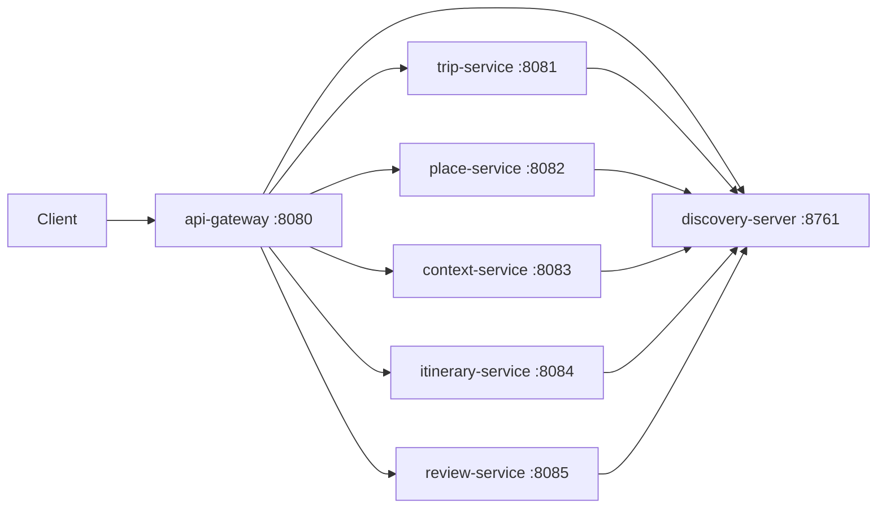

# Architecture

## Affected Services

- API Gateway: `services/api-gateway`, standardized as `api-gateway`.
- Discovery Server: `services/discovery-server`, completed as a working Eureka server.
- Trip Service: `services/trip-service`, standardized as `trip-service`.
- Place Service: `services/place-service`, standardized as `place-service`.
- Context Service: `services/context-service`, standardized as `context-service`.
- Itinerary Service: `services/itinerary-service`, standardized as `itinerary-service`.
- Review Service: `services/review-service`, standardized as `review-service`.

## Service Ownership

Discovery server owns service registration metadata only. API Gateway owns public ingress routing. Domain services keep their current ownership and do not gain cross-service persistence dependencies.

## Flow

## Port Convention

| Component | Application Name | Local Port |
| --- | --- | --- |
| API Gateway | `api-gateway` | `8080` |
| Discovery Server | `discovery-server` | `8761` |
| Trip Service | `trip-service` | `8081` |
| Place Service | `place-service` | `8082` |
| Context Service | `context-service` | `8083` |
| Itinerary Service | `itinerary-service` | `8084` |
| Review Service | `review-service` | `8085` |
| identity-service | `identity-service` | `8091` reserved |
| user-service | `user-service` | `8092` reserved |
| notification-service | `notification-service` | `8093` reserved |
| ai-service | `ai-service` | `8094` reserved |

## Sync Communication

Gateway routes incoming HTTP requests to registered service IDs through Spring Cloud Gateway discovery/load-balancer URIs. Domain services should not call each other as part of this setup.

## Async Events

No Kafka events are introduced by this setup.

## Rejected Alternatives

- Keep PascalCase service names: rejected because architecture docs and service-boundary conventions use kebab-case.
- Hardcode Gateway routes to host ports only: rejected because Eureka is an expected platform component and should be used for discovery.
- Create missing planned services now: rejected because they need separate feature plans.

## Related

- [TripSense Architecture](../../architecture/tripsense-architecture.md)
- [Service Boundaries](../../architecture/service-boundaries.md)
