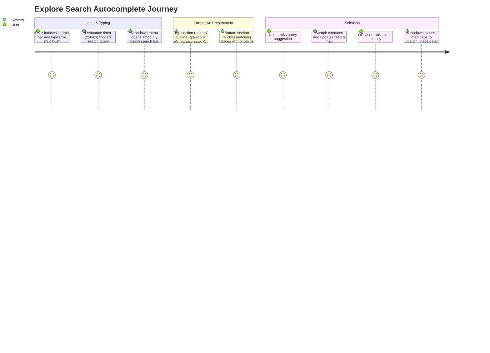

# Explore Search Autocomplete Dropdown — Specification & Implementation Plan

`STATUS: DONE`

- **Owner Service**: `apps/web/tripsense`
- **Affected Components**: `apps/web/tripsense/src/features/places/components/explore-feed-header.tsx`, `apps/web/tripsense/src/features/places/components/place-discovery-view.tsx`, `apps/web/tripsense/src/features/places/services/places-api.ts`
- **Downstream Services**: `services/place-service` (`/api/places/search`, `/api/places/autocomplete`)
- **Created Date**: 2026-09-28
- **Target PR Boundaries**: [Phase 1 (Search Dropdown UI & Query Suggestions), Phase 2 (Place Matching with Photo & Star Fallback), Phase 3 (Keyboard Navigation & Map Sync)]

---

## 1. Goal & Requirements

### 1.1 Problem Statement & User Goal
Currently, the search bar in the Explore Left Pane (`ExploreFeedHeader`) is a plain text input without auto-suggestions or matching places. When users type a keyword (such as "xe múc huế"), they must press Enter blindly to execute a full search.

In modern exploration interfaces (like Mindtrip / Google Maps / ZioMap), as the user types:
1. A clean, rounded dropdown menu appears beneath the pill search bar.
2. The dropdown displays two distinct sections:
   - **Query Suggestions**: Keyword-level suggestions with magnifying glass icon `🔍` (e.g., `"xe múc huế"`, `"xe múc in Hue"`).
   - **Place Results**: Direct place matches with:
     - Left thumbnail: If photo exists, render `w-10 h-10 rounded-lg object-cover`. If no photo data exists, render a dedicated **Star** placeholder icon box as requested (`"nếu mà không có data ảnh thì cứ để ảnh hình ngôi sao dạng chưa có"`).
     - Title: Bold place title with matching query terms highlighted.
     - Subtitle: District and City (e.g., `Huong Thuy, Huế`).
3. Clicking a query suggestion searches that term; clicking a place selects the card, flies map to the pin, and previews details.

### 1.2 User Flows & Journey



### 1.3 Scope Boundaries

- **In-Scope**:
  - Update `ExploreFeedHeader` to render the floating autocomplete dropdown beneath the pill search bar.
  - Implement 250ms debounced search using existing `searchPlaces({ q, lat, lng, limit: 5, signal })` to retrieve places with actual photo data (`primaryPhoto` and `photos`).
  - Generate instant query suggestions:
    - `🔍 [query]`
    - `🔍 [query] in [DestinationName]` (localized to active destination, e.g. `Hue` / `Đà Nẵng` / `Hội An`).
  - Render place rows:
    - Place with photo: Next.js / HTML `Image` thumbnail `w-10 h-10 rounded-lg object-cover`.
    - Place without photo: Placeholder box `w-10 h-10 rounded-lg bg-amber-500/10 border border-amber-500/20` with a Star icon `★` (`Star className="h-5 w-5 fill-amber-400 text-amber-400"`).
    - Place title: `font-semibold text-sm line-clamp-1 text-foreground`.
    - Subtitle: `text-xs text-muted-foreground line-clamp-1` (e.g. `Huong Thuy, Huế`).
  - Keyboard navigation: `ArrowDown`, `ArrowUp`, `Enter`, `Escape`.
  - Click-outside dismiss and clear button `(x)` resetting suggestions.
  - Callback integration: `onSelectSuggestion(query)` and `onSelectPlace(place)`.

- **Out-of-Scope**:
  - Modifying backend MongoDB schema (existing `place-service` endpoints already return all necessary fields).
  - Modifying global header or chat drawers.

### 1.4 Acceptance Criteria

- [x] **AC-1 (Dropdown Trigger & Dismiss)**: Typing $\ge 2$ characters displays the dropdown within 250ms. Clicking outside or pressing Escape closes the dropdown.
- [x] **AC-2 (Query Suggestions Section)**: Top section displays keyword suggestions with `Search` icon (`🔍 [query]`, `🔍 [query] in [Destination]`). Clicking replaces input and submits search.
- [x] **AC-3 (Place Results with Photo & Star Fallback)**: Matching places display below. If photo is present, thumbnail renders correctly. If photo is absent, a Star placeholder icon renders cleanly.
- [x] **AC-4 (Selection Integration)**: Clicking a place selects that place in `PlaceDiscoveryView`, centers map, and opens detail drawer.
- [x] **AC-5 (Keyboard Navigation)**: Users can navigate suggestions using Arrow keys and select with Enter.
- [x] **AC-6 (Zero Console / API Regressions)**: Preserves existing `searchPlaces` debouncing and viewport sync without memory leaks.

---

## 2. Architecture & How Search / ZioMap Works

### 2.1 ZioMap & Search Workflow in TripSense

```text
[Browser / ExploreFeedHeader]
         |
         | 1. Typing (debounced 250ms): GET /api/places/search?q=...&lat=...&lng=...&limit=5
         v
[Next.js API Gateway Proxy (:8080)]
         |
         | 2. Routes to place-service
         v
[PlaceSearchServiceImpl (place-service)]
    |--> 3. Checks Redis Cache (hit -> return immediately)
    |--> 4. Miss -> Calls ZioMapProvider (REST to https://ziomap-api.socibi.com)
    |         - /api/place/text-search (query, location, radius, languageCode=vi)
    |         - Fetches name, address, location, ratings, photo references
    |--> 5. Enriches photo URLs (ZioMap photo endpoint)
    |--> 6. Persists to MongoDB + caches in Redis
    v
[Return PlaceDto[] to Frontend]
    - id, name, location, address, district, city, rating, photos, primaryPhoto
```

### 2.2 Why `searchPlaces` vs `getAutocomplete`?
- **ZioMap Autocomplete (`/api/place/autocomplete`)**: Only returns textual predictions (`description`, `mainText`, `secondaryText`) without photo URLs.
- **ZioMap Text Search (`/api/place/text-search` via `searchPlaces`)**: Returns full place objects with coordinates, ratings, and photo URLs (`primaryPhoto.url` and `photos[]`).
- **Optimal Strategy**: By calling `searchPlaces(query, currentDest.lat, currentDest.lng, limit: 5)`, the frontend gets both rich place metadata AND photo URLs to show the thumbnail, while easily falling back to the Star icon when `photos` is empty.

---

## 3. Component Design & Implementation Plan

### Phase 1: ExploreFeedHeader Search Dropdown UI
- [x] Added state in `ExploreFeedHeader`:
  - `placeSuggestions`: Array of matching places.
  - `isDropdownOpen`: boolean.
  - `selectedIndex`: number (-1 for none).
  - `isSearchingSuggestions`: boolean indicator.
- [x] Rendered Dropdown container below search input:
  - `absolute left-0 right-0 top-full mt-2 rounded-2xl border border-border bg-popover/95 backdrop-blur-md shadow-2xl p-1.5 z-50 animate-in fade-in-0 zoom-in-95`
- [x] Rendered Query Suggestion Items:
  - `🔍 [query]`
  - `🔍 [query] in [destinationName]`

### Phase 2: Place Results with Star Fallback & Highlighting
- [x] Rendered Place Items:
  - If `place.primaryPhoto?.url || place.photos?.[0]`:
    - `<Image src={url} alt={place.name} fill unoptimized sizes="40px" className="object-cover" />` inside `w-10 h-10 rounded-lg overflow-hidden`.
  - If no photo:
    - `<div className="w-10 h-10 rounded-lg bg-amber-500/10 dark:bg-amber-500/20 border border-amber-500/20 flex items-center justify-center shrink-0"><Star className="h-5 w-5 fill-amber-400 text-amber-400" /></div>`
  - Name: `HighlightedText` with matching query terms in `font-bold` and remainder in `font-normal`.
  - Location: `text-xs text-muted-foreground truncate` (`[place.district, place.city].filter(Boolean).join(", ")`).

### Phase 3: Selection Handlers & Discovery View Sync
- [x] Connected `onSelectPlace` in `PlaceDiscoveryView`:
  - When user clicks a place from the dropdown:
    - Sets search query to place name.
    - Closes dropdown.
    - Calls `handleAddAndSelectPlace(place)` and `handleOpenDetailsForPlace(place)`.
- [x] Connected `onSelectQuerySuggestion`:
  - Sets search query to selected text.
  - Closes dropdown.
  - Triggers `executeSearch(query)`.
- [x] Keyboard navigation:
  - ArrowDown / ArrowUp keys highlight item in list.
  - Enter key selects highlighted item.
  - Escape closes dropdown.

---

## 4. Human Approval Gate & Completion

```text
STATUS: DONE
```
Implementation complete and verified with TypeScript 0 errors, Vitest 22/22 tests passing, and i18n parity check passed.
