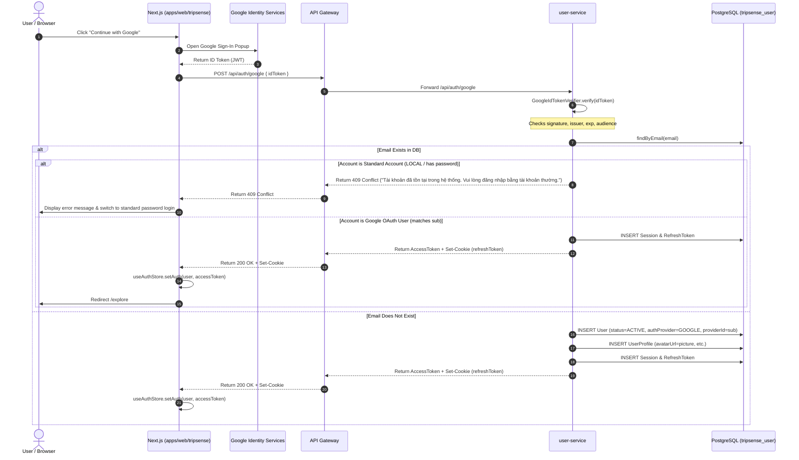

# Architecture: Google OAuth Login

## Component Overview

Google OAuth uses the **ID Token Verification / OIDC Exchange** pattern between Next.js (client) and `user-service` (backend).

## Service Boundaries & Guardrails

- **Zero Cross-Service Coupling**: `user-service` directly manages user credentials, sessions, and user profiles in its own database (`tripsense_user`).
- **Standard Routing**: Requests route via Spring Cloud Gateway (`/api/auth/**`) directly to `user-service`.
- **Stateless Tokens**: The returned Access Token is signed by `user-service`'s internal JWT secret and used across downstream services (e.g. `trip-service`, `social-service`) via HTTP `Authorization: Bearer <token>`.
