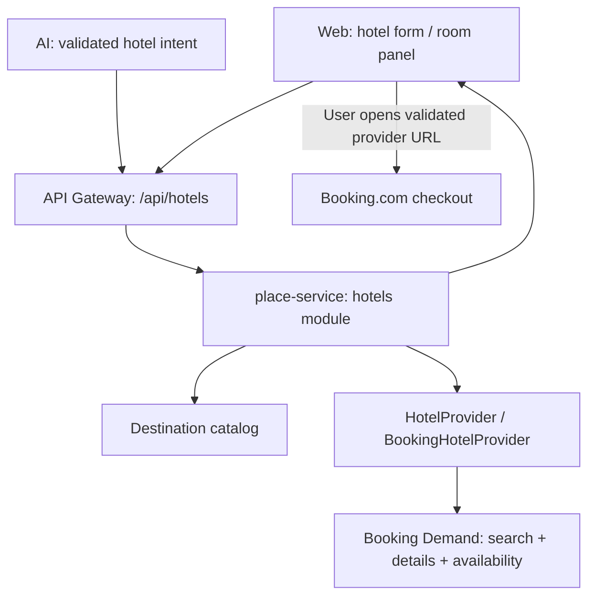

# Hotel Availability & OTA Redirect — Specification & Implementation Plan

`STATUS: SUPERSEDED`

2026-09-28: Current direction is first-party allocated inventory and [Partner onboarding with business-specific approval](./partner-onboarding-and-business-approval.md). This OTA redirect proposal is retained for future reference and is not awaiting implementation approval.

- **Owner Service**: `services/place-service` — module `hotels` mới, dùng hạ tầng service hiện có.
- **Affected Components**: `services/place-service`, `services/api-gateway`, `services/ai-service`, `apps/web/tripsense`.
- **Created Date**: 2026-09-27.
- **Nguồn yêu cầu**: brief “User chọn địa điểm + ngày check-in/check-out + số người → chỉ hiển thị khách sạn còn phòng → redirect OTA”.
- **Phạm vi tài liệu**: kế hoạch đề xuất; chưa triển khai application code, chưa xác minh quyền truy cập tài khoản Booking.com.
- **Related**: [Architecture](../architecture/tripsense-architecture.md), [Service boundaries](../architecture/service-boundaries.md), [Workflow](../workflows/multi-agent-feature-workflow.md), [Live activity](./live-ai-agent-activity-stream.md), [Adaptive chat](./adaptive-ai-travel-chat-redesign.md), [Evidence ranking](./evidence-aware-recommendation-ranking.md).

## 1. Goal & Requirements

### 1.1 Mục tiêu và hành trình

Người dùng tìm được khách sạn có sản phẩm phù hợp với ngày lưu trú và số khách, xem giá có nguồn, kiểm tra phòng/rate mới nhất, rồi hoàn tất đặt phòng trên Booking.com.

1. Mở trang `/hotels` hoặc nhận lời mời tìm khách sạn trong AI chat.
2. Chọn điểm đến được hỗ trợ, check-in/check-out, số người lớn, số phòng và phân bổ người vào phòng; xác nhận quốc gia người đặt.
3. Bấm tìm kiếm. Backend gọi Booking search, ghép thông tin mô tả theo đúng provider ID, trả tối đa 20 khách sạn mỗi trang.
4. Card hiển thị tên, ảnh nếu có quyền sử dụng, địa chỉ, điểm đánh giá và thang điểm, giá cho toàn kỳ lưu trú/toàn bộ số phòng, thời điểm kiểm tra.
5. Bấm “Xem phòng”: chỉ lúc này gọi availability của khách sạn được chọn, hiển thị các lựa chọn đáp ứng cả nhóm khách.
6. Bấm “Xem ưu đãi trên Booking.com”: mở URL HTTPS do provider trả về và backend kiểm tra. Booking.com chịu trách nhiệm xác nhận phòng, giá cuối cùng, thanh toán và booking.

“Còn phòng” nghĩa là provider vừa trả sản phẩm phù hợp; không phải giữ chỗ hay bảo đảm còn phòng khi đến OTA. Không gọi availability cho cả danh sách khách sạn.

### 1.2 Phạm vi MVP đề xuất

| In scope | Out of scope |
| --- | --- |
| Một provider Booking.com Demand API, abstraction `HotelProvider` | Expedia/Agoda/Amadeus, so sánh đa OTA, scraping |
| Tìm kiếm có ngày, xem phòng/rate, redirect website | Tạo/hủy/sửa booking, payment, credit card, webhook booking |
| Người lớn; 1–4 phòng, 1–16 người lớn, phân bổ rõ ràng | Trẻ em/infant, phân bổ gia đình phức tạp; không âm thầm coi trẻ em là người lớn |
| Catalog điểm đến khởi đầu: Đà Nẵng, Hà Nội, TP.HCM sau khi đối chiếu provider IDs | Tự nhận mọi tên địa điểm/toàn cầu khi chưa có mapping |
| Trang hotel độc lập và một evidence tool trong AI chat | Tự ghi khách sạn/booking vào trip; sửa cấu trúc itinerary hoặc trip budget |
| Loading, empty, lỗi provider, hết phòng, đổi giá, pagination | Advanced filters, bản đồ hotel mới, theo dõi chuyển đổi/doanh thu affiliate |
| UI Việt/Anh, responsive, accessibility | Mobile native/deep-link scheme trong MVP |

Các giới hạn trên là **quyết định sản phẩm đề xuất của TripSense**, không được mô tả như giới hạn Booking API. Có thể sửa khi duyệt plan.

### 1.3 Acceptance criteria

- [ ] AC-1: Chỉ kết quả từ live search hợp lệ được hiển thị là đang có lựa chọn phòng; Place thường, web search, LLM và mock không tạo bằng chứng availability.
- [ ] AC-2: Không gửi request khi thiếu ngày, điểm đến chưa resolve, số khách/phòng không hợp lệ hoặc có trẻ em chưa được hỗ trợ.
- [ ] AC-3: Search và detail giữ nguyên ngày, phân bổ người/phòng, quốc gia người đặt, platform và currency; đổi bất kỳ giá trị nào phải kiểm tra lại.
- [ ] AC-4: Giá ghi rõ toàn kỳ lưu trú và toàn bộ số phòng của offer; phân biệt giá hiển thị, tổng có thể tính được, phí chưa xác định. Không gắn `/đêm` vào tổng giá.
- [ ] AC-5: Một trang kết quả gọi một search và tối đa một details batch; không fan-out availability. Detail chỉ gọi một khách sạn.
- [ ] AC-6: Detail xử lý hết phòng/đổi giá; không dùng giá search để giả làm giá detail, không giữ CTA cũ khi request mới lỗi.
- [ ] AC-7: Chỉ mở URL provider hợp lệ; giữ query attribution; không hứa chọn sẵn chính xác rate nếu provider chỉ trả link property.
- [ ] AC-8: AI chỉ kích hoạt tool khi đủ điều kiện, không tự suy diễn ngày/số khách/city ID hoặc báo đã đặt phòng.
- [ ] AC-9: Activity và artifact tương thích replay; reload chat không khôi phục giá/availability cũ thành dữ liệu live.
- [ ] AC-10: Provider timeout/quota lỗi có trạng thái riêng, không trả danh sách rỗng như thể đã xác minh không có phòng.
- [ ] AC-11: Không lộ API token, raw provider response, SQL/exception hoặc URL chứa credential trong UI/log; giới hạn chi phí tồn tại cả ở Gateway và service.
- [ ] AC-12: Provider bị tắt/chưa có credential hiển thị “Tìm phòng hiện chưa khả dụng”; không tự fallback sang demo inventory.

## 2. Architecture & Service Boundaries

### 2.1 Hiện trạng đã kiểm tra

| Thành phần | Hiện trạng / điểm tích hợp |
| --- | --- |
| Place service | Spring Boot/Java 21, MongoDB, Redis; `PlaceController` hiện dùng `/api/places`; `PlaceProvider` dành cho địa điểm, chưa có hotel availability adapter. |
| API Gateway | `GatewayRoutesConfig.java` khai báo route bằng Java, hiện chỉ có `/api/places/**` cho Place; có Redis rate limiter và trusted-proxy IP resolver. Không thấy JWT verification tập trung trong config đã kiểm tra; không mặc định coi route mới là đã được xác thực. |
| AI | `app/tools.py` có typed tools/provenance; `app/activities.py` và run event hiện hỗ trợ activity; chưa có hotel search tool. `app/mocks/hotels.json` không phải inventory production. |
| Web | `features/ai-chat/{types,artifact-renderer,agent-activity}.tsx/ts` và shared `apiClient` là điểm tích hợp; chưa có feature hotels. |
| Trip / recommendation | Không thay đổi persistence hoặc ranking trong MVP. Hotel provider ID không phải canonical Place ID. |

Một số link feature trong index hiện không có file tương ứng; kế hoạch này dựa vào source và các tài liệu liên quan còn tồn tại, không coi link thiếu là implementation evidence.

### 2.2 Quyết định ownership

Đặt `hotels` trong **place-service** vì service đã sở hữu location lookup và provider integration. Module có DTO, client, validators, error mapping và concurrency budget riêng; không đưa giá/phòng vào `Place`, `PlaceCacheService` hoặc `PlaceProvider` hiện tại. `hotel-service` trong brief là phương án tương lai, **chưa tồn tại trong repo**. Chỉ tách khi inventory/booking lifecycle, đội vận hành hoặc yêu cầu scale tạo ranh giới độc lập rõ ràng.



- Web public traffic và hotel tool mới của AI đi qua Gateway; cấu hình backend `HOTEL_GATEWAY_URL`, không cho model/client đặt base URL.
- Synchronous HTTP vì người dùng cần giá/phòng ngay. Không có Kafka topic hay event liên service mới.
- Không query chéo DB, không cross-service JPA; không ghi dữ liệu sang trip-service.
- Interface độc lập provider: `search(HotelSearchRequest) -> HotelSearchPage`, `getAvailability(providerHotelId, HotelStayRequest) -> HotelAvailability`. Adapter tự batch static details để trả DTO hoàn chỉnh.
- Chỉ `provider=BOOKING` được hỗ trợ. Việc thêm provider phải có contract tests riêng, không tự bật failover provider khác.

### 2.3 Xác minh provider và phiên bản

Các điểm đã kiểm tra trên tài liệu chính thức ngày 2026-09-27:

| Điểm xác minh | Hệ quả đối với plan |
| --- | --- |
| Demand API cần Managed Affiliate Partner, Partner Centre, API token và `X-Affiliate-Id`. [Prerequisites](https://developers.booking.com/demand/docs/getting-started/prerequisites) | Quyền sandbox/production và agreement là external dependency; chưa được xác minh trong phiên lập kế hoạch. |
| Search trả accommodation có sản phẩm phù hợp; IDs địa lý phải từ provider, booker country/platform ảnh hưởng kết quả. [Search guide](https://developers.booking.com/demand/docs/accommodations/search-for-available-properties) | Không dùng city ID minh họa trong brief làm seed thật, không lấy quốc gia điểm đến làm quốc gia người đặt. |
| Search, details và availability có vai trò khác nhau; redirect dùng URL provider. [v3.1 quick guide](https://developers.booking.com/demand/docs/accommodations/accommodation-v3.1-quick-guide) | Phải enrichment details; không giả định search luôn chứa tên/ảnh/địa chỉ. |
| Không cache giá/availability để tái sử dụng. [Migration FAQ](https://developers.booking.com/demand/docs/migration-guide/v3/migration-faqs) | No-store; đọc lại provider khi tìm lại/xem phòng. |
| v3.1 dùng `price.book`, `price.total`, `extra_charges`; v3.2 đổi cấu trúc sang `display`, `charges` và currency object. [v3.2 migration](https://developers.booking.com/demand/docs/migration-guide/v3.2/accommodations/search) | Không trộn DTO giữa phiên bản. |

**Baseline đề xuất: pin Booking Demand v3.1** để triển khai luồng đã mô tả trong brief, không tuyên bố đây là phiên bản mới nhất. Phase 0 phải xác nhận tài khoản còn được hỗ trợ phiên bản này và pin OpenAPI contract. Nếu chỉ được cấp v3.2, cập nhật mapping adapter và fixture trong spec trước implementation; public TripSense DTO giữ nguyên. Không tự nhận payload cả hai version theo phỏng đoán.

## 3. API & Event Contracts

### 3.1 REST contract

Giữ envelope hiện có của Place: `{success,data,error?,meta?}`. Các hotel endpoint là **public read-only**, không cần đăng nhập; không nhận userId/tripId, không chứa tài nguyên riêng tư. Chat/run vẫn yêu cầu JWT và ownership hiện có. Gateway route mới `/api/hotels/** -> lb://place-service`, không rewrite prefix.

| Method | Gateway path = service path | Input / output |
| --- | --- | --- |
| GET | `/api/hotels/destinations?q=Da&locale=vi` | Catalog search nội bộ, max 10 mục; không gọi provider theo mỗi keystroke. |
| POST | `/api/hotels/search` | `HotelSearchRequest` → `HotelSearchPage`. |
| POST | `/api/hotels/BOOKING/{providerHotelId}/availability` | `HotelStayRequest` → `HotelAvailability`. |

POST cho search/availability giúp gửi guest allocation có cấu trúc và tránh đưa chi tiết chuyến đi vào access-log query string. Không tạo `/redirect` endpoint MVP; CTA dùng URL đã validate từ availability response.

```ts
type HotelStayRequest = {
  checkIn: string;                   // YYYY-MM-DD, ngày tại destination
  checkOut: string;
  adults: number;
  rooms: number;
  allocation: Array<{ adults: number }>;
  bookerCountry: string;             // ISO alpha-2 lowercase, user xác nhận
  platform: "desktop" | "mobile" | "tablet";
  currency: "VND" | "USD";
  locale: "vi" | "en";
};
type HotelSearchRequest = HotelStayRequest & {
  destinationId: string;             // opaque TripSense destination key
  pageSize: 20;
  cursor?: string;                   // opaque signed continuation, max 8 KiB
};
type Money = { amount: string; currency: string }; // decimal string, Java BigDecimal
type HotelPrice = {
  display: Money;
  total: Money | null;
  basis: "ENTIRE_STAY_ALL_REQUESTED_ROOMS";
  includedCharges: Array<{ label: string; amount: Money | null }>;
  excludedCharges: Array<{ label: string; amount: Money | null }>;
  conditionalCharges: Array<{ label: string; amount: Money | null }>;
  hasUnquantifiedCharges: boolean;
};
type HotelSummary = {
  provider: "BOOKING";
  providerHotelId: string;            // provider numeric ID serialized as string
  name: string;
  imageUrl: string | null;
  address: string | null;
  coordinates: { latitude: number; longitude: number } | null;
  stars: number | null;              // không nhầm stars với guest review score
  reviewScore: { value: number; scale: number; count: number | null } | null;
  price: HotelPrice;
  checkedAt: string;                 // UTC ISO instant
};
type HotelSearchPage = {
  criteria: HotelSearchRequest;      // normalized, không echo cursor
  status: "AVAILABLE" | "NO_AVAILABILITY";
  hotels: HotelSummary[];
  nextCursor: string | null;
  partialDetails: boolean;
};
type HotelRoomOption = {
  optionId: string;                  // opaque key của lựa chọn cho cả nhóm
  components: Array<{
    productId: string;
    roomId: string;
    roomName: string | null;
    quantity: number;
    adultsPerRoom: number;
    mealPlan: string | null;
    cancellation: {
      type: "FREE_UNTIL" | "NON_REFUNDABLE" | "OTHER" | "UNKNOWN";
      freeUntil: string | null;
      summary: string | null;
    };
  }>;
  price: HotelPrice;
};
type HotelAvailability = {
  provider: "BOOKING";
  providerHotelId: string;
  criteria: HotelStayRequest;
  checkedAt: string;
  status: "AVAILABLE" | "NO_AVAILABILITY";
  options: HotelRoomOption[];
  bookingUrl: string | null;
  redirectScope: "PROPERTY";         // không hứa exact room/rate preselection
};
```

Ví dụ request (không phải provider payload):

```json
{
  "destinationId": "vn-da-nang",
  "checkIn": "2026-10-20",
  "checkOut": "2026-10-22",
  "adults": 2,
  "rooms": 1,
  "allocation": [{ "adults": 2 }],
  "bookerCountry": "vn",
  "platform": "desktop",
  "currency": "VND",
  "locale": "vi",
  "pageSize": 20
}
```

Destination response: `{success:true,data:[{id,name,countryCode,timeZone}]}`. `q` dài 2–100, locale vi/en; catalog chứa alias không dấu để resolve. Backend từ chối ID không được bật thay vì chọn thành phố gần giống.

### 3.2 Validation và provider mapping

- Check-in không trước ngày hiện tại ở timezone điểm đến; lưu trú 1–30 đêm, check-in trong 365 ngày tới. Đây là app limits; Phase 0 kiểm tra chúng không vượt quyền/giới hạn provider.
- `adults` 1–16; `rooms` 1–4; mỗi allocation ít nhất 1 adult, số allocation bằng rooms, tổng bằng adults. Không tự chia phòng khác input. Từ chối unknown fields, children và giá trị ngoài miền.
- `providerHotelId` chỉ chuỗi số dương, max 20 ký tự; không chấp nhận URL/path. Destination ID là allowlist server-owned.
- Country người đặt bắt buộc, không mặc định từ tiếng Việt hoặc destination. Platform lấy từ UI/device và không được AI tự đổi để tìm giá khuyến mại.
- Adapter map `checkIn -> checkin`, `checkOut -> checkout`, `adults/rooms/allocation -> guests`, `bookerCountry/platform -> booker`, `destinationId -> city` từ catalog đã xác minh. Currency/locale chỉ gửi khi contract provider hỗ trợ; trả currency thực tế, không gắn nhãn VND cho số tiền khác currency.
- Search yêu cầu extras cần cho sản phẩm/phí; details batch theo danh sách IDs search trả về, join bằng ID tuyệt đối, không ghép theo thứ tự hoặc tên.
- Availability sử dụng provider-supported recommendation/bundle cho **toàn bộ allocation**. Không hiển thị một product rẻ nhất là đủ cho nhiều phòng, không tự nhân giá một phòng để tạo offer.
- Contract fixtures Phase 0 phải xác minh quantity/bundle và giá cho 2 phòng khác loại. Nếu không chứng minh được mapping, không được phát hành multi-room bằng phép tính đoán; thu hẹp scope cần cập nhật plan.
- Giá v3.1: map giá display từ `book`, tổng từ `total`, giữ phân loại included/excluded/conditional; không cộng phí included lần nữa. Provider missing/unknown fee không đổi thành zero. [Pricing troubleshooting](https://developers.booking.com/demand/docs/accommodations/pricing-troubleshooting)
- `checkedAt` là lúc hoàn tất lần gọi tương ứng, không phải thời hạn bảo đảm. UI luôn ghi giá có thể đổi trên provider; optional giá trung bình/đêm chỉ là phụ, chia số đêm và ghi rõ cho toàn bộ phòng.
- Missing ảnh/địa chỉ/rating dùng placeholder/ẩn field; thiếu giá hợp lệ phải loại offer. Nếu dữ liệu lỗi khiến không xác định được kết quả, trả `UPSTREAM_INVALID_RESPONSE`, không giả báo `NO_AVAILABILITY`.

### 3.3 Pagination và lỗi

Cursor HMAC có version, provider next-page token, hash toàn bộ criteria, expiry 15 phút; không chứa giá/phòng. Lần tiếp theo phải có cùng criteria; kiểm tra signature/expiry trước khi gọi provider. TTL này là app policy và không được dài hơn provider token validity. Không log hoặc dùng token như URL. Nếu token vượt budget, trả lỗi an toàn thay vì cắt token.

| HTTP | Code | Hành vi |
| --- | --- | --- |
| 200 | status `NO_AVAILABILITY` | Chỉ khi response provider thành công và không có sản phẩm phù hợp; options/hotels rỗng, bookingUrl null. |
| 400 | `INVALID_HOTEL_SEARCH`, `INVALID_CURSOR`, `CURSOR_EXPIRED` | Inline error hoặc đề nghị tìm lại. |
| 404 | `DESTINATION_NOT_SUPPORTED`, `HOTEL_NOT_FOUND` | Provider xác định không có ID/ID không nằm catalog; không suy từ timeout. |
| 429 | `HOTEL_RATE_LIMITED` | Có Retry-After, không auto retry vòng lặp. |
| 502 | `HOTEL_UPSTREAM_INVALID_RESPONSE` | Dữ liệu không thể normalize an toàn. |
| 503 | `HOTEL_SEARCH_UNAVAILABLE` | Disabled, thiếu credential, provider auth/quota/circuit open; giấu chi tiết cấu hình. |
| 504 | `HOTEL_PROVIDER_TIMEOUT` | Người dùng có thể thử lại. |

Lỗi dùng `{success:false,error:{code,message},meta:{requestId}}`, safe message server-owned. `Cache-Control: no-store` cho search/availability cả tại service và Gateway. Response provider 401/403 không biến thành yêu cầu user đăng nhập TripSense.

### 3.4 AI tool và SSE

- Tool mới `search_hotels` nhận đúng `HotelSearchRequest` không cursor; tối đa một search cho mỗi bộ criteria và tối đa hai bộ criteria/run trong budget chung. Không tự paginate hoặc gọi availability cho mọi kết quả.
- Context resolver hỏi phần còn thiếu; không biến lịch itinerary thành check-out khi chưa có ý định lưu trú rõ ràng. Hotel intent cần live inventory được phân biệt với yêu cầu tìm POI loại HOTEL.
- Deterministic executor gọi Gateway, validate và normalize kết quả; LLM không tạo `providerHotelId`, price, booking URL hoặc trạng thái còn phòng.
- Tái sử dụng stage `SEARCH`, thêm kind `SEARCHING_HOTELS` vào backend/frontend allowlist; RUNNING/COMPLETED/FAILED từ lần gọi thật. Không xuất provider URL/arguments/credentials trong activity.
- Artifact mới `HOTEL_SEARCH_CONTEXT` có schemaVersion 1 và data `{searchId, criteria, checkedAt, state:"RECHECK_REQUIRED"}`. Đây là descriptor để khôi phục panel tìm khách sạn; không nhét hotel inventory vào `PLACE_LIST`, không tạo canonical Place ID giả.
- Giá, danh sách sản phẩm, booking URL và response thô **không vào persisted SSE, message JSON, tool audit payload hoặc LLM prose lưu lịch sử**. AI nhận metadata an toàn về việc kiểm tra; câu trả lời dùng template giới thiệu panel, không chép quote vào lịch sử.
- Bổ sung **transient SSE event** `hotel.results` trên stream run hiện có để chuyển kết quả live tới panel, không dùng hàm `publish()` đang persist mọi event. Payload: `{schemaVersion:1, deliveryId, runId, searchId, artifactId, artifactVersion, data:HotelSearchPage}`. Event này không có SSE `id`, không có durable `sequence`, không ghi `RunEvent`; queue chỉ phục vụ giao nhận của request đang chạy, không là cache để phục vụ search sau.
- Thứ tự backend: provider thành công → persist descriptor `artifact.upsert` → fan-out `hotel.results` cho subscriber đang kết nối → complete activity. Cùng `searchId`/artifactVersion liên kết hai event. LLM chỉ nhận metadata an toàn, giá và card lấy từ typed event; provider thất bại không có event kết quả live.
- Frontend có reducer riêng cho transient results, validate schema/run/search/version, dedupe deliveryId; không cập nhật `afterSequence` từ event này, không nhập giá vào persisted chat store. Khi hoàn tất run, giữ live panel trong memory của tab; khi đổi criteria hoặc disconnect/reload thì invalidates và hiện nút kiểm tra lại.
- Replay/reload, hoặc subscriber kết nối sau lúc kết quả đã phát, chỉ khôi phục descriptor và trạng thái `RECHECK_REQUIRED`. User bấm tìm lại qua hotel API; không tự bắn lại provider call. Không replay transient results hoặc biến descriptor thành bằng chứng đang còn phòng. Đây là trade-off chấp nhận để không lưu inventory.
- Repo hiện có `subscribers`/queue trong `main.py`, nhưng durable stream loop giả định mọi event có sequence. Phase 3 phải thêm nhánh serialization transient và test reconnect/completion ordering; không coi đây là khả năng đã có. Subscriber queue đầy thì bỏ event transient, giữ descriptor để user refresh; không làm run treo hoặc ghi quote xuống DB.
- Kafka: không có. Durable SSE envelope, sequence/version và owner checks giữ nguyên theo [Live activity](./live-ai-agent-activity-stream.md); transient event là bổ sung contract riêng và không tham gia replay.

## 4. Data Model & Migrations

### 4.1 Persistence tối thiểu

**Không tạo bảng SQL, collection Mongo, Flyway migration hoặc booking record trong MVP.** Place hiện dùng MongoDB; không thêm PostgreSQL chỉ để lưu hotel offers.

| Dữ liệu | Owner / nơi lưu | Quy tắc |
| --- | --- | --- |
| Destination catalog | Place module, file cấu hình server version-controlled | `{id, names:{vi,en}, aliases[], countryCode, timeZone, bookingCityId, verifiedAt}`; unique id và provider city ID; seed sau khi kiểm chứng `/common/locations/...` của version đã pin. |
| Token và affiliate credential | Runtime secrets của Place | Không commit vào catalog, env example, frontend hay AI. |
| Giá, availability, URL booking | Bộ nhớ request và UI đang mở | Không Redis/Mongo/localStorage, service worker hoặc persisted React Query cache. |
| Rate-limit counters | Redis key namespace riêng của Gateway | TTL theo limiter; không chứa body, giá hoặc token. |
| Chat artifact | AI-owned Message/RunEvent JSON hiện có | Chỉ criteria descriptor + thời điểm; không quote/inventory. |

Static details cũng không cache trong baseline để giảm yêu cầu retention chưa được xác minh. Sau này chỉ cache metadata/ảnh khi partner terms cho phép và có TTL rõ ràng; không dùng cache Place chung.

### 4.2 Rollback

Tắt `HOTEL_SEARCH_ENABLED`, ẩn UI entry và tool capability; giữ schema reader tương thích artifact cũ. Không xóa dữ liệu Place/Trip, không cần rollback database. Catalog cũ có thể rollback bằng version config. Dọn memory state trên navigation/logout; không cần job xóa quote vì không có quote persistence.

## 5. Security, Abuse & UX

### 5.1 Trust boundaries

- Hotel data public: không có IDOR theo user trong endpoint hotel. Mọi endpoint chat/run vẫn kiểm tra owner; foreign/missing IDs không lộ dữ liệu khác người.
- Backend base URL cố định theo environment và API version; TLS verification bật; không follow arbitrary redirect. Client/model không được cung cấp endpoint hoặc provider credential.
- `bookingUrl`: parser URL chuẩn, chỉ HTTPS, hostname exact `www.booking.com`/`booking.com`, không userinfo, port lạ, fragment/control characters. Các host khác chỉ thêm sau khi có bằng chứng provider và review allowlist. Không kiểm tra bằng chuỗi `contains("booking.com")`.
- Giữ nguyên query attribution của URL hợp lệ; không tự chế affiliate ID/link. Affiliate query do provider trả là phần link công khai; không xuất auth token/header hoặc log toàn bộ link.
- Ảnh cũng là untrusted URL: HTTPS + CDN allowlist xác minh Phase 0; không proxy host tùy ý, không dùng đường approved-photo của Place khi chưa có mapping/quyền phù hợp. Không có ảnh hợp lệ thì placeholder.
- Không render provider HTML; length-bound các text DTO. Không gửi tên/email/passport/payment data sang Booking cho search.
- Service chỉ accessible qua mạng nội bộ/Gateway, không mở port internet. Gateway limiter bật mặc định riêng cho hotel; Redis lỗi fail closed cho tính năng này.
- App limits đề xuất: 1 request/giây/IP, burst 5; service bulkhead 10 provider requests đồng thời/instance, circuit breaker sau 5 lỗi liên tiếp, half-open sau 30 giây. Tổng replica quota phải cấu hình theo hạn mức partner trước production; IP limiter không thay thế global quota.
- Provider deadline: connect 2 giây, mỗi operation tối đa 6 giây, search + details tổng 10 giây, Gateway 12 giây. Không auto retry ở MVP để tránh nhân chi phí; tôn trọng Retry-After.
- Logs chỉ requestId, operation, elapsed, normalized error code và số item; không request/response body, Authorization, affiliate header, cursor, raw exception hay booking URL. Metrics không gắn hotel ID/IP làm high-cardinality label.

### 5.2 Web behavior

- Module dự kiến `src/features/hotels`, route `src/app/(main)/hotels/page.tsx`; dùng shared form/card/dialog/theme tokens và control sizing hiện tại.
- Form có destination combobox, dates, adults/rooms/allocation, booker country; currency VND mặc định nhưng hiển thị currency thực tế provider trả. User có thể đổi USD.
- Khi form criteria đổi: hủy request cũ bằng AbortController, increment request generation, bỏ response sai generation, xóa detail/CTA cũ ngay. Pagination cũng bind criteria hash.
- Đổi khách sạn đóng detail cũ; mỗi lần mở detail kiểm tra availability mới. Loading dùng skeleton/inline; 0 kết quả dùng EmptyState; lỗi có retry inline, không toast cho từng fetch.
- Card: “Từ X cho Y đêm · Z phòng”, thuế/phí rõ ràng, “Kiểm tra lúc …”; không “chỉ còn 1 phòng” nếu chỉ biết một product còn available.
- CTA chỉ enabled khi availability thành công, có full-party option và URL hợp lệ. Sau 2 phút trong panel, chuyển “Kiểm tra lại giá” và yêu cầu refresh trước khi mở link; đây là UX freshness policy, không phải reservation TTL.
- Link dùng `target="_blank" rel="noopener noreferrer"`; giải thích ngắn “Hoàn tất đặt phòng trên Booking.com”; không báo booking thành công khi user quay lại.
- Keyboard navigation, label input, focus trap/return của dialog, aria-live trạng thái tải; không chỉ dùng màu cho lỗi.
- i18n đặt `places.hotels.*`, thao tác chung dùng `common.*`, chat dùng `aiPlanner.*`; parity en/vi và alphabetic sort. Mọi REST qua `apiClient`, safe errors qua sanitizer.
- Tuân thủ [i18n](../I18N_STANDARDS.md), [Error handling](../ERROR_HANDLING_AND_LOGGING_STANDARDS.md), [UX feedback](../UX_FEEDBACK_GUIDELINES.md); đọc web AGENTS và skill frontend tương ứng trước implementation.

## 6. Devil's Advocate & Trade-offs

| Rủi ro / phương án | Quyết định |
| --- | --- |
| Chưa có Booking partnership | Phase 0 là gate dữ liệu thật. Tests fixture được phép trong test suite; không coi sandbox/mock là hotel còn phòng production. Không thay bằng scraping. |
| New hotel-service giúp ranh giới rõ | Hoãn deployment/service mới; module riêng đủ cho MVP read-only và cho phép extraction sau. |
| 30 detail requests gây quota spike | Batch details cho một page, availability chỉ cho hotel user mở. |
| Multi-room sum sai, cancellation khác nhau | Dùng full-party provider recommendation; policy giữ riêng mỗi component. Không gộp thành “miễn phí hủy” nếu chỉ một phòng miễn phí. |
| Search/details bị lệch hoặc details thiếu | Join ID, allow thiếu static fields; mất tên/giá hợp lệ phải loại item và ghi partial; toàn bộ unusable là lỗi upstream, không xác nhận hết phòng. |
| Giá đổi giữa search/detail/OTA | Detail là observation mới; replace nguyên offer, thông báo thay đổi; OTA quyết định cuối, không lock giá. |
| Offer cũ qua chat history | Chỉ persist criteria, user chủ động tìm lại; không lưu quote rồi gắn badge live khi reload. |
| Transient event mất khi disconnect hoặc khác worker | Descriptor replay vẫn tồn tại; UI yêu cầu refresh. Không hứa exactly-once delivery cho live quote. Giữ topology stream hiện có; scale-out fan-out là việc riêng, không thêm Redis inventory cache để che lỗi. |
| Demand inventory không phủ toàn Booking website | Không tuyên bố toàn bộ thị trường hoặc giá rẻ nhất. Không dùng website scraping làm acceptance oracle. |
| Public API bị lạm dụng | IP limit + provider quota + bulkhead; không dựa vào login để che giấu thiếu quota control. |
| List hotel bị đưa vào itinerary như Place | Loại khỏi Place artifact và trip commit; mapping canonical là increment sau. |

## 7. Phased Implementation Tasks & Verification

Tất cả phase dưới đây chỉ bắt đầu implementation sau khi plan được duyệt.

| Phase / PR | Tasks | Exit criteria |
| --- | --- | --- |
| 0 — Provider feasibility | Xác nhận partner access, v3.1 entitlement, sandbox/prod endpoints, quota, display/image rules; pin OpenAPI; lấy ID 3 destination; capture fixture đã loại secret cho search/details/availability và multi-room. | Có adapter contract thực chứng; nếu thiếu access ghi BLOCKED external integration, không claim chạy thật. |
| 1 — Backend + Gateway | Tạo `hotels` module/DTO/validation/provider abstraction; Booking adapter; destination catalog; no-store/error mapper; gateway Java route/limiter, service quota/bulkhead/deadline/config. | Contract/unit/integration tests pass, disabled/secret-missing fail closed; request tới gateway chạy đúng mapping. |
| 2 — Web hotel flow | Trang/form/cards, pagination, room panel, CTA, request generation/cancellation, safe errors, i18n/accessibility. | Flow search → detail → provider mở được với sandbox; empty/error/races không dùng offer cũ. |
| 3 — AI evidence integration | Typed `search_hotels`, clarification, criteria-only durable artifact, transient `hotel.results` publisher/serializer/reducer, activity/budget và reload behavior theo §3.4. | Chat đủ context tự tìm và render live cards; thiếu context phải hỏi; history không chứa inventory; missed delivery/reload yêu cầu refresh, không giả replay quote. |
| 4 — Release verification | Cross-service tests, regression Place/chat, production configuration checks, smoke search/detail và kiểm tra link không tạo booking, observability + rollback rehearsal. | Có evidence dữ liệu thật với tài khoản được cấp, hoặc ghi rõ release chưa đủ điều kiện; feature flag bật theo môi trường. |

### 7.1 Test matrix

| Nhóm | Ca bắt buộc |
| --- | --- |
| Validation | Leap day, local midnight, checkout <= checkin, >30 đêm, >365 ngày, allocation mismatch, children bị reject, country/platform/ID sai; không gọi provider khi invalid. |
| Adapter | Version-pinned fixtures; search → batch details ID join; sparse photos/ratings; fractional amounts; VND/USD; unknown fees; included phí không bị cộng hai lần. |
| Occupancy | 1 phòng/2 người; 2 phòng khác loại/rate/policy; thiếu đủ số phòng không tạo offer; không lấy giá single-product làm tổng. |
| Inventory | Search có phòng/detail hết phòng; giá tăng/giảm; provider malformed/401/429/5xx/timeout; timeout không bị biến thành empty. |
| Security | Booking domain giả/subdomain suffix, HTTP, userinfo/port/control chars, SSRF image/base URL; log secret scan bằng sentinel token; forged/expired/cross-criteria cursor; forwarded-IP spoof; service quota không bị bypass bởi AI. |
| UI | A request chậm trả sau B, detail đổi khách sạn/ngày, đóng dialog, pagination reset, CTA hết freshness, unavailable CTA, decimal formatting, focus/keyboard và en/vi. |
| AI / persistence | Thiếu dates/guests phải clarify; không tự set country; tool không nhận URL; không claim availability trước live search; replay không trigger provider; Message/RunEvent/ToolCall không có quote/product/bookingUrl; không tạo Place ID/trip commit; transient không đổi durable sequence, duplicate/out-of-order/queue-full/late subscriber/disconnect đều an toàn. |
| Regression | Existing `/api/places/**`, PlaceProvider/cache, ai place artifacts/activity replay và trip handoff vẫn pass. |

### 7.2 Verification commands (sau implementation)

Chạy Java 21 và dependencies theo repo; commands PowerShell từ repo root trừ block có `Set-Location`. Những lệnh này là checklist tương lai, **chưa được chạy để xác minh feature chưa tồn tại**.

```powershell
services/place-service/mvnw.cmd -f services/place-service/pom.xml test
services/api-gateway/mvnw.cmd -f services/api-gateway/pom.xml test
```

```powershell
Set-Location services/ai-service
python -m pytest tests
```

```powershell
Set-Location apps/web/tripsense
npm run i18n:check
npm run type-check
npm test
npm run lint
npm run build
```

Manual smoke qua Gateway: chọn một destination thực đã xác minh, ngày tương lai/2 adults/1 room → có kết quả → mở detail → kiểm tra tổng, phí, URL attribution → mở Booking.com. Không tạo booking/payment. Lặp case 2 phòng và no-availability. Sandbox không chứng minh production inventory hay quyền launch.

## 8. Approval Decisions & External Dependencies

Các quyết định mặc định để duyệt cùng plan: module thuộc Place; Booking v3.1 pinned; public read-only + quota; người lớn/multi-room; 3 thành phố seed; không quote persistence; AI tự gọi tool khi đủ tiêu chí và chuyển live cards qua transient SSE; không trip persistence.

Điểm cần xác nhận trước release:

1. Tài khoản đã có Managed Affiliate access, sandbox và production entitlement chưa? Credential phải cấu hình backend, không gửi vào chat.
2. Version/quota và quyền hiển thị ảnh/static content nào được cấp? Chốt bằng Phase 0, không đoán từ tài liệu công khai.
3. Nếu cần hỗ trợ trẻ em/toàn cầu hoặc khôi phục nguyên quote qua reload ngay lần đầu, cần sửa phạm vi này trước implementation.

## Human Approval Gate

Theo [feature-planning skill](../../.agents/skills/feature-planning/SKILL.md): “Do not write or modify application code until the user explicitly says the equivalent of `Approved`, `Implement`, or `Proceed`.”

Phạm vi này đã được thay thế. Xem Partner plan để biết hướng hiện tại; không bắt đầu implementation từ đề xuất OTA cũ.

`STATUS: SUPERSEDED`
