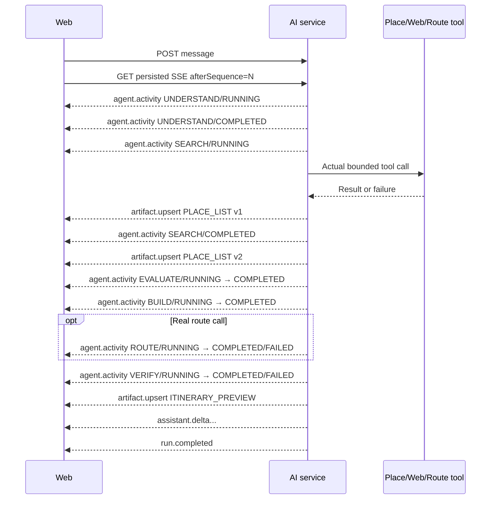

# Live AI Agent Activity Stream — Specification & Implementation Plan

`STATUS: DONE`

- **Owner Service**: `services/ai-service`
- **Affected Components**: `services/ai-service`, `apps/web/tripsense`
- **Created Date**: 2026-09-21
- **Related Feature**: [Adaptive AI Travel Chat Redesign](./adaptive-ai-travel-chat-redesign.md)
- **Target PR Boundaries**: backend event contract and lifecycle; frontend live activity/history; verification and compatibility cleanup

---

## 1. Goal and requirements

### 1.1 Problem

The current implementation emits replayable `agent.status` events with one display string. This proves that real backend stages can be streamed, but it cannot represent concurrent or sequential work items, completion/failure, a compact history, or stable updates after SSE replay.

TripSense should show a live work experience comparable in responsiveness to modern AI assistants while exposing only concise summaries of actions the system actually performed. It must never expose raw chain-of-thought, prompts, model reasoning, tokens, provider secrets, raw tool arguments, internal URLs, stack traces, or hidden security decisions.

### 1.2 User journey

1. The user sends a message and immediately sees an active “Understanding…” activity.
2. When backend retrieval begins, the current activity completes and a real search activity starts.
3. As grounded place evidence becomes available, `PLACE_LIST` artifacts appear immediately and are updated while further bounded research continues.
4. Search completion reports a factual aggregate such as “Found 12 relevant places” only after the tool result is normalized.
5. Evaluation, itinerary build, route and verification activities reflect the actual code paths entered.
6. The current activity is visually prominent. Completed activities collapse into a compact, expandable history.
7. `ITINERARY_PREVIEW` appears after build/validation, followed by the final streamed natural-language response.
8. Disconnect/reconnect replays activities and artifacts without duplicates or state regression.
9. Reloading a completed conversation restores the compact activity history attached to the assistant message.

### 1.3 In scope

- Add persisted SSE event type `agent.activity`.
- Add a typed backend/frontend `AgentActivity` contract.
- Derive every activity from an actual backend transition or result.
- Maintain stable activity IDs and explicit lifecycle states.
- Persist final sanitized activity history in assistant message JSON.
- Progressively upsert place artifacts before final response.
- Render one active activity and collapsed completed/failed history.
- Preserve `agent.status` temporarily for backward compatibility.
- Add replay, deduplication, accessibility and information-disclosure tests.

### 1.4 Out of scope

- Raw chain-of-thought or model scratchpads.
- Model-generated progress narration.
- Timer-based, percentage-based or simulated progress.
- New microservices, Kafka topics or websocket infrastructure.
- Changes to canonical place identity, provider selection, tool budgets, itinerary validation or trip commit semantics.
- Storing raw tool inputs/results in activity history.

### 1.5 Acceptance criteria

- [x] `agent.activity` uses the existing persisted SSE envelope and monotonically increasing sequence.
- [x] Every `RUNNING` activity corresponds to code entering real work; every `COMPLETED` activity corresponds to a completed action/result.
- [x] A stable `activityId` identifies updates to the same activity across replay.
- [x] Activity stages are restricted to `UNDERSTAND|SEARCH|EVALUATE|BUILD|ROUTE|VERIFY`.
- [x] Activity statuses are restricted to `RUNNING|COMPLETED|FAILED|SKIPPED`.
- [x] Labels/summaries are server-authored from allowlisted templates and sanitized structured values.
- [x] No prompt, chain-of-thought, raw tool arguments, secret, token count, internal URL or stack trace appears in an activity.
- [x] Place artifacts stream as soon as canonical evidence is available and later versions upsert without duplicate cards.
- [x] A route activity is emitted only when the configured real route adapter is called.
- [x] A search result count is emitted only after normalization and counts canonical relevant results, not raw provider rows.
- [x] State-only and direct-chat requests emit no fake search/build/route work.
- [x] SSE reconnect reconstructs identical current/history state and does not regress a completed activity to running.
- [x] Completed conversation reload restores its compact activity history.
- [x] Existing clients consuming `agent.status` continue to work during the compatibility window.
- [x] Canonical IDs, provenance, tool budgets, validation and explicit trip confirmation remain unchanged.

---

## 2. Architecture and service boundaries

### 2.1 Data flow



### 2.2 Ownership

| Component | Responsibility |
|---|---|
| `ai-service` | Creates activity IDs, applies lifecycle rules, renders safe labels/summaries, persists SSE events and final history. |
| Place/web/route adapters | Produce actual results/failures; they never author user-facing activity text. |
| Web app | Reduces events by activity ID, renders current/history, upserts artifacts, handles reconnect and accessibility. |
| API Gateway | Existing authenticated REST/SSE routing; no route change expected. |

No service boundary or database ownership changes. Synchronous tool calls remain justified by the interactive response. Kafka is unnecessary because run events already provide durable ordered streaming.

### 2.3 Invariants

1. Activity is telemetry for user-visible work, not a reasoning trace.
2. The backend is the only authority for activity state.
3. The frontend never invents stages while waiting.
4. An activity can transition `RUNNING → COMPLETED|FAILED|SKIPPED`; terminal activity states never return to `RUNNING`.
5. Replayed duplicate or older updates cannot overwrite newer activity state.
6. Artifact delivery remains independent from activity delivery; an artifact must not be delayed to make the activity display look smoother.

---

## 3. API and event contracts

### 3.1 Existing endpoints

No new public endpoint:

| Method | Path | Change |
|---|---|---|
| `POST` | `/api/ai/v1/conversations/{id}/messages` | Unchanged response. |
| `GET` | `/api/ai/v1/runs/{id}/stream?afterSequence=N` | Adds persisted `agent.activity` events. |
| `GET` | `/api/ai/v1/conversations/{id}/messages` | Adds optional `activities` to assistant messages. |

Authentication, owner scope and indistinguishable foreign/missing ID behavior remain unchanged.

### 3.2 Typed `AgentActivity`

```ts
type AgentActivityStage =
  | "UNDERSTAND"
  | "SEARCH"
  | "EVALUATE"
  | "BUILD"
  | "ROUTE"
  | "VERIFY";

type AgentActivityStatus = "RUNNING" | "COMPLETED" | "FAILED" | "SKIPPED";

type AgentActivityKind =
  | "UNDERSTANDING_REQUEST"
  | "RESOLVING_CONTEXT"
  | "SEARCHING_PLACES"
  | "SEARCHING_CURRENT_SOURCES"
  | "COMPARING_EVIDENCE"
  | "COMPARING_GEOGRAPHIC_FIT"
  | "BUILDING_ITINERARY"
  | "REVISING_ITINERARY"
  | "OPTIMIZING_ROUTE"
  | "VERIFYING_CONSTRAINTS"
  | "VERIFYING_EVIDENCE";

type AgentActivity = {
  schemaVersion: 1;
  activityId: string;
  stage: AgentActivityStage;
  kind: AgentActivityKind;
  status: AgentActivityStatus;
  label: string;
  summary?: string;
  startedAt: string;
  updatedAt: string;
  completedAt?: string;
};
```

`label` is a short present-tense or completed action. `summary` adds bounded factual context. Both are localized by server-owned templates using safe values.

Example start:

```json
{
  "schemaVersion": 1,
  "activityId": "run-id:search:1",
  "stage": "SEARCH",
  "kind": "SEARCHING_PLACES",
  "status": "RUNNING",
  "label": "Searching for bánh mì in Da Nang",
  "summary": "Looking for canonical places that match your request.",
  "startedAt": "2026-09-21T03:00:00Z",
  "updatedAt": "2026-09-21T03:00:00Z"
}
```

Example completion with the same ID:

```json
{
  "schemaVersion": 1,
  "activityId": "run-id:search:1",
  "stage": "SEARCH",
  "kind": "SEARCHING_PLACES",
  "status": "COMPLETED",
  "label": "Found 12 relevant places",
  "summary": "Canonical results are ready for comparison.",
  "startedAt": "2026-09-21T03:00:00Z",
  "updatedAt": "2026-09-21T03:00:02Z",
  "completedAt": "2026-09-21T03:00:02Z"
}
```

`stage` and `kind` remain stable for the lifetime of an activity. Completion updates only lifecycle fields and user-facing result text while retaining `activityId`.

### 3.3 Stable activity ID

The server allocates IDs, never the model. Format is opaque to clients but implementation may use:

```text
{runId}:{stage-lowercase}:{ordinal}
```

The ordinal is allocated once when actual work starts. The activity object is retained in the run executor and reused for completion/failure. Reconnect replays the stored ID. Retry of a distinct tool execution gets a new ordinal and activity ID.

### 3.4 Event envelope

```text
event: agent.activity
id: <sequence>
data: {
  "schemaVersion": 1,
  "eventId": "...",
  "runId": "...",
  "conversationId": "...",
  "sequence": 17,
  "occurredAt": "...",
  "type": "agent.activity",
  "payload": { AgentActivity }
}
```

The existing `publish()` transaction persists the event before fan-out.

### 3.5 Template policy

Allowed interpolated values:

- normalized destination name;
- normalized subject/category terms;
- duration/day count;
- canonical result count;
- high-level constraint names such as required food or schedule;
- high-level provider failure category.

Disallowed values:

- raw prompt/system prompt;
- raw model response or reasoning;
- raw URL or internal service address;
- tool arguments JSON;
- token counts or model configuration;
- credentials, headers or provider payloads;
- stack traces/database errors;
- user-owned data unrelated to the displayed task.

Labels and summaries have backend length limits: label 160 characters, summary 320 characters.

### 3.6 Compatibility

For one compatibility window, backend emits both:

- `agent.activity`: authoritative new contract;
- `agent.status`: legacy summary derived from the same activity transition.

The web prefers `agent.activity` and ignores `agent.status` after observing the first activity event for that run. Removal of `agent.status` requires a later approved contract cleanup.

---

## 4. Persistence and state reduction

### 4.1 Database

No new table or migration is required:

- `RunEvent.event_type` already supports additive event names.
- `RunEvent.payload_json` stores typed activity payloads.
- `Message.content_json` stores final bounded activity history beside artifacts.

Assistant message JSON becomes:

```json
{
  "schemaVersion": 1,
  "artifacts": [],
  "activities": [
    {
      "schemaVersion": 1,
      "activityId": "...",
      "stage": "SEARCH",
      "kind": "SEARCHING_PLACES",
      "status": "COMPLETED",
      "label": "Found 12 relevant places",
      "startedAt": "...",
      "updatedAt": "...",
      "completedAt": "..."
    }
  ]
}
```

History is capped at 24 activities per assistant message and contains only the latest state for each ID. Old messages without `activities` remain valid.

### 4.2 Reducer rules

Backend and frontend use the same conceptual reduction:

1. Key by `activityId`.
2. Apply only events with a newer SSE sequence.
3. Preserve first `startedAt`.
4. Terminal state cannot regress to `RUNNING`.
5. Sort by `startedAt`, then first sequence.
6. Current activity is the latest `RUNNING` activity.
7. History is all terminal activities, collapsed by default.

### 4.3 Rollback

Disable new event emission and frontend rendering. Existing JSON keys and stored events are ignored by old readers. No destructive rollback is necessary.

---

## 5. Backend activity mapping

| Real backend action | Start activity | Completion/failure source |
|---|---|---|
| Enter context resolution | `UNDERSTAND/UNDERSTANDING_REQUEST` | Resolved action/facts or clarification outcome. |
| Read prior facts/preview | `UNDERSTAND/RESOLVING_CONTEXT` | Resolver returns. |
| Execute place tool | `SEARCH/SEARCHING_PLACES` | Normalized canonical candidate list or tool failure. |
| Execute web search/open | `SEARCH/SEARCHING_CURRENT_SOURCES` | Normalized sources or guarded failure. |
| Run retrieval/selection comparison | `EVALUATE/COMPARING_EVIDENCE` | Sufficiency and selected candidates computed. |
| Run geographic comparison | `EVALUATE/COMPARING_GEOGRAPHIC_FIT` | Coordinates/route eligibility checked. |
| Draft new plan | `BUILD/BUILDING_ITINERARY` | Draft/fallback preview exists. |
| Apply partial edit | `BUILD/REVISING_ITINERARY` | Minimal-change validation finishes. |
| Call configured real router | `ROUTE/OPTIMIZING_ROUTE` | Valid legs or provider failure. |
| Run deterministic itinerary checks | `VERIFY/VERIFYING_CONSTRAINTS` | Issues and committable state computed. |
| Check claim/provenance coverage | `VERIFY/VERIFYING_EVIDENCE` | Supported/unknown claims classified. |

Rules:

- No `ROUTE` activity for mock route calculation or when route is not requested/executed.
- No search activity for L0 direct answers or state-only changes requiring no provider.
- “Found N” uses deduplicated canonical results after filtering.
- Multiple real searches may create multiple search activities; repeated signatures remain suppressed by the existing budget logic.
- A failed activity records a safe summary such as “Place search was unavailable; using saved results” and never exposes an exception string.

---

## 6. Progressive artifacts and response ordering

1. Each successful place retrieval round normalizes candidates.
2. The server immediately upserts `PLACE_LIST` with a stable artifact ID and incremented version.
3. The event is persisted before the next retrieval/reassessment begins.
4. The final list remains canonical-ID deduplicated.
5. Map/cards update from each latest version.
6. Build and validation produce `ITINERARY_PREVIEW` referencing those same IDs.
7. The final answer streams after preview verification so prose cannot get ahead of deterministic results.

The system does not wait for all research to finish before showing already available canonical evidence.

---

## 7. Frontend design

### 7.1 State

Add:

```ts
type AiMessage = {
  // existing fields
  activities?: AgentActivity[];
};
```

During an active run, keep an activity reducer scoped by run/message. On completion, reload the assistant message and use persisted `activities` as the source of truth.

### 7.2 Rendering

- Current `RUNNING` activity: visible row with spinner, label and optional one-line summary.
- Completed history: compact disclosure such as “5 steps completed”; collapsed by default.
- Expanded history: ordered list with stage icon, label, completion state and no raw technical metadata.
- Failed activity: restrained warning style; it does not replace the user-facing run error.
- Mobile: single-line label with summary wrapping below; no horizontal overflow.
- `aria-live="polite"` announces current label changes only, avoiding replay spam.
- Respect reduced-motion preference; spinner animation is disabled/replaced when requested.

### 7.3 Replay behavior

- Deduplicate by `activityId` and sequence.
- Ignore legacy `agent.status` after any `agent.activity` is seen.
- Do not announce replayed completed items through `aria-live`.
- Artifact upsert remains keyed by artifact ID/version independently.

---

## 8. Security and privacy

| Risk | Control |
|---|---|
| Chain-of-thought leakage | Only enum kinds and server templates; never accept activity prose from model output. |
| Prompt/tool leakage | No raw prompt, arguments or result payload in activity builder. |
| Secret/internal topology leakage | Allowlisted safe summaries; map exception classes to public failure categories. |
| IDOR/replay disclosure | Existing run/conversation owner checks apply to stream and message history. |
| Untrusted provider text | Never interpolate provider/page text directly into labels; only normalized canonical names/categories after validation. |
| Activity spam | Emit on meaningful action transitions; cap persisted final history at 24. |
| XSS | React text rendering; length bounds; no HTML activity fields. |

---

## 9. Failure modes and trade-offs

| Issue | Decision |
|---|---|
| Activity start persisted but process dies before completion | Recovery emits/records a terminal failed run; UI may show the last activity as interrupted. On final history synthesis, nonterminal activities become `FAILED` with a generic interruption summary. |
| Event persistence succeeds but subscriber disconnects | Replay from sequence restores identical state. |
| Tool succeeds but artifact publish fails | Run fails; activity cannot claim the result is available until normalization and artifact persistence succeed. |
| Dual `agent.status` and `agent.activity` events increase rows | Accepted temporarily for compatibility; remove legacy event only in a separately approved cleanup. |
| Too many granular steps create noise | Emit logical user-visible actions, not every function call; collapse terminal history. |
| Model could produce more natural progress text | Rejected because it can fabricate work and expose reasoning. Use deterministic templates. |
| Timer-based progress feels smoother | Rejected because it misrepresents actual execution. |
| Separate activity table | Rejected because ordered `RunEvent` plus bounded message JSON already meet replay and reload requirements. |

---

## 10. Implementation tasks

### Phase 1: backend contract and lifecycle

- [x] Add Pydantic/enums for `AgentActivity` and length validation.
- [x] Add an activity lifecycle helper that allocates stable IDs and enforces transitions.
- [x] Replace direct `publish_status` calls with lifecycle start/complete/fail calls at actual execution boundaries.
- [x] Derive legacy `agent.status` from the same lifecycle event during compatibility.
- [x] Record only sanitized activity data in `RunEvent`.
- [x] Finalize in-flight activity safely on cancellation, provider failure and process interruption.
- [x] Reduce and store bounded final activity history in assistant `content_json`.
- [x] Return `activities` from message listing.

### Phase 2: progressive evidence

- [x] Confirm each retrieval round publishes `PLACE_LIST` immediately with stable ID/incremented version.
- [x] Count only normalized canonical relevant results in completion summaries.
- [x] Emit evaluate/build/route/verify activities only around corresponding real operations.
- [x] Preserve artifact/provenance/canonical-ID and tool-budget rules.

### Phase 3: frontend

- [x] Add typed activity enums/interface.
- [x] Add a pure replay-safe activity reducer with terminal-state protection.
- [x] Add current activity and compact expandable history component.
- [x] Prefer `agent.activity`; keep legacy fallback.
- [x] Restore history from assistant messages after run completion/reload.
- [x] Add accessible announcements and reduced-motion behavior.

### Phase 4: verification and review

- [x] Backend contract tests for all enum/status/timestamp fields.
- [x] Tests proving activities originate from actual code actions and direct chat has no fake stages.
- [x] Tests proving route activity requires a real configured route call.
- [x] Replay tests for duplicate, out-of-order and start/completion events.
- [x] Failure/cancellation/process-restart lifecycle tests.
- [x] Tests that sensitive sentinel strings in prompt/tool/provider data never appear in activities.
- [x] Progressive artifact ordering and stable ID/version tests.
- [x] Frontend reducer, collapsed history, reload and accessibility tests.
- [x] Architecture, security and PR-readiness reviews.

### Verification commands

```powershell
# AI service (through the repository's Docker test environment)
docker exec -e PYTHONPATH=/app ai-service pytest -q tests
# Result: 50 passed in 4.51s

# Web
cd apps/web/tripsense
npm run test -- --reporter=dot
# Result: 16 test files passed, 63 tests passed

npm exec -- tsc --noEmit
# Result: 0 errors

npx eslint "src/features/ai-chat/agent-activity*.{ts,tsx}" "src/features/ai-chat/types.ts"
# Result: 0 errors, 0 warnings

npm run build
# Result: Compiled successfully, 0 errors
```

No gateway contract test is required as gateway routing was unchanged.

---

## Human approval gate

`STATUS: DONE`

Approved by the user on 2026-09-21: “làm đi”. Implementation and automated verification completed successfully on 2026-09-21.
