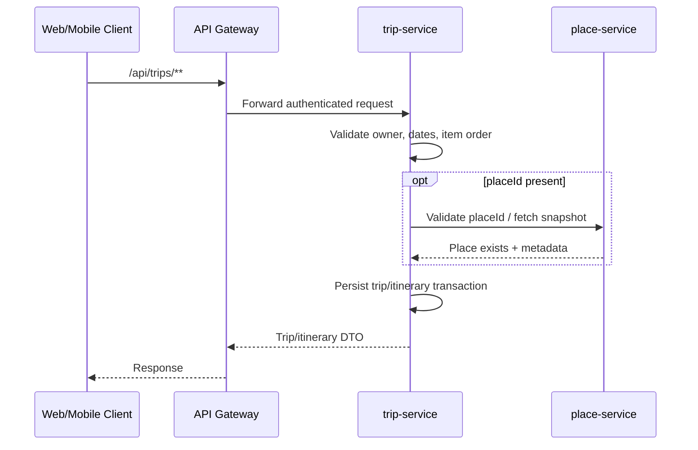

# Architecture

## Affected Services

- `apps/web/tripsense`: trip list, trip detail, itinerary day, and itinerary item management UI. Current trip pages are mock-driven and must be integrated with API responses during implementation.
- `services/api-gateway`: add an additive `/api/trips/**` route to `lb://trip-service`.
- `services/trip-service`: new service required; owns trip lifecycle and itinerary persistence for this MVP.
- `services/place-service`: validates `placeId` and provides optional display metadata; it does not share persistence.
- `services/user-service`: authentication and user identity source. Trip ownership uses authenticated user claims.
- `services/ai-service`: can produce draft itinerary suggestions later; it does not own saved itinerary state.

## Service Ownership

`trip-service` co-locates trip and itinerary management for TF-47. This resolves the current conflict between planned `trip-service` and planned `itinerary-service` by choosing the simpler owner for the MVP aggregate. The internal domain model should remain modular enough for later extraction if itinerary optimization becomes independently complex.

`trip-service` uses PostgreSQL for durable trip/itinerary persistence and Redis through Spring Cache for low-latency read caching of owned trip detail, trip lists, and itinerary reads. Mutating operations must evict affected cache entries.

## Flow

## Sync Communication

- Web/mobile clients call API Gateway only.
- API Gateway routes `/api/trips/**` to `lb://trip-service`.
- `trip-service` may synchronously call `place-service` before creating or importing a place-based itinerary item.
- Existing itinerary reads must not depend on `place-service` availability; saved snapshots are enough to render.
- `trip-service` should derive user identity from validated JWT claims and avoid synchronous user lookup unless absolutely required.

## Async Events

No Kafka events are required for TF-47 MVP. Later phases may publish `TripCreated`, `TripArchived`, `ItineraryItemCreated`, `ItineraryItemUpdated`, and `ItineraryReordered` for notifications, collaboration, analytics, or re-optimization.

## Rejected Alternatives

- Separate `itinerary-service` now: rejected because every trip detail, date edit, ownership check, and reorder would require tight synchronous coupling.
- Persist canonical itinerary state in `ai-service`: rejected because AI suggestions must remain draft content and deterministic trip rules belong in `trip-service`.
- Store full `Place` entities in trip tables: rejected because `place-service` owns place metadata.
- Require every itinerary item to have `placeId`: rejected because real trip plans include flights, notes, transfers, hotels, and manual items.

## Frontend Contract

- `/trips`: fetch paginated trips, show loading, empty, error, and archived-filter states.
- `/trips/new`: create trip and navigate to detail on success.
- `/trips/{tripId}`: fetch trip metadata and itinerary days in one detail flow.
- Day sections support item add, edit, delete/archive, and reorder interactions.
- Failed mutations keep the last saved state visible and surface retry affordances.

## Related

- [TripSense Architecture](../../architecture/tripsense-architecture.md)
- [Service Boundaries](../../architecture/service-boundaries.md)
