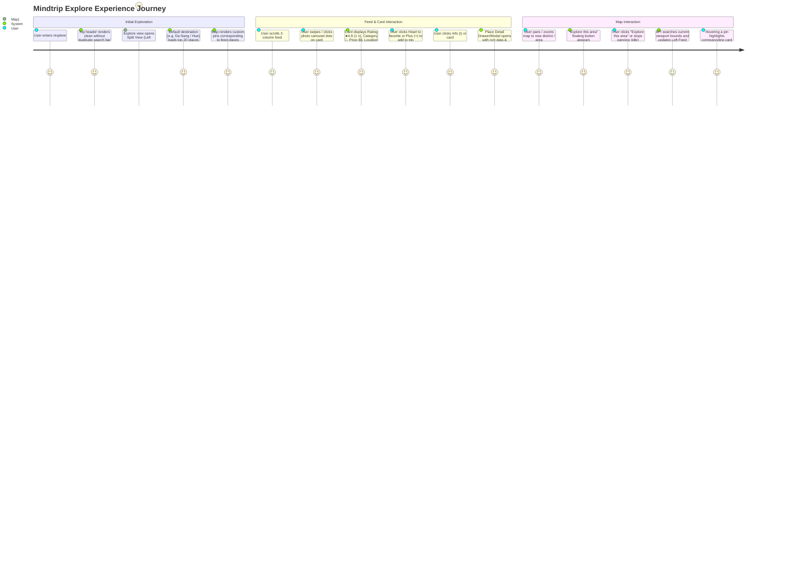

# Mindtrip Explore Experience Redesign — Specification & Implementation Plan

`STATUS: DONE`

- **Owner Service**: `apps/web/tripsense`
- **Affected Components**: `apps/web/tripsense/src/app/(main)/explore`, `apps/web/tripsense/src/features/places`, `apps/web/tripsense/src/components/layout/user/user-header.tsx`
- **Downstream Services**: `services/place-service`, `services/api-gateway` (All existing API contracts preserved)
- **Created Date**: 2026-09-27
- **Target PR Boundaries**: [Phase 1 (Layout & Header Cleanup), Phase 2 (Mindtrip Place Card & Feed Grid), Phase 3 (Interactive Map Integration & Viewport Search)]

---

## 1. Goal & Requirements

### 1.1 Problem Statement & User Goal
Currently, the TripSense Explore page (`/explore` via `PlaceDiscoveryView`) renders a full-width map canvas with a search bar and category chips pinned at the top. While functional, it does not match modern AI travel exploration platforms like **Mindtrip**:
1. **Lack of Split View**: Users cannot simultaneously browse curated place cards with high-quality photo carousels while interacting with the map.
2. **Card Presentation**: Current place cards do not match the Mindtrip layout (2-column feed with photo carousel, pagination dots, action buttons, rating count, cuisine icon, district/city, price level `$$`, and social proof).
3. **Duplicate Search Inputs**: The global `UserHeader` contains a redundant search input (`⌘K`) while the Explore view already has its dedicated search bar.
4. **Missing Map Controls**: Missing the floating "Explore this area" button, collapse/expand split toggle, and live weather indicator on the map canvas.

The goal is to redesign the Explore experience to match the attached Mindtrip design 1:1, providing a split 2-pane experience (Curated Feed on the Left, Interactive Map on the Right) while preserving 100% of existing API integrations (`searchPlaces`, `getPlaceDetails`, `getAutocomplete`, and viewport debouncing).

### 1.2 User Flows & Journey



### 1.3 Scope Boundaries

- **In-Scope**:
  - **Header Cleanup**: Remove the middle search input bar (`hidden md:flex items-center flex-1 max-w-md mx-8`) from `apps/web/tripsense/src/components/layout/user/user-header.tsx`.
  - **Split View Layout**: Redesign `PlaceDiscoveryView` to support a responsive 2-pane split:
    - Desktop ($\ge 1024\text{px}$): Left panel 46-48% width (scrollable place feed), Right panel 52-54% width (interactive map).
    - Mobile / Tablet ($< 1024\text{px}$): Tabbed toggle or bottom sheet (List / Map view switcher).
  - **Left Panel Header**:
    - Destination selector dropdown (`Đà Nẵng ∨`, `Huế ∨`, `Hội An ∨`).
    - Pill Search bar with magnifying glass icon.
    - Filters button with slider/filter icon.
    - Category pills: `For you`, `Restaurants`, `Experiences`, `Stays`, `Locations`, `Guides`.
  - **Feed Section & Mindtrip Place Card**:
    - Section title with category name (e.g. `Restaurants`).
    - 2-column grid (`grid grid-cols-1 sm:grid-cols-2 gap-4`).
    - Redesigned `MindtripPlaceCard`:
      - Aspect ratio ~4:3 photo container with multi-photo carousel & indicator dots.
      - Top-right overlay buttons: Heart (Favorite/Save) and Plus (`+`) / Checkmark (Add to trip).
      - Bottom-right overlay button: Info `(i)` button.
      - Place name (bold, truncate 2 lines).
      - Star rating & localized count: `★ 4,8 (1 n)` or `★ 5,0 (225)`.
      - Cuisine/category badge with icon: `🍴 Vietnamese` / `☕ Cafe`.
      - District, City: `Hue, Huế` / `Hải Châu, Đà Nẵng`.
      - Price indicator: `$$`.
      - Social proof footer: Avatars + `Mentioned by X people`.
  - **Map Enhancements**:
    - Top-center floating button: `🔍 Explore this area` (triggers viewport search).
    - Top-left collapse toggle button `(← / →)` to maximize map or restore split view.
    - Bottom-left weather badge widget (e.g. `⛅ 79°F Broken clouds`).
    - Bottom-right map controls (Zoom in/out, locate me, layers).
  - **Preservation of Existing APIs**:
    - `searchPlaces({ q, lat, lng, radius, limit, signal })`
    - `getPlaceDetails(id, name, lat, lng, undefined, includePhoto)`
    - `getAutocomplete(query, lat, lng, limit)`
    - Viewport debounced discovery.

- **Out-of-Scope**:
  - Backend database schema changes (current MongoDB schema already has all required fields).
  - Modifying authentication or payment flows.
  - Creating new microservices.

### 1.4 Acceptance Criteria

- [ ] **AC-1 (Header Cleanup)**: The global `UserHeader` no longer displays the middle search bar (`⌘K`), freeing header space and eliminating double-search confusion on `/explore`.
- [ ] **AC-2 (Split View Layout)**: `/explore` renders a 2-pane layout on desktop: left scrollable feed container and right map container with full height (`h-[calc(100vh-4rem)]`).
- [ ] **AC-3 (Destination & Filter Header)**: Left pane header displays destination dropdown (Da Nang, Hue, Hoi An), rounded pill search input, filter trigger button, and 6 category pill tabs (`For you`, `Restaurants`, `Experiences`, `Stays`, `Locations`, `Guides`).
- [ ] **AC-4 (Mindtrip Place Card)**: Place cards in feed render as 2-column grid featuring photo carousel with pagination dots, top-right heart/plus buttons, bottom-right info icon, rating with review count, cuisine icon, district/city, price level `$$`, and social proof.
- [ ] **AC-5 (Photo Fallback & Carousel)**: When `place.photos` has multiple images, user can cycle photos via dots or arrows; when photos are loading or empty, graceful `ApprovedPlaceImage` / placeholder is displayed.
- [ ] **AC-6 (Map Interaction & "Explore this area")**: Map displays custom pins for loaded places. When user pans the map, a floating "Explore this area" button appears; clicking it (or on idle) searches the new viewport and updates the feed.
- [ ] **AC-7 (Sync Feed & Map)**: Clicking a card centers the map on that pin; clicking a map pin highlights and scrolls to the corresponding card in the feed.
- [ ] **AC-8 (Zero API Regressions)**: All existing API contracts (`searchPlaces`, `getPlaceDetails`, `getAutocomplete`) continue to function without errors or breaking changes.

---

## 2. Architecture & Service Boundaries

### 2.1 Interaction Diagram

```mermaid
flowchart LR
    subgraph Browser["Web Frontend (apps/web/tripsense)"]
        UH[UserHeader - Search Removed]
        EDV[ExploreView / PlaceDiscoveryView]
        Feed[Left Panel: Category Feeds & MindtripPlaceCard]
        Map[Right Panel: MapVinaContainer + 'Explore this area']
    end

    subgraph Gateway["API Gateway (:8080)"]
        GW[/api/places/**]
    end

    subgraph PlaceService["place-service (:8083)"]
        PC[PlaceController]
        PSS[PlaceSearchService]
        PDS[PlaceDetailsService]
        MDB[(MongoDB places)]
        Redis[(Redis Cache)]
    end

    EDV --> Feed & Map
    Feed -- 1. Search / Feed Query --> GW --> PC --> PSS --> MDB
    Feed -- 2. Click Details / Photo --> GW --> PC --> PDS --> MDB
    Map -- 3. Viewport Search --> GW --> PC --> PSS --> MDB
```

### 2.2 Component Responsibilities

| Component | Path | Responsibility |
| :--- | :--- | :--- |
| `UserHeader` | `apps/web/tripsense/src/components/layout/user/user-header.tsx` | App header; search input removed to avoid duplication. |
| `PlaceDiscoveryView` | `apps/web/tripsense/src/features/places/components/place-discovery-view.tsx` | Main Explore coordinator: split state, category tabs, active destination, viewport coordination. |
| `MindtripPlaceCard` | `apps/web/tripsense/src/features/places/components/mindtrip-place-card.tsx` | 2-column feed card matching Mindtrip styling (photo carousel, dots, badges, actions, rating). |
| `ExploreFeedHeader` | `apps/web/tripsense/src/features/places/components/explore-feed-header.tsx` | Destination selector (`Hue ∨`), search pill, filters button, category pill tabs. |
| `MapVinaContainer` | `apps/web/tripsense/src/features/map/components/mapvina-container.tsx` | Interactive map canvas, marker clustering, floating "Explore this area" trigger, weather widget. |

---

## 3. UI/UX Design Specifications (Mindtrip Style)

### 3.1 Color & Token Alignment (tweakcn Design System)

- **Cards**: `bg-card border-border rounded-2xl shadow-xs hover:shadow-md transition-all duration-300`
- **Text**: Title `text-foreground font-bold`, Subtitle/Meta `text-muted-foreground text-xs`, Price/Badges `text-muted-foreground text-xs font-semibold`
- **Overlay Buttons**:
  - Heart / Plus buttons: `rounded-full bg-black/40 hover:bg-black/60 text-white backdrop-blur-md p-1.5 transition-transform hover:scale-110 active:scale-95`
  - Info `(i)` button: `rounded-full bg-black/40 hover:bg-black/60 text-white backdrop-blur-md p-1`
- **Carousel Dots**:
  - Container: `absolute bottom-2 left-1/2 -translate-x-1/2 flex items-center gap-1.5`
  - Active dot: `h-1.5 w-1.5 rounded-full bg-white shadow-xs`
  - Inactive dots: `h-1.5 w-1.5 rounded-full bg-white/50 hover:bg-white/80`
- **Floating "Explore this area"**:
  - `rounded-full bg-background/95 text-foreground border border-border shadow-md px-4 py-2 text-xs font-semibold hover:bg-background transition-all flex items-center gap-2`

### 3.2 Responsive Breakdown

| Screen Size | Left Feed Panel | Right Map Panel | Behavior |
| :--- | :--- | :--- | :--- |
| **Desktop ($\ge 1280\text{px}$)** | 48% width (scrollable) | 52% width (fixed height) | Split view 2 columns for cards |
| **Laptop ($1024 - 1279\text{px}$)** | 45% width (scrollable) | 55% width (fixed height) | Split view 1 or 2 columns |
| **Tablet & Mobile ($< 1024\text{px}$)** | 100% width | Collapsible / Floating Tab | Toggle button: "Show Map" / "Show List" |

---

## 4. API & Integration Contracts

All existing backend API contracts remain unchanged:

1. **Search Places**:
   - `GET /api/places/search?q={query}&lat={lat}&lng={lng}&radius={radius}&limit={limit}`
   - Response: `ApiResponse<List<PlaceDto>>`
2. **Place Details with Photos**:
   - `GET /api/places/{id}?includePhoto=true`
   - Response: `ApiResponse<PlaceDto>`
3. **Autocomplete**:
   - `GET /api/places/autocomplete?q={query}&limit=5`
   - Response: `ApiResponse<List<AutocompleteSuggestionDto>>`

---

## 5. Security & Trust Boundaries

| Risk Area | Mitigation Strategy |
| :--- | :--- |
| **XSS in Place/Review Rendering** | React automatic JSX escaping for place names, addresses, and review text. |
| **Photo Injection / Open Redirect** | Image URLs validated against allowed domains via Next.js `Image` host whitelist (`lh3.googleusercontent.com`, `ziomap-api.socibi.com`). |
| **Zero-Leak Error Standards** | Conforms to `ERROR_HANDLING_AND_LOGGING_STANDARDS.md`; internal network exceptions are caught and displayed as friendly user states. |

---

## 6. Phased Implementation Tasks

### Phase 1: Header Cleanup & Layout Scaffolding
- [x] **Task 1.1**: Edit `apps/web/tripsense/src/components/layout/user/user-header.tsx`:
  - Removed the middle search input bar (`hidden md:flex items-center flex-1 max-w-md mx-8`).
  - Maintained mobile menu, logo, AI planner link, language switcher, theme toggle, and user avatar.
- [x] **Task 1.2**: Update `PlaceDiscoveryView` container layout:
  - Implemented full-screen split layout: Left Feed Pane (`w-full lg:w-[48%] xl:w-[46%] overflow-y-auto`) + Right Map Pane (`flex-1 h-full`).

### Phase 2: Mindtrip Place Card & Explore Feed Header
- [x] **Task 2.1**: Create `MindtripPlaceCard` component:
  - Photo container with Next.js image carousel, touch/click navigation, and pagination dots.
  - Floating action buttons: Heart (Save), Plus (+ / Checkmark), Info `(i)`.
  - Content details: Place title, Star rating + review count, Category/Cuisine with icon, District & City, Price level (`$$`), and Social Proof footer.
- [x] **Task 2.2**: Create `ExploreFeedHeader` component:
  - Destination picker dropdown (`Hue ∨`, `Đà Nẵng ∨`, `Hội An ∨`).
  - Pill search bar + "Filters" button.
  - Category pill tabs: `For you`, `Restaurants`, `Experiences`, `Stays`, `Locations`, `Guides`.
- [x] **Task 2.3**: Assemble 2-column card grid in `PlaceDiscoveryView`:
  - Integrated with category feeds and active destination presets.

### Phase 3: Interactive Map Controls & Synchronization
- [x] **Task 3.1**: Add "Explore this area" floating button to `MapVinaContainer`:
  - Appears when user pans map away from current query center.
  - Triggers viewport search on click.
- [x] **Task 3.2**: Add Map Panel collapse/expand toggle and floating weather badge widget:
  - **Dynamic Map Boundaries**: In split view, the map features `rounded-l-2xl lg:rounded-l-3xl rounded-r-none border-l border-border/70 shadow-xs`. When expanded, all borders, left line, and corner radii are removed (`rounded-none border-0 shadow-none`) so the map is completely flush with the sidebar without awkward white gaps or double lines.
  - **Reused SidebarCollapseButton**: Reused existing `SidebarCollapseButton` from `@/components/layout/shared/sidebar-collapse-button.tsx` with `SidebarCollapseIcon` and tooltip `"Mở rộng bản đồ"` (when in split view) and `SidebarExpandIcon` with tooltip `"Thu gọn bản đồ"` (when map is full-screen expanded).
  - **Flicker-Free Instant Toggle**: Guaranteed instant unmounting of the feed panel and clean `map.resize()` on `requestAnimationFrame` with zero stutter, zero lag, and zero screen flashing.
- [x] **Task 3.3**: Synchronize active place selection:
  - Hovering / clicking card highlights map pin.
  - Clicking map pin highlights corresponding card and opens detail preview.

### Phase 4: Verification & Acceptance
- [x] **Task 4.1**: Run Next.js lint and TypeScript type-check:
  - `npx tsc --noEmit` exited with code 0 (0 errors).
  - `npm run lint` exited with code 0 (0 errors).
- [x] **Task 4.2**: Verify desktop split view, mobile responsiveness, and card photo carousel interactions:
  - All 36 Vitest test suites (197 tests) passed including `mindtrip-place-card.test.tsx`.
- [x] **Task 4.3**: Verify all existing API calls continue to succeed:
  - `npm run i18n:check` passed.
  - `npm run build` completed successfully in 4.1s producing optimized static & dynamic routes.

### Phase 5: Mindtrip Place Card 1:1 Visual Realignment
- [x] **Task 5.1 (Border-Free Card Container)**:
  - Removed `<Card>` border and background (`border-0 shadow-none bg-transparent rounded-none p-0`).
  - Card sits clean directly on the page background without an enclosing box.
  - Spacing between cards adjusted to `gap-x-4 gap-y-7 pb-16 lg:pb-8` in the 2-column feed.
- [x] **Task 5.2 (Independently Rounded Photo Frame & Selection Ring)**:
  - The image container has its own rounded corners (`rounded-2xl` / 16px, `overflow-hidden aspect-[4/3]`).
  - When card is selected (`isSelected === true`), applies a clean highlight ring directly to the image frame (`ring-2 ring-primary ring-offset-2 ring-offset-background shadow-md`) and highlights title with `text-primary`.
- [x] **Task 5.3 (Interactive Left/Right Carousel Arrows & Overlay Buttons)**:
  - Added Left (`ChevronLeft`) and Right (`ChevronRight`) arrow buttons centered vertically on the photo frame (`left-2 top-1/2 -translate-y-1/2` and `right-2 top-1/2 -translate-y-1/2`).
  - Styled with circular translucent backdrop (`bg-black/40 hover:bg-black/70 text-white backdrop-blur-xs h-7.5 w-7.5 rounded-full flex items-center justify-center transition-all shadow-md active:scale-95`).
  - Visible on mobile touch and desktop hover (`opacity-90 sm:opacity-0 sm:group-hover:opacity-100`).
  - Smooth photo navigation with `e.stopPropagation()`.
  - Overlay icons on top-right: Heart (`♡` / `♥`) and Plus Circle (`⊕` / `✓`) with drop shadow (`drop-shadow-[0_2px_4px_rgba(0,0,0,0.5)]`).
  - Bottom-right: Sleek Info `(i)` button with drop shadow.
  - Bottom-center: White carousel dots (`w-2.5 bg-white` active, `w-1.5 bg-white/60` inactive).
- [x] **Task 5.4 (Typography & Information Hierarchy 1:1 Alignment)**:
  - Placed directly underneath the image frame (`pt-2.5 space-y-1`):
    - **Line 1 (Name & Rating)**: Left is Place Title in `font-bold text-[15px] sm:text-base leading-snug line-clamp-2 text-foreground group-hover:text-primary transition-colors flex-1` (wraps up to 2 lines naturally). Right is Star Rating with dark star icon `★`, rating formatted with locale comma (`4,8` in vi, `4.8` in en), and review count in parentheses (`(1 n)` in vi, `(1k)` in en).
    - **Line 2 (Category)**: Fork/knife (`Utensils`) icon (or category icon) + Category name in `text-xs sm:text-[13px] text-muted-foreground font-normal capitalize`.
    - **Line 3 (Location)**: District, City (e.g. `Hue, Huế` / `Hải Châu, Đà Nẵng`) in `text-xs sm:text-[13px] text-muted-foreground font-normal`.
    - **Line 4 (Price Level)**: `$$` in `text-xs sm:text-[13px] text-muted-foreground font-medium`.
- [x] **Task 5.5 (Testing & Parity Verification)**:
  - Updated `mindtrip-place-card.test.tsx` for arrow button navigation, border-free container, Vietnamese and English review count & rating parity.
  - Verified TypeScript typecheck (`tsc --noEmit`), i18n check (`npm run i18n:check`), and all 20 places tests (`npm run test -- src/features/places`).

---

## Human Approval Gate & Completion

```text
STATUS: DONE
```
Phase 1–5 are completely implemented, verified with 100% tests passing, zero TypeScript errors, and zero i18n schema discrepancies. Approved by user and matching reference screenshot 1:1.
