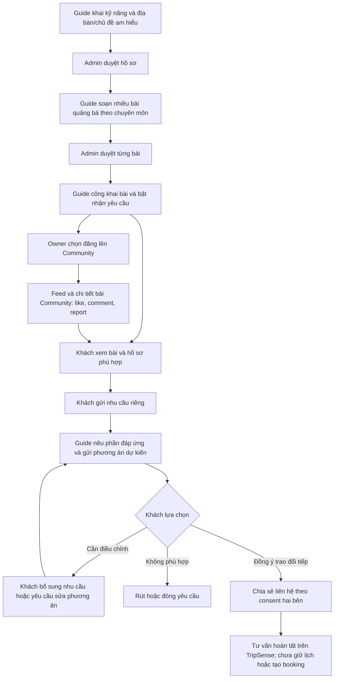
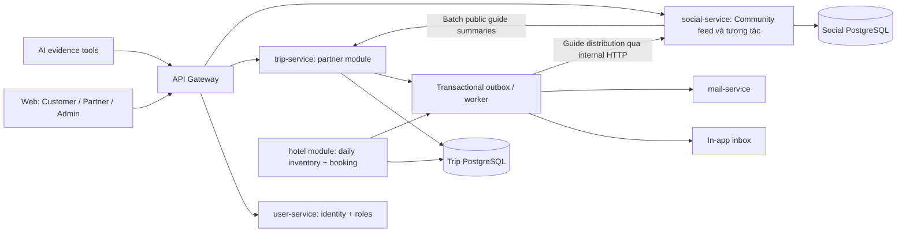

# Partner Onboarding & Business Approval — Feature Plan

`STATUS: DONE`

- **Ngày cập nhật**: 2026-09-28 (hoàn thiện 5 quy tắc: khóa mở lại sau material change với reverification; versioned suspension fencing & idempotent async closure; dynamic per-inquiry contact consent & revocation; phân định material change bài quảng bá tránh lệch ngữ cảnh bình luận; bổ sung support case `MANAGEMENT_CLAIM` xử lý tranh chấp quyền quản lý).
- **Phạm vi mới**: đối tác khách sạn, quán ăn/nhà hàng và hướng dẫn viên; xét duyệt theo nghiệp vụ, chủ động mở bán; hướng dẫn viên đăng bài quảng bá gắn chuyên môn, phân phối qua Community hiện có và tiếp nhận yêu cầu tư vấn của khách.
- **Owner**: `user-service` sở hữu identity/platform roles; module `partner` trong `trip-service` sở hữu hồ sơ kinh doanh, membership, xét duyệt và quyền nghiệp vụ. Module `hotel` tiếp tục sở hữu inventory/reservation trong cùng database Trip.
- **Affected**: `services/user-service`, `services/trip-service`, `services/social-service`, `services/api-gateway`, `services/mail-service`, `services/ai-service`, `apps/web/tripsense`.
- **Thay thế**: onboarding, role, approval và lifecycle/chính sách vận hành hotel trong [Hotel Management & Booking](./hotel-management-and-booking.md). Giữ invariant inventory theo đêm, giá snapshot, hold 10 phút, idempotency và outbox từ plan cũ; khi khác nhau, tài liệu này là nguồn quyết định. OTA-first không còn là scope hiện tại.
- **Trạng thái code**: implementation hotel ở working tree còn dang dở, chưa release. Theo yêu cầu “feature plan lại”, dừng implementation để duyệt phạm vi mới; không tự xóa hay tiếp tục hoàn thiện code cũ trong lượt lập kế hoạch này.

## 1. Mục tiêu và quyết định sản phẩm

### 1.1 Một tài khoản, nhiều loại hình đối tác

User vẫn có thể tìm địa điểm, lập lịch trình và đặt phòng như Customer. Khi muốn cung cấp dịch vụ, user bật khu vực Đối tác và chọn loại hình:

| Loại hình | Hồ sơ đăng ký | Chức năng có thể duyệt trong phạm vi này |
| --- | --- | --- |
| `HOTEL` | Khách sạn/cơ sở lưu trú | `HOTEL_LISTING`, `HOTEL_INVENTORY`, `HOTEL_BOOKING` |
| `RESTAURANT` | Quán ăn/nhà hàng/café; subtype nằm trong hồ sơ | `RESTAURANT_LISTING`, `RESTAURANT_MENU` |
| `TOUR_GUIDE` | Hồ sơ cá nhân, kỹ năng, lĩnh vực/địa bàn am hiểu | `GUIDE_LISTING`, `GUIDE_PROMOTION`, `GUIDE_INQUIRY` |

Một user có thể sở hữu nhiều cơ sở, kể cả nhiều cơ sở cùng loại. Hotel A và Hotel B là hai hồ sơ duyệt độc lập. Hồ sơ hướng dẫn viên cá nhân chỉ có một bản ghi cho mỗi owner; doanh nghiệp điều hành nhiều hướng dẫn viên là increment sau.

**Duyệt theo hồ sơ + capability.** Đã có một hotel được duyệt không làm nhà hàng/hồ sơ hướng dẫn viên được duyệt theo. Chọn loại hình chỉ mở form và tạo draft; không cấp quyền xuất hiện công khai hoặc nhận booking.

### 1.2 Role và quyền nghiệp vụ

| Tầng | Giá trị | Ý nghĩa |
| --- | --- | --- |
| Platform role | `ROLE_USER` | Các chức năng người dùng/khách du lịch hiện tại. |
| Platform role bổ sung | `ROLE_PARTNER` | Vào workspace đối tác, tạo draft, nộp hồ sơ, nhận lời mời quản lý. Không tự cấp quyền bán dịch vụ. |
| Platform role hiện có | `ROLE_ADMIN`, `ROLE_MODERATOR` | Admin xét duyệt; Moderator không tự có quyền duyệt đối tác. |
| Membership tại từng business | `OWNER`, `MANAGER`, `STAFF` | Phạm vi thao tác trên đúng cơ sở được giao. Không phải global role. |
| Capability tại từng business | Allowlist theo kind ở trên | Chức năng Admin đã duyệt cho đúng hồ sơ, phiên bản và business. |

`ROLE_PARTNER` được backend cấp khi tài khoản ACTIVE đã xác thực chọn tham gia khu vực Đối tác. Đây là quyền **nộp hồ sơ**, không phải nhãn “đối tác đã xác minh”. Người dùng không tự gửi role bất kỳ, không đổi `ROLE_USER` thành Owner/Admin. UI phân biệt rõ “Đã đăng ký đối tác”, “Đang xét duyệt” và “Cơ sở đã được duyệt”.

Không tạo global role `HOTEL_OWNER`, `RESTAURANT_OWNER`, `TOUR_GUIDE` cho từng ngành: một người có thể kiêm nhiều ngành, còn quyền sửa từng cơ sở phải được kiểm tra bằng membership. Loại hình hướng dẫn viên là nghiệp vụ/hồ sơ, không phải quyền sửa mọi hồ sơ hướng dẫn viên.

### 1.3 User flow

1. User đăng nhập → “Trở thành đối tác” → xác nhận tham gia workspace.
2. Chọn khách sạn/quán ăn/hướng dẫn viên; có thể quay lại thêm loại khác sau.
3. Tìm cơ sở đã tồn tại trước khi tạo draft; nếu đã có người quản lý, đi qua yêu cầu xác minh quyền quản lý. Guide tạo một hồ sơ cá nhân, có thể đăng nhiều bài quảng bá dưới hồ sơ đó.
4. Chọn mục tiêu dễ hiểu: “Đăng thông tin”, “Nhận đặt phòng”, “Giới thiệu chuyên môn và nhận yêu cầu tư vấn”. Backend ánh xạ thành capability bundle; lưu từng bước và tải minh chứng theo checklist.
5. Nộp hồ sơ → backend validate, đóng băng revision để Admin review.
6. Admin xem hồ sơ theo loại, yêu cầu bổ sung/từ chối/duyệt, kèm lý do và capability được cấp.
7. Đối tác nhận thông báo in-app/email; dashboard mở chức năng đã duyệt và checklist chuẩn bị vận hành. Duyệt không tự công khai hoặc tự mở bán.
8. Owner có thể mời Manager/Staff vào từng cơ sở. Người nhận bật workspace, xác nhận lời mời bằng đúng tài khoản/email đã xác thực.
9. Owner hoàn thiện dữ liệu → công khai hồ sơ → bật nhận booking/yêu cầu theo điều kiện ở §3.3. Có thể tạm dừng tiếp nhận mới mà vẫn xử lý nghĩa vụ cũ.
10. Đăng thêm cơ sở hoặc loại hình → quy trình duyệt riêng, giữ nguyên chức năng Customer. Sửa hồ sơ/xin thêm quyền không tự làm mất bản đã duyệt đang hoạt động.

### 1.4 Hướng dẫn viên: hồ sơ → bài quảng bá → yêu cầu cụ thể → phương án tư vấn

**Mục tiêu**: khách hiểu người hướng dẫn biết gì, làm được gì và có phù hợp với chuyến đi của mình hay không; hướng dẫn viên nhận đủ nhu cầu để trả lời có thể hỗ trợ phần nào. “Quảng bá/quảng cáo” trong increment này là bài giới thiệu dịch vụ tự đăng; chưa có mua quảng cáo, đấu giá hiển thị hay thu phí đẩy bài.

Ba đối tượng riêng, không gộp thành một bio hoặc một bài social tự do:

| Đối tượng | Nội dung và trách nhiệm |
| --- | --- |
| Hồ sơ hướng dẫn viên | Danh tính nghề nghiệp; ngôn ngữ và mức tự đánh giá; kỹ năng như thuyết minh, tổ chức nhóm, hỗ trợ chụp ảnh; **am hiểu gì và ở đâu** như văn hóa Hội An, lịch sử Huế, ẩm thực Đà Nẵng; kinh nghiệm liên quan, đối tượng khách phù hợp, phạm vi có thể hỗ trợ và giới hạn. |
| Bài quảng bá | Một góc chuyên môn cụ thể: tiêu đề, mô tả trải nghiệm, khu vực/địa điểm, chủ đề, kỹ năng lấy từ hồ sơ đã duyệt, ngôn ngữ, nhóm khách phù hợp, thời lượng gợi ý, quy mô nhóm tối đa, bao gồm/không bao gồm, ảnh và mức giá tham khảo có đơn vị. Một guide có nhiều bài. |
| Yêu cầu khách + phương án phản hồi | Khách gửi ngày/khung giờ mong muốn, số người, ngôn ngữ, địa điểm, mục tiêu/sở thích, kỹ năng cần, ngân sách tùy chọn và ghi chú hỗ trợ. Guide xác nhận điểm đáp ứng/chưa đáp ứng, đề xuất hoạt động/thời lượng và chi phí dự kiến; khách có thể yêu cầu điều chỉnh hoặc đồng ý trao đổi tiếp. |

**Luồng phía hướng dẫn viên**:

1. Đăng ký `TOUR_GUIDE`, khai chuyên môn bằng trường có cấu trúc; mỗi expertise gồm `areaId`, `topicId`, mô tả hiểu biết/kinh nghiệm. “Biết địa phương” chung chung không đủ điều kiện submit.
2. Nộp hồ sơ. Admin đối chiếu checklist, quyền sử dụng ảnh/minh chứng và nội dung khai báo; không tự biến tự khai thành chứng chỉ. Public phân biệt “Tự giới thiệu” và “Minh chứng đã được xem xét”; không suy ra bảo đảm chất lượng từ badge hồ sơ được duyệt.
3. Sau duyệt, Owner/Manager soạn bài quảng bá dựa trên kỹ năng/địa bàn/chủ đề đã được duyệt. Thêm chuyên môn ngoài hồ sơ phải cập nhật hồ sơ trước; không dùng bài viết để vượt review.
4. Bài được Admin duyệt riêng theo revision; Owner/Manager chủ động công khai bài khi business đủ điều kiện. Owner có thể chọn **“Đăng lên Community”** để xuất hiện trong feed hiện có theo §1.5. Sửa bài giữ bản đã duyệt, bản mới phải review. Có thể ẩn hoặc lưu trữ bài.
5. Owner bật “Nhận yêu cầu tư vấn”. Dashboard nhận yêu cầu theo bài hoặc theo hồ sơ; Owner/Manager trả lời thay mặt đúng guide cá nhân, không tự chuyển sang guide khác.
6. Guide gửi phương án cho từng yêu cầu: nội dung đáp ứng, điểm chưa phù hợp, dự kiến lịch trình, bao gồm/không bao gồm, tổng tiền dự kiến và hạn phản hồi. Không khẳng định còn lịch dựa trên bài quảng bá.

**Luồng phía khách**:

1. Khám phá từ Community hoặc tìm theo địa bàn, chủ đề, ngôn ngữ và kỹ năng; xem hồ sơ và các bài quảng bá. Các yêu cầu bắt buộc không được tự nới lỏng khi lọc.
2. Bấm **“Gửi yêu cầu tư vấn”** trên bài/hồ sơ; đăng nhập và xác thực trước khi gửi. Dữ liệu bài được điền gợi ý, khách xác nhận nhu cầu. Một yêu cầu gửi một guide đã chọn, không phát tán cho mọi guide.
3. Xem trạng thái, phản hồi và phương án trong trang yêu cầu riêng. Phần chưa phù hợp phải được nêu rõ; không hiển thị một điểm matching như bảo đảm phục vụ.
4. Yêu cầu chỉnh phương án, từ chối/rút yêu cầu, hoặc bấm **“Đồng ý trao đổi tiếp”** với phiên bản phương án còn hiệu lực. Đây là kết quả tư vấn và đồng ý trao đổi liên hệ; chưa giữ lịch, chưa tạo booking hoặc nghĩa vụ thanh toán trên TripSense.
5. Chỉ chia sẻ kênh liên hệ hai bên chủ động đồng ý chia sẻ (email/số điện thoại) sau bước trên. Cả khách và guide đều có quyền **thu hồi chia sẻ liên hệ bất kỳ lúc nào**, kể cả sau khi inquiry đã `CONTACT_AGREED`; mỗi lần đọc liên hệ đều kiểm tra quyền hiện hành thay vì chỉ dựa vào snapshot lúc đồng ý. Phần đặt lịch, hợp đồng phục vụ, đặt cọc và thanh toán cần increment booking guide riêng; UI nêu rõ giới hạn trước khi khách gửi/đồng ý.

**Ví dụ nghiệm thu**: bài “Khám phá văn hóa và ẩm thực Hội An” nêu am hiểu phố cổ/ẩm thực địa phương, kỹ năng thuyết minh và hỗ trợ chụp ảnh, tiếng Việt/Anh. Khách gửi nhu cầu 4 người, chiều 12/10/2026, tiếng Anh, ưu tiên món chay và tìm hiểu kiến trúc, ngân sách dự kiến. Guide phản hồi tuyến đi/thời lượng, khả năng hỗ trợ ăn chay, chi phí hướng dẫn và khoản ăn uống/vé chưa bao gồm. Không tự gắn kỹ năng tiếng Nhật hoặc cam kết mọi nhu cầu đều đáp ứng.



### 1.5 Community là kênh khám phá và tương tác của guide

Tích hợp vào Community đang có; Partner quản lý chuyên môn và dịch vụ, Community giúp khách khám phá và thảo luận. Đây là scope bắt buộc của bản plan này, không dừng ở copy một URL ra ngoài.

| Điểm chạm | Hành vi sản phẩm |
| --- | --- |
| Community composer | Giữ “Chia sẻ cập nhật”/“Chia sẻ chuyến đi”, bổ sung “Giới thiệu dịch vụ hướng dẫn”. Owner chọn bài đã duyệt/public trong workspace; chưa có hồ sơ thì dẫn tới đăng ký Partner, hồ sơ chưa duyệt thì hiển thị bước cần hoàn thiện. Không nhập badge xác minh trên composer. |
| Feed hiện tại | Thêm type `GUIDE_PROMOTION`, xuất hiện ở tab “Tất cả” và tab mới “Hướng dẫn viên”; giữ newest ordering và page/size của Social. STANDARD/TRIP_SHARE không đổi ý nghĩa. Không ưu tiên trả phí hoặc tự bump bài khi sửa giá/nội dung. |
| Card quảng bá guide | Nhãn “Giới thiệu dịch vụ”, danh tính guide, ảnh approved, tiêu đề, địa bàn/chủ đề, kỹ năng/ngôn ngữ tiêu biểu, giá tham khảo có đơn vị. CTA “Xem chuyên môn” và “Gửi yêu cầu tư vấn”. Likes/comments là tương tác cộng đồng, không phải đánh giá chất lượng hay bằng chứng khách đã sử dụng dịch vụ. |
| Post detail `/community/posts/{postId}` | Reuse trang/modal và thread hiện có; typed summary, link `/guides/{businessId}` và `/guide-promotions/{promotionId}`. Nội dung thương mại lấy từ revision đã duyệt; không thêm caption riêng để đi vòng review. |
| Tương tác | Dùng lại like/comment/reply/report/follow tác giả/chia sẻ link hiện có, giữ auth/visibility/moderation. Bình luận để hỏi chung; nhu cầu riêng/ngân sách/contact đi qua inquiry. Comment/DM/like không tạo inquiry hay xác nhận dịch vụ. |
| Quyền đăng | MVP Owner guide bật/tắt phân phối Community; author là tài khoản guide Owner. Manager có thể chuẩn bị/sửa bài trong Partner theo quyền hiện tại nhưng không đăng lên tài khoản xã hội của Owner. |
| Tần suất và đồng bộ | Một promotion phân phối tối đa một social post chuẩn. Phân biệt hai loại sửa: (1) Sửa phi trọng yếu (chính tả, ảnh minh họa phụ, tinh chỉnh câu từ/giá tham khảo) cập nhật card cùng postId, giữ tương tác/createdAt, hiển thị mốc "Đã cập nhật: [ngày/tháng]" và bình luận liên kết revision lúc gửi; (2) Thay đổi trọng yếu (địa bàn, chủ đề, phạm vi trải nghiệm cốt lõi) bắt buộc tạo bài quảng bá mới, bài cũ unpublish/archive để bình luận cũ không bị đặt sai ngữ cảnh. Owner opt-in một lần, bản mới đã duyệt tự cập nhật; tắt phân phối chỉ ẩn bản Community. Không tự đăng mọi hồ sơ/bài mới vào feed. |
| Tạm dừng/gỡ | Pause inquiry vẫn cho đọc bài nhưng khóa CTA gửi yêu cầu. Promotion unpublish/archive, business suspend hoặc mất quyền listing/promotion làm card không còn hiển thị nội dung dịch vụ/CTA. Moderator gỡ social post không tự suspend guide; Admin Partner xét xử lý nguồn dịch vụ riêng. |

Guide vẫn có thể viết bài STANDARD chia sẻ kinh nghiệm như mọi người, kể cả chưa làm Partner. Bài thường không tự có badge/capability/CTA chính thức của guide. MVP tích hợp typed promotion cho TOUR_GUIDE; typed hotel/restaurant promotion là increment sau. Không thêm social feed, like hoặc comment thứ hai trong Trip.

**Luồng nghiệm thu Community**: Guide được duyệt → bài quảng bá được duyệt/public → Owner xem preview và chọn đăng Community → card xuất hiện trong feed/profile bài của tác giả → khách xem/like/bình luận → mở chuyên môn → gửi inquiry riêng → guide phản hồi trong workspace. Nội dung inquiry, proposal và contact không xuất hiện trong social post/comment hoặc trending analytics.

### 1.6 Scope và acceptance

**Trong scope**: role bổ sung, workspace nhiều business, membership/invitation, revision review/audit/checklist, phát hiện trùng và yêu cầu quyền quản lý, capability authorization, publication và tạm dừng tiếp nhận; hotel booking/fulfilment tối thiểu; restaurant listing/menu/chỉ đường/liên hệ công khai có consent; guide profile + bài quảng bá được duyệt + yêu cầu/phản hồi/phương án tư vấn; notification async, AI đọc dữ liệu public đúng phạm vi.

**Community trong scope**: composer entry, typed GUIDE_PROMOTION trong feed/detail/profile, reuse social interactions/moderation, phân phối có Owner opt-in và cập nhật/ẩn projection theo nguồn Partner. Service contracts, fail-closed source checks và regression Community là phần bắt buộc.

**Chưa triển khai trong scope này**: đặt bàn, gọi món/thanh toán nhà hàng; giữ lịch/booking hướng dẫn viên, bán tour package, lịch làm việc nhiều guide; online payment/payout/commission; quảng cáo trả phí, auto-post khi chưa opt-in, typed hotel/restaurant promotion; OTA/PMS; tự xác minh giấy phép bằng AI; chuyển ownership. Yêu cầu tư vấn không được đổi nhãn thành “đã đặt guide”.

- [ ] AC-1: User vẫn dùng chức năng Customer sau khi tham gia Partner; login/Google/refresh không làm mất role cũ.
- [ ] AC-2: Một tài khoản đăng ký được hotel và restaurant; từng hồ sơ có trạng thái/capability riêng.
- [ ] AC-3: Business chưa có bản duyệt, bị revoke, suspended hoặc đang có thay đổi trọng yếu (`requiresReverification = true`) không được public/new sales. Bản sửa pending/rejected không làm ẩn bản đã duyệt còn hợp lệ nếu không có material change; dữ liệu draft không rò sang public.
- [ ] AC-4: Admin duyệt đúng immutable revision/checklist; expected version cũ trả 409. Hồ sơ đang SUBMITTED muốn sửa phải withdraw rồi submit revision mới.
- [ ] AC-5: Owner/Manager/Staff chỉ truy cập đúng business được giao; giả business ID hoặc capability không vượt quyền.
- [ ] AC-6: Hotel được duyệt listing nhưng chưa booking không nhận hold/confirm. Nhà hàng và guide không gọi được hotel APIs.
- [ ] AC-7: Hotel giữ chống overbooking/idempotency; check-in/check-out/no-show và customer/property cancellation tuân theo §3.5, không release tồn phòng hai lần.
- [ ] AC-8: Suspension/role removal local có hiệu lực tại transaction tiếp theo; suspension gắn `suspensionVersion`/mốc hiệu lực, worker async chỉ đóng inquiry thuộc đúng đợt đình chỉ, inquiry cũ không thể tiếp tục sau reinstatement, không dựa vào menu ẩn hoặc JWT cũ để cấp quyền business.
- [ ] AC-9: Thay đổi quyền/review có audit actor/time/reason/revision và thông báo async không lặp.
- [ ] AC-10: Tài liệu xác minh chỉ applicant có quyền và reviewer được đọc; không xuất hiện trong public profile/AI/logs.
- [ ] AC-11: Không gọi nhà hàng/hướng dẫn viên là “còn chỗ” khi chưa có module kiểm tra availability tương ứng.
- [ ] AC-12: Duplicate enrollment/submission/review/invitation acceptance không tạo role, hồ sơ hay quyết định trùng.
- [ ] AC-13: Duyệt không tự publish/mở bán; readiness chặn cấu hình thiếu. Tách rõ Owner tự pause intake (có thể resume khi đủ điều kiện) với tạm ẩn do thay đổi trọng yếu (`requiresReverification = true`, cấm publish/intake/new transactions cho đến khi Admin duyệt hồ sơ reverification).
- [ ] AC-14: Một guide có nhiều bài, mọi bài liên kết chuyên môn đã duyệt; bài mới/bản sửa chưa duyệt không public. Ảnh công khai tách khỏi tài liệu xác minh.
- [ ] AC-15: Khách gửi nhu cầu cho đúng guide; chỉ khách đó và Owner/Manager của guide đọc/phản hồi. Guide không đổi nhu cầu của khách hoặc tự chấp nhận phương án thay khách.
- [ ] AC-16: Phản hồi chỉ rõ phần đáp ứng/chưa đáp ứng; đồng ý phương án cũ/hết hạn trả 409, đồng ý trao đổi tiếp không sinh booking/payment/availability claim; khách hoặc guide có quyền thu hồi consent từng channel bất kỳ lúc nào, API đọc contact luôn kiểm tra active consent.
- [ ] AC-17: Hồ sơ trùng, tranh chấp và nộp lại sau đình chỉ xuất hiện trong review queue; tranh chấp quyền quản lý có support case `MANAGEMENT_CLAIM` với phân công Admin độc lập, cách ly minh chứng hai bên, không tự chuyển quyền từ canonical POI, tên trùng hay tự đổi owner trong MVP.
- [ ] AC-18: Partner-only discovery dùng bản đã duyệt; POI thông thường chưa tham gia Partner vẫn được tìm/gợi ý qua luồng Place hiện tại.
- [ ] AC-19: Owner opt-in bài guide approved/public xuất hiện đúng một lần trên Community; chỉnh sửa phi trọng yếu giữ postId kèm mốc cập nhật và liên kết revision bình luận; thay đổi trọng yếu (chủ đề/địa bàn) bắt buộc tạo bài mới và lưu trữ bài cũ.
- [ ] AC-20: Partner là nguồn chuyên môn/quyền dịch vụ; source suspended/unpublished/timeout không lộ nội dung cũ hoặc CTA hoạt động trên Community. Source checks dùng batch; Social moderation/deletion không bị retry làm sống lại bài.
- [ ] AC-21: Khách từ Community đi tới đúng guide/promotion/inquiry; social postId chỉ dùng attribution, không là ownership proof. Comment không thay inquiry, không tạo booking và không biến likes thành đánh giá dịch vụ.

## 2. Hiện trạng và service boundaries

### 2.1 Evidence từ code

- `user-service/entity/User.java`: `users.role` là một chuỗi, `getAuthorities()` hiện chỉ trả một role. `AuthServiceImpl` đăng ký/Google tạo `ROLE_USER`; `JwtUtils` ghi claim `role`. Không có partner onboarding hiện hữu.
- Web `features/auth/types/index.ts`: enum hiện có `ROLE_USER`, `ROLE_ADMIN`, `ROLE_MODERATOR`. Cần compatibility cho `roles[]`, không chỉ thêm enum rồi thay primary role.
- Trip đã có PostgreSQL, Flyway, JWT, transaction và membership/invitation cho trip. Dùng lại cách kiểm tra ownership và accept invitation; business membership là bảng riêng vì trip editor không phải người quản lý khách sạn.
- Working tree có module hotel mới: owner trực tiếp ở `hotel_property`, Admin đổi status, inventory/booking/outbox. Đây là **code chưa hoàn tất**, chưa có Partner role hay approval phân ngành. Không coi test vòng trước là xác minh cho thiết kế mới.
- Place hiện sở hữu canonical POI trong MongoDB. Không dùng record quán ăn public đã crawl/nhập từ provider làm bằng chứng sở hữu cơ sở.
- Có mail-service/Resend, Redis và outbox patterns; chưa thấy Kafka broker/client/consumer hoạt động trong cấu hình source đã kiểm tra. Social SSE là chat-specific, không phải generic partner notifications.
- `SocialPostController.java` có feed/page/type, detail, create/update/delete, like/comment và media; `CommunityModerationController.java` có report/decision. `SocialPostResponse`/web `types/post.ts` hiện chỉ STANDARD/TRIP_SHARE. `SocialPostRepository` public queries chỉ nhận STANDARD hoặc public trip shares; thêm enum frontend chưa đủ để promotion xuất hiện.
- `social-feed-screen.tsx` có All/Updates/Shared trips, composer, card và creator/weather/destination rail. Cần mở rộng typed guide card/filter/detail cùng client/hooks/tests. `TripServiceClient` là tiền lệ gọi Trip qua configured RestClient; chưa có guide projection/inquiry contract trong Social.
- Tham chiếu [Community Experience Redesign](./community-experience-redesign/index.md), [Social Post Management](./social-post-management/index.md), [Community Discovery Rail](./community-discovery-rail/index.md); giữ policy public trip snapshot và behavior đang có.

### 2.2 Ownership đề xuất

| Component | Trách nhiệm |
| --- | --- |
| `user-service` | Identity, primary role hiện hữu, bổ sung `ROLE_PARTNER`, JWT/DTO role compatibility. Không sở hữu inventory/capability của business. |
| `trip-service/partner` | Registry, hồ sơ/revision, checklist, approval, membership, capability, publication, claim/dispute và audit. Dùng PostgreSQL hiện có. |
| `trip-service/guide` | Chuyên môn public qua approved profile, bài quảng bá/review, inquiry và phương án tư vấn; FK nội bộ business. Không sở hữu social feed hoặc chat tổng quát. |
| `trip-service/hotel` | Room types, daily allocation/price, hold/booking/cancellation/fulfilment và support case; FK nội bộ sang business. |
| `place-service` | Canonical POI, location lookup như hiện tại. Chỉ tham chiếu `canonicalPlaceId` tùy chọn qua API/ID, không query Mongo từ Trip. |
| `mail-service` | Gửi thông báo sau commit qua internal authenticated API. |
| `social-service` | GUIDE_PROMOTION social post/projection, feed/detail/profile, likes/comments/reports/moderation. Chỉ nhận ID/public contract, không sở hữu guide approval, capability hoặc private inquiry. |
| Gateway/Web | Routes; customer/partner mode; form theo loại, dashboard, review, public listing, safe errors và i18n. |
| AI | Đọc partner catalog/bài guide đã duyệt, giải thích kỹ năng phù hợp từ dữ liệu public; giữ discovery POI thông thường. Hotel availability thật; không gửi inquiry, duyệt hoặc đặt dịch vụ tự động. |

Giữ các business và reservation trong cùng Trip DB để approval/suspension và bước hold/confirm có thể kiểm tra **cùng một local transaction**. Việc dùng `trip-service` cho module cung cấp dịch vụ là mở rộng ownership có chủ ý trong plan này; tách module package với trip lifecycle. Nếu quy mô yêu cầu tách service sau, đó là quyết định kiến trúc riêng.

Không tạo partner/hotel/restaurant/guide service mới, database mới hay broker. Không đưa role của user thành FK xuyên DB. Không nhúng entity User của user-service vào Trip.

Inquiry dùng timeline nghiệp vụ giới hạn gồm nhu cầu, câu hỏi làm rõ, phản hồi và phương án có phiên bản; không làm thêm presence, typing, read receipts, file chat hay DM. Giữ dữ liệu này trong Trip để kiểm tra quyền tiếp nhận/suspension và phiên bản phương án cùng transaction. Tích hợp chat Social nếu cần sau sẽ dùng ID/contract, không đọc bảng Social hoặc dùng chat acceptance làm xác nhận dịch vụ.

Community command opt-in/revision/publication trong Trip ghi distribution state + outbox cùng local transaction. Worker gọi internal authenticated HTTP tới Social để upsert/ẩn projection; eventual consistency chấp nhận được với việc xuất hiện trên feed. Social đọc batch public summary/eligibility từ Trip khi render để không phát nội dung cũ khi event gỡ đến chậm. Không gọi remote trong DB transaction, không distributed transaction/FK Social → Trip; Kafka vẫn ngoài scope.



## 3. Approval và phân quyền

### 3.1 Hồ sơ chung và dữ liệu theo loại

Chung: business kind, display name, owner từ JWT, contact details, service area, mô tả, document references và phiên bản. Kiểm tra dữ liệu có kiểu; không cho client gửi JSON tùy ý rồi dùng làm permission.

| Kind | Dữ liệu riêng | Checklist review sản phẩm |
| --- | --- | --- |
| HOTEL | Địa chỉ, timezone, check-in/out policy, loại cơ sở; liên kết hotel property | Kiểm tra liên hệ/quyền đại diện cơ sở và thông tin khai báo; duyệt listing trước hoặc đồng thời inventory/booking. |
| RESTAURANT | Subtype, địa chỉ, cuisine tags, giờ mở cửa, menu item/price/currency | Kiểm tra quyền đại diện, địa chỉ và nội dung/menu. Giá menu không phải giá booking, opening hours không phải số bàn còn trống. |
| TOUR_GUIDE | Tên nghề nghiệp, ngôn ngữ/mức tự đánh giá, skill IDs, expertise theo area/topic + mô tả kinh nghiệm, nhóm khách phù hợp, giới hạn phục vụ, giá tham khảo | Xác minh chủ hồ sơ là người cung cấp dịch vụ; tối thiểu một ngôn ngữ, kỹ năng và cặp địa bàn/chủ đề có mô tả cụ thể. Kiểm tra minh chứng cho claim cần chứng minh; không tự coi review sản phẩm là chứng nhận pháp lý. |

Checklist có `kind`, `region`, `version`, thời điểm hiệu lực và các mục `{code, required, acceptedEvidenceTypes, expiryRequired}`; application snapshot lưu phiên bản checklist và kết quả từng mục `PASS/FAIL/NEEDS_INFO`, reviewer, reason. Thiếu mục bắt buộc không approve; thiếu thông tin có thể bổ sung dùng CHANGES_REQUIRED; khai sai/không đáp ứng dùng REJECTED kèm mã lý do, hướng xử lý. Partial approve trả kết quả từng capability; không âm thầm bỏ qua quyền đã request.

Baseline bắt buộc: tài khoản/email xác thực, contact đã kiểm tra, quyền đại diện hoặc danh tính guide, hồ sơ theo kind đầy đủ, kiểm tra trùng/tranh chấp, nội dung và quyền sử dụng ảnh. Chứng chỉ/giấy tờ có thời hạn lưu expiry và capability chịu ảnh hưởng; khi hết hạn, chỉ thu hồi quyền phụ thuộc, thông báo và yêu cầu review lại. Không sửa ngược snapshot checklist cũ khi đổi cấu hình. Checklist vùng áp dụng và loại minh chứng chấp nhận phải được cấu hình, review và version hóa trước bật submit ở vùng đó; vùng chưa cấu hình chỉ draft. Đây là điều kiện release, không có fallback “Admin tự quyết” hoặc AI xác minh pháp lý.

### 3.2 State machine

```text
Application revision: DRAFT -> SUBMITTED -> APPROVED | CHANGES_REQUIRED | REJECTED | WITHDRAWN
Approved profile: approved_revision_id nullable; chỉ trỏ tới immutable revision được duyệt
Approval validity: NONE | VALID | REVOKED
Operation: ACTIVE | SUSPENDED
Publication: HIDDEN | PUBLISHED
Intake: accepting_new = false | true
```

- Business mới: NONE/ACTIVE/HIDDEN/false, requiresReverification = false, không có approved revision. ACTIVE riêng lẻ không cấp bất kỳ quyền public/giao dịch nào. UI hiển thị trạng thái hồ sơ mới nhất bên cạnh trạng thái vận hành, không dùng một enum cho cả hai.
- Mỗi business tối đa một SUBMITTED application; submit đóng băng profile, document versions, checklist và requested capabilities. Muốn sửa hồ sơ đang nộp phải withdraw; revision mới có version riêng.
- Admin decision nhận `expectedBusinessVersion`, `expectedApplicationVersion` + `applicationId`; lock business/application, kiểm tra checklist và revision rồi quyết định. Lưu kết quả từng capability; approve lần đầu phải có listing capability và profile hợp lệ.
- Approve cấp **subset** capability được request và hợp lệ theo kind. `HOTEL_BOOKING` phụ thuộc LISTING + INVENTORY; RESTAURANT_MENU phụ thuộc RESTAURANT_LISTING; GUIDE_PROMOTION và GUIDE_INQUIRY đều phụ thuộc GUIDE_LISTING. Không cấp capability chưa triển khai. Xin thêm quyền giữ grant cũ; không revoke quyền chỉ vì không xuất hiện trong request/decision mới.
- Self-review bị cấm: reviewer không phải owner hoặc member của business đang xét duyệt. `ROLE_MODERATOR` không thay thế `ROLE_ADMIN`.
- Sửa tên/mô tả/chuyên môn tạo draft riêng; public tiếp tục đọc approved snapshot. Reject bản sửa không làm mất bản đã duyệt. Public DTO không đọc draft `profile_json` hay draft displayName. Khi duyệt bản mới, chuyển pointer atomically; bài guide viện dẫn kỹ năng đã bị bỏ phải HIDDEN và review lại.
- Thay đổi địa điểm thực tế, người cung cấp dịch vụ hoặc quyền đại diện/pháp lý không được tiếp tục dùng thông tin cũ sai thực tế để bán:
  - Khi Owner khai báo material change hoặc nộp application revision đánh dấu material change: hệ thống kích hoạt cờ `requiresReverification = true`, chuyển ngay `publicationState = HIDDEN` và `acceptingNew = false`.
  - **Khóa cứng việc mở lại sau thay đổi quan trọng**: Backend chặn toàn bộ lệnh `PUT /publication` sang `PUBLISHED`, `PUT /intake` sang `acceptingNew = true`, và chặn tạo/xác nhận giao dịch mới (hold/booking/inquiry/proposal agreement mới) chừng nào `requiresReverification == true`. Tách bạch tuyệt đối với trường hợp Owner tự nguyện tạm ẩn/pause intake (operational pause, `requiresReverification == false`, Owner được tự mở lại khi readiness đạt). Khóa reverification chỉ được giải phóng khi Admin thẩm định checklist thay đổi và ra quyết định APPROVE hồ sơ reverification tương ứng, gỡ `requiresReverification = false`. Owner identity không được chuyển trong MVP. Admin có thể suspend độc lập khi có rủi ro/tranh chấp; bản sửa thông thường không tự gây suspension.
- Giá/inventory/menu vận hành không reset profile approval. Menu có kiểm tra nội dung, giới hạn trường và audit; Admin có thể gỡ nội dung vi phạm. Menu endpoint không sửa contact/identity/chuyên môn.
- Suspend/revoke, hold/confirm và inquiry/proposal approval dùng cùng business lock. Booking confirmed được giữ; hold chưa confirm sau suspension/revoke booking bị chặn, release theo expiry/cancel. Quyền hết hạn phải được kiểm tra ngay trong command, không đợi worker thu hồi.
- Khi suspend: HIDDEN/false; chặn proposal/đồng ý trao đổi mới, đóng inquiry chưa kết thúc với reason BUSINESS_UNAVAILABLE theo mốc đình chỉ (§3.6), giữ lịch sử và thông báo. Hotel vẫn phục vụ/hủy/support booking cũ theo §3.5. Việc approve hồ sơ bổ sung không tự hết suspension: Admin reinstatement riêng có lý do, sau đó Owner tự publish/mở intake lại.
- Admin phải ghi lý do cho reject/changes/suspend/revoke; audit append-only. Dashboard không gộp tất cả thành boolean `verified`.

### 3.3 Publication và readiness

`publicEligible = approvalValidity == VALID && approvedRevision != null && !requiresReverification && operationState == ACTIVE && listingCapability còn hiệu lực && publicationState == PUBLISHED`.

`newIntakeEligible = publicEligible && acceptingNew && capability nghiệp vụ còn hiệu lực && readiness đạt && !requiresReverification`. Đây là predicate backend, không phải field client được tự gửi. Tồn phòng/ngày cụ thể còn phải kiểm tra trong hotel transaction. Capability revoke listing kéo theo dependents, HIDDEN/false; revoke quyền tiếp nhận chỉ tắt intake, giữ listing hợp lệ.

| Thao tác | Actor / điều kiện |
| --- | --- |
| Xem readiness | Owner/Manager; trả checklist thiếu với mã lỗi; không tự bật publication/intake khi vừa đạt. |
| Publish hồ sơ | Owner; profile approved, ACTIVE, listing capability, !requiresReverification, contact công khai có consent nếu có. Restaurant cần địa chỉ/giờ hoạt động hợp lệ; guide cần đủ ngôn ngữ/kỹ năng/expertise đã duyệt. Nếu requiresReverification=true trả 409 REVERIFICATION_REQUIRED. Menu có thể trống, UI không tạo menu giả. |
| Mở hotel booking | Owner; published + HOTEL_BOOKING, !requiresReverification, room/capacity/cancellation policy hợp lệ, ít nhất một ngày bán trong 365 ngày tới có giá/tồn phòng hợp lệ. Search vẫn lọc đủ mọi đêm; không coi readiness là có phòng mọi ngày. |
| Mở guide inquiry | Owner; published + GUIDE_INQUIRY, !requiresReverification và hồ sơ chuyên môn hợp lệ. Không bắt buộc có bài quảng bá vì khách có thể gửi từ profile. Bài chỉ public nếu profile public và GUIDE_PROMOTION hợp lệ. |
| Pause intake / unpublish | Owner; version checked, có audit. Unpublish luôn tắt intake. Không hủy booking, inquiry cũ hoặc hold còn hiệu lực. Valid hold tạo trước pause vẫn được confirm nếu approval/operation/booking capability còn hợp lệ. |
| Resume | Owner chủ động, kiểm tra lại readiness/quyền và !requiresReverification; Admin reinstatement hoặc duyệt reverification không tự mở bán. |

### 3.4 Cơ sở trùng, quyền quản lý và tranh chấp

- Candidate lookup theo canonicalPlaceId (nếu có), địa chỉ/địa bàn chuẩn hóa, contact và tên; trả public candidate tối thiểu, không tiết lộ hồ sơ pending, giấy tờ hoặc chủ tài khoản cho applicant khác. Tên gần giống chỉ là tín hiệu, không là UNIQUE hay bằng chứng ownership.
- Cơ sở hiện có: applicant gửi `management-claim` cùng minh chứng, không tạo bản được duyệt song song. Admin phân biệt trùng thật, cơ sở khác cùng địa chỉ, hoặc tranh chấp. Hồ sơ pending/suspended liên quan chỉ Admin thấy để chống nộp lại né lịch sử; không tự từ chối chỉ vì chung địa chỉ.
- Nếu đã có Owner hợp lệ: mời vào business bằng luồng invitation sau xác minh/đồng ý của Owner; claim không tự cấp membership.
- **Xử lý tranh chấp quyền quản lý qua Support Case (`MANAGEMENT_CLAIM`)**:
  - Khi claim chuyển sang trạng thái `DISPUTED` (hoặc có khiếu nại tranh chấp sở hữu), hệ thống tự động hoặc cho phép mở `partner_support_case` với `resourceType = MANAGEMENT_CLAIM`, gắn `claimId` và `businessId`.
  - **Phân công Admin độc lập**: `assignedAdmin` phải là Admin không có quan hệ hay xung đột lợi ích với claimant hoặc bất kỳ member nào của business tranh chấp (cấm self-review/conflict).
  - **Cách ly minh chứng hai bên (Dual-evidence isolation)**: Admin được phân công có quyền đọc đối chiếu minh chứng của cả hai phía (`evidenceDocuments` của claim từ claimant và hồ sơ/tài liệu của current owner tại business). Tuyệt đối không cho Claimant đọc minh chứng của Owner và ngược lại, bảo vệ PII và bí mật kinh doanh.
  - **Quyết định giải quyết tuân thủ giới hạn MVP — không tự động chuyển ownership**: Kết quả xử lý support bao gồm: (1) `CLAIM_INVITATION_MEDIATION` (hướng dẫn hòa giải để Owner mời Claimant làm Manager/Staff), (2) `CLAIM_REJECT` (bác bỏ yêu cầu nếu chứng cứ không đủ), (3) `CLAIM_ALLOW_DISTINCT` (xác nhận hai cơ sở độc lập hợp lệ dù chung địa chỉ/tên gần giống), hoặc (4) `CLAIM_SUSPEND_BUSINESS` (chuyển cơ sở sang `SUSPENDED` nếu có rủi ro gian lận/tranh chấp pháp lý phức tạp chờ phán quyết có thẩm quyền). Kết quả claim tương ứng: RESOLVED_INVITATION, REJECTED, DISPUTED hoặc DISTINCT_BUSINESS_ALLOWED.
- Candidate/claim resolution tham chiếu business liên quan và lưu audit; Admin approve phải xử lý cờ duplicate chưa giải quyết. Hai hồ sơ có cùng canonicalPlaceId chưa được phép duyệt đồng thời nếu chưa có quyết định phân biệt rõ, dùng lock trên canonical reference tại Trip DB để chống hai reviewer đua nhau. Không ghi vào Place DB.

### 3.5 Hotel: fulfilment, hủy và sự cố

Giữ stay `[checkIn,checkOut)`, hold 10 phút, PAY_AT_PROPERTY, price/currency snapshot và local inventory transaction. Bổ sung:

```text
HELD -> CONFIRMED | EXPIRED | CANCELLED
CONFIRMED -> CHECKED_IN | NO_SHOW | CANCELLED
CHECKED_IN -> CHECKED_OUT
```

- Snapshot khi hold: `checkInAt`, `checkOutAt`, `freeCancellationUntil = checkInAt`, `noShowAfter` và timezone. Mặc định đề xuất noShowAfter là 06:00 ngày sau check-in, phải trước checkOutAt; cấu hình giờ không hợp lệ chặn readiness. Chỉ hỗ trợ check-in đúng ngày dự kiến tới trước check-out; sai/lệch lịch cần support, không tự sửa booking.
- Customer tự hủy HELD bất kỳ lúc còn hold; CONFIRMED được hủy miễn phí khi server time `< freeCancellationUntil`. Sau cutoff khách tạo support case; không có phí tự động/ghi nhận đã thanh toán trong MVP. Thời điểm cutoff hiển thị trước confirm, không dùng so sánh ngày làm mất cả buổi sáng check-in.
- Owner/Manager cập nhật CHECKED_IN khi khách đến, NO_SHOW khi qua noShowAfter và chưa check-in, CHECKED_OUT khi đã nhận phòng và thực tế kết thúc lưu trú. Không tự đánh NO_SHOW chỉ từ cron. STAFF MVP chỉ đọc nên chưa thực hiện các transition này.
- Cơ sở không phục vụ được: Owner/Manager hủy CONFIRMED với `initiatedBy=PROPERTY`, reason bắt buộc, kể cả đã qua cutoff; mở support case và thông báo khách. CHECKED_IN không được biến thành hủy trước lưu trú; ghi sự cố và kết thúc thực tế qua support/checkout. Không tự hứa hoàn tiền/đổi khách sạn khi chưa có nghiệp vụ đó.
- Hủy trước check-in release mọi đêm còn cam kết đúng một lần. Hủy do cơ sở/NO_SHOW sau ngày đầu release các đêm từ ngày hiện tại theo timezone trở đi; đêm quá khứ giữ ledger lịch sử. CHECKED_IN/CHECKED_OUT không tự release inventory đã phục vụ; checkout sớm không tự bán lại đêm còn lại trong MVP. Tất cả release có marker/range audit để retry không trừ hai lần.
- Suspended/pause/revoke bán mới không chặn việc thực hiện booking đã có: member còn ACTIVE được đọc booking, check-in/out, xử lý no-show, property cancellation/support theo luật trên, không cần sales capability. Membership bị revoke không còn quyền vận hành. Khi Owner bị khóa/không thể xử lý, Admin dùng case được phân công, quyền SUPPORT_CASE riêng có audit và PII tối thiểu; không tự truy cập mọi booking từ quyền review business.
- Support case có reporter, bookingId, category, reason, assignedAdmin, OPEN/IN_PROGRESS/RESOLVED và resolution note. Admin được phân công có thể hủy CONFIRMED vì service failure và ghi audit, không giả danh customer hay sửa giá. Customer luôn đọc được lịch sử và gửi case dù cơ sở bị đình chỉ.

### 3.6 Guide promotion và inquiry lifecycle

- Promotion draft/revision: DRAFT → SUBMITTED → APPROVED/CHANGES_REQUIRED/REJECTED/WITHDRAWN. Bài có `approvedRevisionId`, HIDDEN/PUBLISHED/ARCHIVED; public chỉ khi cả bài và business eligible. Mỗi revision lưu approvedProfileRevisionId, skill/expertise refs; Admin review nội dung/phạm vi/giá/ảnh. Approve bài không tự approve profile/capability. Staff không soạn/đăng hoặc đọc inquiry. Phân biệt: (1) Sửa phi trọng yếu (chính tả, ảnh phụ, tinh chỉnh giá tham khảo cùng đơn vị) được duyệt dưới revision mới của bài; (2) Thay đổi trọng yếu (đổi cặp areaId/topicId, đổi dịch vụ/kỹ năng trải nghiệm cốt lõi) bắt buộc tạo bài quảng bá mới, không dùng bản sửa của bài cũ để đổi chủ đề nhằm bảo vệ tính toàn vẹn ngữ cảnh thảo luận.
- Public giá tham khảo có `amount`, `currency`, `unit=HOUR/DAY/GROUP/PERSON`, giải thích bao gồm/không bao gồm; không lấy giá này làm báo giá cuối hoặc inventory. Dùng ảnh đã xác nhận ownership/scan qua media channel public riêng; giấy tờ không được làm ảnh quảng cáo. MVP ảnh, chưa video.
- Inquiry state: `SUBMITTED -> IN_DISCUSSION -> PROPOSAL_SENT -> CONTACT_AGREED`; có thể SUBMITTED → PROPOSAL_SENT trực tiếp. PROPOSAL_SENT → IN_DISCUSSION khi khách yêu cầu chỉnh; mọi state chưa kết thúc → DECLINED (guide), WITHDRAWN (customer), EXPIRED (deadline), CLOSED (suspension/support). CONTACT_AGREED/DECLINED/WITHDRAWN/EXPIRED/CLOSED là terminal; không mở lại, nhu cầu mới tạo inquiry mới.
- Khách chỉnh nhu cầu trước terminal tạo `requirementsRevision` mới, append history và vô hiệu phương án đang chờ; guide không sửa yêu cầu khách. Proposal immutable có revision, requirementsRevision, matched/unmet requirements, chương trình, tổng chi phí dự kiến VND, inclusions/exclusions, validUntil và contact consent. Gửi phương án mới thay thế bản pending cũ trong cùng transaction; lý do khác nhu cầu phải trình bày rõ.
- `CONTACT_AGREED` chỉ do customer với proposalId + expectedVersion + contactConsent, khi proposal là bản hiện hành/chưa hết hạn và business ACTIVE, GUIDE_INQUIRY còn hiệu lực. Khách hoặc Guide Owner có quyền **thu hồi consent từng channel (EMAIL/PHONE) bất kỳ lúc nào**, kể cả sau khi inquiry đã `CONTACT_AGREED`. Bảng consent lưu theo inquiry, grantor, grantee và channel. Mọi lần đọc contact đều kiểm tra active consent: channel bị thu hồi lập tức bị che (null/masked) đối với bên kia. Snapshot lúc agree chỉ lưu vết lịch sử/audit, không cấp quyền vĩnh viễn. Owner pause intake/unpublish không cấm hoàn tất inquiry đã có; suspension/revoke inquiry thì cấm. Không gọi action này ACCEPT_BOOKING, không tạo calendar lock/booking/payment.
- Đề xuất giới hạn MVP: một inquiry chưa kết thúc/customer/guide, 5 inquiry mới/customer/ngày UTC, tối đa 10 đang mở/customer; self-inquiry của owner/member bị chặn. Inquiry hết hạn tại min(submittedAt + 7 ngày, thời điểm bắt đầu muộn nhất khách chấp nhận): dateTo + preferredStartTime hoặc 23:59:59 dateTo theo timezone nếu chưa chọn giờ. Reject nếu mốc này đã qua. Proposal validUntil > now và <= min(inquiry.expiresAt, proposedStartAt). Sửa ngày chỉ rút ngắn deadline khi cần, không kéo dài giới hạn 7 ngày. Khi hết hạn proposal, không đồng ý được; vẫn có thể xin phương án mới trước inquiry deadline.
- Câu hỏi/phản hồi là plain text tối đa 2.000 ký tự, tổng 50 entries/inquiry, không file/HTML; nội dung nhạy cảm không đưa vào email, public listing hoặc AI context. Khách không phải cung cấp giấy tờ/địa chỉ lưu trú chính xác để hỏi tư vấn. Nhu cầu ngoài scope guide trả DECLINED có reason hoặc phương án ghi rõ unmet requirements, không tự gửi sang người khác.
- Inquiry lưu snapshot nguồn bài/profile tại thời điểm gửi; bài bị ẩn/lưu trữ không làm mất lịch sử.
- **Đóng inquiry bất đồng bộ có version và mốc hiệu lực (Suspension fencing tokens)**:
  - Mỗi lần Admin ra quyết định đình chỉ cơ sở (`SUSPENDED`) hoặc thu hồi capability `GUIDE_INQUIRY`, hệ thống tăng `business.suspension_version` đơn điệu và ghi nhận mốc `suspended_at` trong local transaction.
  - Sự kiện outbox đóng inquiry mang payload `{businessId, suspensionVersion, suspendedAt, reason}`.
  - Worker xử lý chỉ đóng các inquiry có `createdAt <= suspendedAt` và `boundSuspensionVersion <= event.suspensionVersion`.
  - Mọi command xử lý inquiry (gửi câu hỏi/phản hồi, gửi proposal, agree to contact) đều kiểm tra trạng thái business và mốc `suspended_at` ngay trong command (fail-closed check).
  - **Inquiry dở dang trước mốc đình chỉ vĩnh viễn bị vô hiệu hóa**: Không thể tiếp tục xử lý hoặc agree sau khi guide được reinstatement; chúng phải chuyển sang terminal `CLOSED` (reason `BUSINESS_UNAVAILABLE` / `SUSPENDED_DURING_INQUIRY`).
  - Sau khi Admin reinstatement, cơ sở chỉ được tiếp nhận các inquiry MỚI phát sinh sau mốc reinstatement (`createdAt > reinstatedAt`). Nếu worker cũ của đợt đình chỉ trước chạy trễ sau reinstatement, worker kiểm tra thấy inquiry mới có `createdAt > suspendedAt` nên sẽ **bỏ qua hoàn toàn, không đóng nhầm inquiry mới**. Capability expiry/revoke GUIDE_INQUIRY cũng đóng các inquiry chưa terminal theo cùng cơ chế versioned fencing này.

### 3.7 Permission matrix

| Action | Customer | Partner applicant | OWNER | MANAGER | STAFF | ADMIN |
| --- | --- | --- | --- | --- | --- | --- |
| Đọc listing public đã duyệt | Có | Có | Có | Có | Có | Có |
| Tạo business draft | Tham gia Partner trước | Có | Có | Có, trở thành owner của draft mới | Có, trở thành owner của draft mới | Có, nhưng không self-review |
| Sửa hồ sơ/nộp review của cơ sở | Không | Chỉ cơ sở mình sở hữu | Có | Không | Không | Review action riêng, không giả danh owner |
| Giá/inventory/menu vận hành | Không | Không | Có nếu approved+capability | Có nếu approved+capability | Chỉ đọc phần được giao | Chỉ bằng admin action có audit nếu được bổ sung |
| Xem reservations tại cơ sở | Chỉ booking của mình | Chỉ booking của mình | Có | Có | Có, dữ liệu tối thiểu | Không tự có quyền đọc PII chỉ vì được review |
| Hủy/check-in/out booking | Hủy booking mình theo policy | Như Customer | Theo §3.5 | Theo §3.5 | Không | Chỉ support case được phân công, action giới hạn và audit |
| Publish profile/bật intake | Không | Không | Có, readiness | Không | Không | Suspend/reinstate riêng, không mở bán thay Owner |
| Soạn/nộp/publish bài guide | Không | Draft của mình, chưa publish | Có | Có | Không | Review/gỡ nội dung riêng, cấm self-review |
| Inquiry/proposal | Yêu cầu của mình | Như Customer | Đúng guide được giao | Đúng guide được giao | Không với quyền Staff; vẫn đọc inquiry riêng như Customer | Chỉ support case/report được phân công, không đại diện khách đồng ý |
| Mời/xóa member | Không | Owner draft | Có | Không | Không | Không tự tham gia business |
| Duyệt/suspend/cấp capability | Không | Không | Không | Không | Không | Có, khác business của mình |

Lệnh đối tác mới = authenticated actor + membership ACTIVE đúng business + capability/state cho phép + resource ownership + transition/version/policy hợp lệ. Tách command vận hành nghĩa vụ hiện hữu theo §3.5/3.6, không áp cổng sales mới lên cancellation/history. Customer commands dùng customer ownership; ROLE_PARTNER không thay thế resource gates và customer không phải enroll Partner để gửi inquiry/booking.

### 3.8 Community publication và moderation

- Owner opt-in bằng command tại Trip, kiểm tra membership OWNER, approved revision, publicEligible và GUIDE_PROMOTION; không cần GUIDE_INQUIRY để đăng bài giới thiệu, nhưng CTA gửi yêu cầu chỉ bật khi đủ intake. Preview hiển thị đúng summary từ approved revision; expectedRevisionId cũ trả SOURCE_CHANGED. Author luôn là Owner đã xác thực; manager chỉ sửa canonical promotion theo quyền §3.7.
- Trip giữ `communityEnabled`, `distributionVersion`, approved revision và `communityPostId` khi nhận acknowledgment. Bật lần đầu trả PENDING_SYNC, worker upsert Social; callback không phải nguồn cấp permission.
- **Đồng bộ bài quảng bá và phân định ngữ cảnh bình luận trên Community**:
  - **Chỉnh sửa phi trọng yếu (Non-material revision)**: Cập nhật card trên cùng `communityPostId`, giữ nguyên likes/shares và thread bình luận. Card hiển thị rõ mốc **'Đã cập nhật: [ngày/tháng]'** kèm badge revision. Mỗi bình luận lưu `submitted_under_revision`; khi render bình luận thuộc revision cũ, UI hiển thị chú thích ngữ cảnh: 'Bình luận cho phiên bản trước ngày DD/MM/YYYY'.
  - **Thay đổi trọng yếu (Material revision)**: Bắt buộc tạo bài quảng bá mới trong Partner. Bài quảng bá cũ chuyển sang `ARCHIVED` hoặc `UNPUBLISHED` trên Community: social post cũ được giữ nguyên thread thảo luận đúng ngữ cảnh lịch sử nhưng khóa CTA tư vấn ('Dịch vụ này đã ngừng nhận yêu cầu mới'); bài quảng bá mới sau khi duyệt và opt-in sẽ tạo một `communityPostId` MỚI độc lập, bắt đầu chuỗi tương tác và thảo luận sạch, hoàn toàn không kế thừa bình luận của chủ đề khác.
  - Cập nhật revision (phi trọng yếu), tắt opt-in, unpublish/archive hoặc đổi business eligibility tăng `distributionVersion` cho các promotion đã opt-in và phát event. Retry không tạo postId mới; old version bị bỏ qua.
- Social projection lưu source IDs/version/distribution intent, không sao chép inquiry/docs/contact hay toàn bộ commercial body vào STANDARD content. GUIDE_PROMOTION `content`/`mediaUrls` không chứa bản copy có thể bị phát lại qua code path legacy; response lấy typed public summary từ Trip. Một sourcePromotionId UNIQUE ánh xạ một postId kể cả đã xóa/gỡ.
- Feed/detail/profile resolve promotion IDs bằng **một batch call** cho mỗi page, timeout tổng 1 giây, không retry trong render. Source báo unavailable/unknown/communityEnabled=false hoặc dependency timeout: trả card trung tính `UNAVAILABLE`/`TEMPORARILY_UNAVAILABLE`, không title/media/giá/badge/CTA cũ. Giữ slot/page/total semantics của Social; không lấy thiếu item rồi giả total hoặc loop scan toàn feed. Projection inactive đã đồng bộ bị loại ở SQL; placeholder chỉ xử lý khoảng trễ/lỗi. STANDARD/TRIP_SHARE vẫn phục vụ nếu Trip guide endpoint lỗi.
- Source check chỉ chứng thực tại thời điểm đọc, không giữ distributed lock. Trang đã mở có thể cũ; mọi inquiry POST vẫn revalidate source/intake trong Trip transaction. Like/comment mới cũng kiểm tra social visibility/moderation và source eligibility trước local write; đây là tương tác, không cấp quyền dịch vụ. Các read comment/detail khác cũng qua cùng resolver, không có nhánh get-by-ID vượt gỡ bài. Xóa/unlike/report vẫn có đường thực hiện phù hợp khi source lỗi, không cần service capability.
- Public Community promotion chỉ PUBLIC hoặc ẩn; endpoint visibility/content cũ không được biến GUIDE_PROMOTION thành STANDARD, thêm caption chưa duyệt hoặc gắn private media. Chỉnh thương mại dẫn về Partner và review revision. Owner tắt phân phối là hide có thể bật lại; `DELETE /api/social/posts/{id}` là soft-delete local với tombstone, không tự phục hồi bằng bật lại opt-in hoặc retry. UI giải thích dùng hide khi muốn tạm ẩn; tạo lại cùng source sau delete/gỡ bị chặn trong MVP.
- Community Moderator/Admin gỡ bài/comment theo flow report hiện có, không grant/revoke Partner capability. Bài đã bị moderation remove giữ tombstone, event/revision mới không làm sống lại. Admin Partner suspend/hide nguồn dịch vụ khi cần sau case độc lập; màn review có link nguồn để đối chiếu nhưng không cho Moderator đọc evidence/inquiry. Partner workspace truy vấn Social status khi xem sync để phân biệt PENDING_SYNC, DISTRIBUTED, HIDDEN, REMOVED_BY_AUTHOR, REMOVED_BY_MODERATION, SYNC_FAILED.
- Theo dõi tác giả dùng user ID của guide, không follow business entity mới. Counts/ranking của Community phải thêm policy rõ: promotion xuất hiện theo newest và profile, **không cộng vào suggested-creator activity score hoặc destination trending** trong MVP để tránh quảng bá đẩy lệch discovery hiện có. Like count không biến thành sao đánh giá dịch vụ. Report/comment moderation giữ rule hiện tại.

## 4. API & DTO contracts

Routes public đi qua Gateway. Envelope dùng convention `ApiResponse<T>{success,message,data,timestamp}` và `ErrorResponse{code,message,details,timestamp}`; không raw SQL/provider errors.

| API | Auth / tác dụng |
| --- | --- |
| `POST /api/users/me/partner-enrollment` | ACTIVE user, body `{acceptedTermsVersion}`; idempotent thêm role PARTNER, không nhận `role`/userId. |
| `GET /api/users/me` hoặc DTO self hiện có | Bổ sung `roles[]` và `partnerEnrolled`; không phá field `role`. |
| `GET /api/partners/business-kinds?region=` | Partner; schemaVersion, kind, goal bundles, capabilities, checklist/version hỗ trợ; vùng chưa cấu hình trả submitEnabled=false. |
| `GET/POST /api/partners/businesses` | List business có membership / tạo draft với `Idempotency-Key`. |
| `GET/PATCH /api/partners/businesses/{id}` | Member theo permission; Owner PATCH draft với expectedVersion, kind immutable; không sửa trực tiếp approved snapshot. |
| `POST /api/partners/businesses/{id}/applications` | Owner submit; idempotency key + expectedVersion + checklistVersion + requestedCapabilities + documentIds; kiểm tra toàn bộ required fields ở submit. |
| `GET /api/partners/businesses/{id}/applications` | Owner/history; Manager/Staff không mặc định đọc hồ sơ xác minh. |
| `POST /api/partners/businesses/{id}/applications/{applicationId}/withdraw` | Owner, expectedVersion; chỉ SUBMITTED, giải phóng quyền submit revision mới. |
| `GET /api/partners/businesses/{id}/readiness` | Owner/Manager; trả canPublish/canAcceptNew và missingRequirements[]; không thay đổi trạng thái. |
| `PUT /api/partners/businesses/{id}/publication` | Owner `{expectedVersion,state:HIDDEN\|PUBLISHED}`, kiểm tra §3.3; nếu `requiresReverification=true` trả 409 `REVERIFICATION_REQUIRED`; hide tắt intake trong cùng transaction. |
| `PUT /api/partners/businesses/{id}/intake` | Owner `{expectedVersion,acceptingNew}`, true phải đủ readiness và `!requiresReverification` (nếu vi phạm trả 409 `REVERIFICATION_REQUIRED`); false không hủy nghĩa vụ/hold cũ. |
| `POST /api/partners/businesses/{id}/material-changes` | Owner `{expectedVersion,kind:LOCATION\|REPRESENTATION\|PROVIDER_IDENTITY,reason,reverificationApplicationId?}`, đặt `requiresReverification = true`, `publicationState = HIDDEN`, `acceptingNew = false`; chặn publish/intake/new sales đến khi Admin approve hồ sơ reverification. Không chuyển owner. |
| `GET /api/partners/business-candidates?kind=&areaId=&name=&canonicalPlaceId=` | Partner, bounded và rate limit; public fields của candidate đã công khai, hồ sơ khác chỉ Admin truy cập. |
| `POST /api/partners/management-claims` / `GET /api/partners/management-claims` | Applicant tạo/đọc claim draft của mình `{businessId,reason}`; không cần membership tại business đích. |
| `POST /api/partners/management-claims/{id}/submit` | Claimant, expectedVersion + evidenceDocumentIds ready của chính claim; chuyển DRAFT → SUBMITTED. |
| `POST /api/partners/management-claims/{id}/documents/upload-intents` / `.../{documentId}/complete` / `.../{documentId}/access` | Claimant/reviewer đúng claim; cùng private storage/scan/TTL như business docs, không dùng quyền document của business đích. |
| `POST /api/partners/businesses/{id}/invitations` | Owner; email, role MANAGER/STAFF, expiry. Không mời OWNER/Admin. |
| `POST /api/partners/invitations/{token}/accept` | Partner nhận bằng đúng verified email; token hash trong DB, single use, bounded expiry. |
| `DELETE /api/partners/businesses/{id}/members/{userId}` | Owner; không xóa owner, revoke có hiệu lực từ local transaction tiếp theo. |
| `GET /api/admin/partner-applications?kind=&state=&cursor=` | Admin review queue phân loại, page tối đa 50. |
| `POST /api/admin/partner-applications/{id}/decision` | Admin, expectedBusinessVersion/expectedApplicationVersion, decision, checklistResults, capabilityDecisions, reason; duyệt reverification application gỡ `requiresReverification = false`; self-review reject. |
| `POST /api/admin/partner-businesses/{id}/suspension` | Admin; reason + expectedVersion. Tăng monotonic `suspensionVersion`, ghi nhận mốc `suspendedAt` để fence async closure. |
| `POST /api/admin/partner-businesses/{id}/reinstatement` | Admin; expectedVersion + reason + remediationApplicationId đã duyệt, giữ HIDDEN/false; ghi nhận `reinstatedAt`, chỉ cho phép inquiry mới sau mốc này. |
| `GET /api/admin/management-claims` / `POST /api/admin/management-claims/{id}/decision` | Admin khác claimant/owner/member, expectedVersion, outcome, linkedBusinessIds, reason; không cấp membership/đổi owner. |
| `POST /api/admin/partner-businesses/{id}/capability-revocations` | Admin; subset cần revoke + expectedVersion + reason; revoke theo dependency. Cấp lại phải qua application revision mới. |
| `GET /api/partners/businesses/{id}/capabilities` | Member; backend authoritative, UI dùng để mở màn hình. |
| `POST /api/partners/businesses/{id}/documents/upload-intents` | Owner; tạo object key server-owned và upload URL ngắn hạn khi private storage đã sẵn sàng. MIME JPEG/PNG/PDF, tối đa 10 MiB/file, 10 file/application. |
| `POST /api/partners/businesses/{id}/documents/{documentId}/complete` | Owner; server kiểm tra object metadata/scan, không tin URL/MIME/size client tự khai. |
| `POST /api/partners/businesses/{id}/documents/{documentId}/access` | Owner hoặc reviewer được phép; read URL TTL tối đa 60 giây, no-store và audit. |
| `GET /api/partners/notifications` / `POST .../{id}/read` | Recipient-scoped notification inbox. |
| `/api/hotels/**` | Hotel domain hiện tại, bổ sung business ownership/capability gates. |
| `GET /api/partner-listings?kind=&destination=&cursor=` / `GET /api/partner-listings/{id}` | Chỉ publicEligible, approved snapshot + consented public contact; 404 khi ẩn/không hợp lệ. |
| `PUT /api/partners/businesses/{id}/restaurant-menu` | OWNER/MANAGER + RESTAURANT_MENU, versioned menu update. |
| `PUT /api/partners/businesses/{id}/contact-sharing` | Owner, expectedVersion; consent cho public contact riêng với consent chia sẻ trong inquiry, chỉ channel đã kiểm tra; mặc định false. Không public private contact qua menu/promotion. |

**Guide contracts** — tất cả list cursor max 50, public endpoints dùng approved DTO; private endpoints no-store. `b` là businessId, `p` là promotionId, `r` là revisionId, `i` là inquiryId trong bảng:

| API | Contract / quyền |
| --- | --- |
| `GET /api/guide-taxonomy` | Public; stable area/topic/skill/language IDs, labels en/vi, catalogVersion. Taxonomy từ cấu hình versioned của Trip; place IDs nếu có chỉ qua contract Place. |
| `GET /api/guides` / `GET /api/guides/{b}` | PublicEligible; filters areaId/topicIds/skillIds/language; structured expertise và approved badge semantics, không documents/private contact. |
| `GET /api/guide-promotions` / `GET /api/guide-promotions/{p}` | PublicEligible cả profile và bài; filters như guides, cursor; canonical URL dùng được khi chia sẻ. |
| `GET/POST /api/partners/businesses/{b}/guide-promotions` | Owner/Manager list/create draft; create chỉ TOUR_GUIDE, không grant capability tự động. |
| `GET/PATCH /api/partners/businesses/{b}/guide-promotions/{p}` | Owner/Manager, expectedVersion, sửa draft, không ghi đè revision đã submit/approved. |
| `POST /api/partners/businesses/{b}/guide-promotions/{p}/submit` / `.../withdraw` | Owner/Manager, expectedVersion; submit cần GUIDE_PROMOTION, profile hợp lệ, media ready và expertise thuộc approved profile; nếu phát hiện thay đổi trọng yếu (địa bàn/chủ đề cốt lõi) thì yêu cầu tạo promotion mới. |
| `GET /api/admin/guide-promotion-revisions` / `POST /api/admin/guide-promotion-revisions/{r}/decision` | Admin khác business member, expectedBusinessVersion/expectedPromotionVersion, decision, reason; review bản đóng băng. |
| `PUT /api/partners/businesses/{b}/guide-promotions/{p}/publication` | Owner/Manager `{expectedVersion,state:HIDDEN\|PUBLISHED\|ARCHIVED}`; archived là terminal, không hard delete nguồn inquiry. |
| `POST /api/partners/businesses/{b}/promotion-media/upload-intents` / `.../{mediaId}/complete` | Owner/Manager, public-content upload scope; server kiểm tra owner/mime/size/object version/scan. Client không gửi URL tùy ý. Draft media đọc bằng signed preview; chỉ ảnh approved được public delivery. |
| `POST /api/guides/{b}/inquiries` | Verified Customer + Idempotency-Key; GuideInquiryInput, derive customer từ JWT; newIntakeEligible, không self-inquiry. Trả 201 hoặc replay 200 cùng ID. |
| `GET /api/me/guide-inquiries` / `GET /api/partners/businesses/{b}/guide-inquiries` | Customer own / Owner+Manager đúng guide; filter state/cursor. |
| `GET /api/guide-inquiries/{i}` / `GET /api/guide-inquiries/{i}/contacts` | Customer own hoặc Owner/Manager của guide; dynamic authorization check: chỉ trả channel liên hệ có active consent hiện hành từ đối phương; channel bị thu hồi trả null/masked. |
| `PATCH /api/guide-inquiries/{i}/requirements` | Customer own, expectedVersion; append revision, invalidate pending proposal, không đổi guide/customer/source snapshot. |
| `POST /api/guide-inquiries/{i}/responses` | Customer own hoặc Owner/Manager, `{expectedVersion,body}`; append timeline, SUBMITTED → IN_DISCUSSION. Không sửa state tùy ý. |
| `POST /api/guide-inquiries/{i}/proposals` | Owner/Manager, GuideProposalInput; lock business/inquiry, chỉ nhu cầu hiện hành, không fake availability. |
| `POST /api/guide-inquiries/{i}/proposal-decisions` | Customer `{expectedVersion,proposalId,action:REQUEST_REVISION\|AGREE_TO_CONTACT,note?,contactConsent?}`; kiểm tra revision/deadline, ghi nhận active contact consent hai bên, trả CONTACT_AGREED khi phù hợp. |
| `POST /api/guide-inquiries/{i}/contact-consents/revoke` | Customer hoặc Owner/Manager guide `{channel:EMAIL\|PHONE,reason?}`; thu hồi quyền xem contact ngay lập tức, áp dụng kể cả khi inquiry đã CONTACT_AGREED. |
| `POST /api/guide-inquiries/{i}/withdraw` / `.../decline` | Customer own withdraw / Owner+Manager decline; version checked, reason, idempotent terminal replay. |
| `PUT/DELETE /api/me/guide-blocks/{b}` / `GET /api/me/guide-blocks` | Customer tự block/unblock guide, không áp cho customer khác; PUT đóng inquiry chưa terminal và chặn tương tác mới. |
| `PUT/DELETE /api/partners/businesses/{b}/inquiry-blocks/{customerId}` / `GET .../inquiry-blocks` | Owner/Manager guide, chỉ target đã có inquiry tại guide; block/unblock có audit, không truy cập Social block. |
| `POST /api/partner-support-cases` / `GET /api/partner-support-cases/{id}` | Customer/partner liên quan: `{resourceType:HOTEL_BOOKING\|GUIDE_INQUIRY\|GUIDE_PROMOTION\|MANAGEMENT_CLAIM,resourceId,category,reason}`; với MANAGEMENT_CLAIM: reporter là claimant hoặc current owner (`resourceId` là claimId), không xem được chứng từ của đối phương. |
| `GET /api/admin/partner-support-cases` / `POST .../{id}/assignment` / `POST .../{id}/resolution` | Admin queue; assign Admin độc lập không xung đột lợi ích. Sau assign mới đọc dữ liệu cần thiết: với MANAGEMENT_CLAIM, Admin được quyền đọc đối soát minh chứng cả hai bên mà không làm lộ chéo giữa hai bên. Actions: `HOTEL_SERVICE_FAILURE_CANCEL`, `GUIDE_INQUIRY_CLOSE`, `PROMOTION_HIDE`, `CLAIM_INVITATION_MEDIATION`, `CLAIM_REJECT`, `CLAIM_ALLOW_DISTINCT`, `CLAIM_SUSPEND_BUSINESS`, `NOTE_AND_RESOLVE`. Không tự động chuyển ownership trong MVP. |
| `POST /api/hotels/bookings/{id}/check-in` / `.../check-out` / `.../no-show` | Owner/Manager đúng business, expectedVersion, các mốc §3.5, nghĩa vụ hiện hữu vẫn được xử lý khi suspended. |

Mọi POST nghiệp vụ mới dùng Idempotency-Key bound actor+operation+payload hash; update/decision cần expectedVersion, đổi payload dưới cùng key trả 409. PUT trạng thái target là idempotent với cùng command key, stale version khác command trả 409. Không tạo API restaurant booking/guide availability. Profile theo kind sửa qua draft; không đi vòng review bằng menu, promotion hoặc hotel property PUT cũ. API hotel status/identity cũ chuyển sang partner flow hoặc fail closed, không tồn tại hai nguồn cấp approval.

**Community contracts** — public command/read qua Gateway; internal routes không được Gateway expose, dùng service credential có audience/scope riêng, configured discovery/base URL và timeout:

| API | Contract / owner |
| --- | --- |
| `PUT /api/partners/businesses/{b}/guide-promotions/{p}/community-publication` | Trip; Owner `{expectedVersion,expectedRevisionId,enabled}` + Idempotency-Key. enabled=true phải publicEligible; false luôn cho Owner tắt. Trả 202 `{promotionId,distributionVersion,desiredEnabled,syncState,postId?}`; không hứa xuất hiện ngay khi Social chưa ack. |
| `GET /api/partners/businesses/{b}/guide-promotions/{p}/community-publication` | Trip; Owner/Manager; trạng thái delivery và postId/link, đọc Social status ngoài transaction nếu cần; dependency lỗi trả syncState UNKNOWN, không che local deletion bằng DISTRIBUTED cũ. |
| `POST /internal/partner-guide-summaries/batch` | Trip, Social service only; `{promotionIds:UUID[]}` max50. Mỗi ID trả availability, businessId, owner public identity, approvedRevisionId, distributionVersion, communityEnabled, summary public và canRequestInquiry. Không cấp draft/evidence/PII; ID không eligible chỉ id+availability. |
| `PUT /internal/community/guide-promotions/{p}` | Social, Trip distributor only; `{eventId,distributionVersion,businessId,ownerUserId,approvedRevisionId,enabled}`. Idempotent upsert guide source reference, kiểm tra source/owner binding từ authenticated Trip contract, không nhận author/content tùy ý từ browser. Trả `{postId,appliedVersion,deliveryState}`; older event no-op, tombstone không resurrect. |
| `POST /internal/community/guide-promotions/status-batch` | Social, Trip only; IDs max50 → postId/lastAppliedVersion/local moderation+deletion status, không comment/reporter data. |
| `GET /api/social/posts?type=GUIDE_PROMOTION&page=&size=` | Social; thêm allowlist type vào ALL/type/userId queries + response mapper; size max50 cho type mới, ALL bounded max50. Giữ contract phân trang cũ. |
| `/api/social/posts/{postId}` và like/comment/report endpoints hiện có | Social; typed GUIDE_PROMOTION branch, source batch resolver, ownership/visibility/moderation trước khi đọc/tương tác. Create STANDARD và trip-share endpoints không nhận payload để tự tạo GUIDE_PROMOTION. |

Response SocialPost thêm `guidePromotion` nullable và `guideAvailability` nullable (AVAILABLE/UNAVAILABLE/TEMPORARILY_UNAVAILABLE). GUIDE_PROMOTION AVAILABLE có `{businessId,promotionId,approvedRevisionId,title,summary,coverImageUrl,areaTopics,skillLabels,languageLabels,indicativePrice,profilePath,promotionPath,canRequestInquiry}`; paths server-generated, không arbitrary URLs. STANDARD/TRIP_SHARE giữ field hiện hữu; frontend union bổ sung type mới và handle placeholder trước khi render commercial fields. CTA phải mở source còn hợp lệ và POST đúng guide. `sourceCommunityPostId` tùy chọn trong inquiry là attribution: server xác minh mapping qua Social contract trước transaction, mapping sai bỏ attribution, không thay promotionId/owner/intake authorization. Social lỗi vẫn cho gửi inquiry từ canonical promotion, attribution để null.

```ts
type BusinessKind = "HOTEL" | "RESTAURANT" | "TOUR_GUIDE";
type ApplicationState = "DRAFT" | "SUBMITTED" | "CHANGES_REQUIRED" | "APPROVED" | "REJECTED" | "WITHDRAWN";
type BusinessState = {
  approvalValidity: "NONE" | "VALID" | "REVOKED";
  operationState: "ACTIVE" | "SUSPENDED";
  publicationState: "HIDDEN" | "PUBLISHED";
  acceptingNew: boolean;
  requiresReverification: boolean;
  reverificationApplicationId: string | null;
  suspensionVersion: number;
  suspendedAt: string | null;
  reinstatedAt: string | null;
  approvedRevisionId: string | null;
};
type Capability = "HOTEL_LISTING" | "HOTEL_INVENTORY" | "HOTEL_BOOKING"
  | "RESTAURANT_LISTING" | "RESTAURANT_MENU" | "GUIDE_LISTING" | "GUIDE_PROMOTION" | "GUIDE_INQUIRY";
type SupportCaseResourceType = "HOTEL_BOOKING" | "GUIDE_INQUIRY" | "GUIDE_PROMOTION" | "MANAGEMENT_CLAIM";
type ContactConsentGrant = {
  inquiryId: string;
  grantorUserId: string;
  granteeUserId: string;
  channel: "EMAIL" | "PHONE";
  state: "ACTIVE" | "REVOKED";
  consentedAt: string;
  revokedAt?: string;
};
type HotelProfile = {
  schemaVersion: 1; kind: "HOTEL"; address: string; destination: string;
  timeZone: string; checkInTime: string; checkOutTime: string;
};
type RestaurantProfile = {
  schemaVersion: 1; kind: "RESTAURANT"; subtype: "RESTAURANT" | "EATERY" | "CAFE";
  address: string; destination: string; timeZone: string; cuisineTags: string[];
  openingHours: Array<{ dayOfWeek: number; opens: string; closes: string; closesNextDay: boolean }>;
};
type GuideProfile = {
  schemaVersion: 1; kind: "TOUR_GUIDE"; professionalName: string; bio: string;
  languages: Array<{ code: string; selfAssessedLevel: "BASIC" | "CONVERSATIONAL" | "FLUENT" }>;
  skillIds: string[];
  expertise: Array<{ areaId: string; topicId: string; description: string; experience: string }>;
  audienceTags: string[]; serviceLimitations: string[]; yearsExperience: number;
  indicativePrice: { amount: string; currency: string; unit: "HOUR" | "DAY" } | null;
};
type CreateBusiness = {
  kind: BusinessKind;
  displayName: string; // 1–160
  contact: { email: string; phone: string }; // validate, không là ownership proof
  profile: HotelProfile | RestaurantProfile | GuideProfile; // discriminated validation theo kind
};
type ReviewDecision = {
  expectedBusinessVersion: number;
  expectedApplicationVersion: number;
  decision: "APPROVE" | "REQUEST_CHANGES" | "REJECT";
  checklistResults: Array<{ code: string; result: "PASS" | "FAIL" | "NEEDS_INFO"; reason?: string }>;
  capabilityDecisions: Array<{ capability: Capability; grant: boolean; reason?: string }>;
  reason: string; // bounded 2,000; required trừ approve
};
type PartnerContext = {
  role: string; // legacy primary role
  roles: string[]; // legacy role + additive ROLE_PARTNER
  businesses: Array<BusinessState & { id: string; kind: BusinessKind; latestApplicationState: ApplicationState | null;
    membershipRole: "OWNER" | "MANAGER" | "STAFF"; capabilities: Capability[]; version: number }>;
};
type GuidePromotionInput = {
  expectedVersion: number; title: string; description: string;
  isMaterialChange?: boolean; // nếu nộp revision mới, phân biệt sửa nhẹ vs material change
  expertiseRefs: Array<{ areaId: string; topicId: string }>; skillIds: string[]; languageCodes: string[];
  audienceTags: string[]; suggestedDurationMinutes: number; maxGroupSize: number;
  inclusions: string[]; exclusions: string[]; mediaIds: string[];
  indicativePrice: { amount: string; currency: "VND"; unit: "HOUR" | "DAY" | "GROUP" | "PERSON" } | null;
};
type GuideInquiryInput = {
  promotionId?: string; expectedSourceRevisionId: string;
  sourceCommunityPostId?: string; // optional verified attribution, không cấp quyền
  areaId: string; topicIds: string[]; requiredSkillIds: string[]; languageCode: string;
  dateFrom: string; dateTo: string; preferredStartTime?: string; timeZone: string;
  durationMinutes: number; adults: number; children: number;
  goals: string; supportNotes?: string; budgetVnd?: { min: string; max: string };
};
type ContactConsent = { shareEmail: boolean; sharePhone: boolean; termsVersion: string };
type GuideProposalInput = {
  expectedVersion: number; requirementsRevision: number;
  offeredAreaId: string; offeredTopicIds: string[]; offeredSkillIds: string[]; languageCode: string;
  unmetSoftRequirements: string[]; explanation: string;
  proposedStartAt: string; timeZone: string; durationMinutes: number; program: string;
  inclusions: string[]; exclusions: string[]; estimatedTotalVnd: string;
  validUntil: string; contactConsent: ContactConsent;
};
```

Proposal response bổ sung `id`, `revision`, `requirementsRevision`, `matchedRequirements`, `unmetRequirements`, `isCurrent`, `validUntil`, `canAgreeToContact` và `blockedReasons[]`; matched/unmet của area/topic/skill/language/date/time/duration/group được backend so sánh với yêu cầu và approved profile, không tin guide tự đánh dấu tất cả MATCH. Offered skill/expertise/language phải thuộc profile đã duyệt. Hỗ trợ đặc thù trong goals/notes do guide giải thích cụ thể, khách tự đánh giá; không dùng AI làm quyết định đáp ứng. Khi requirements/profile thay đổi, command agree revalidate điều kiện hiện hành dù proposal response trước đó cho phép.

`kind` trong profile phải khớp business kind. Time dùng `HH:mm`, timezone IANA, dayOfWeek 1–7; giờ qua đêm phải khai rõ `closesNextDay`. Bio tối đa 4.000 ký tự, tags/ngôn ngữ/khu vực tối đa 20 phần tử, mỗi phần tử bounded và allowlist khi có catalog. Giá decimal nonnegative, currency ISO; indicative price luôn ghi “tham khảo”, không được dùng làm quote booking.

CreateBusiness tối thiểu kind/displayName; contact/profile partial được lưu draft với cùng schema discriminator, required fields ở DTO trên bắt buộc khi submit. Guide title 1–160, description/program/goals <=4.000 ký tự, expertise mô tả/kinh nghiệm mỗi trường <=1.000, arrays max20, ảnh max8/bài JPEG/PNG/WebP <=5 MiB/ảnh; EXIF bị loại bỏ, không remote fetch. Max 20 bài chưa archive/guide. Duration 30–1.440 phút cho hoạt động trong ngày; adults 1–30, children 0–30, tổng <=30 và <=maxGroupSize nếu gửi từ bài; ngày từ hôm nay tới 365 ngày, dateTo >=dateFrom và khoảng <=30 ngày. Đề xuất khác ngày/ngôn ngữ/skill bắt buộc phải đánh unmet, khách chỉnh requirements rồi mới AGREE_TO_CONTACT; không tự nới hard requirements. Decimal VND nonnegative, min<=max, không nhận số float từ client làm tổng chính thức.

Public query lọc theo taxonomy IDs, nhiều skill/topic dùng all-required, language/area exact; nếu không khớp trả empty và gợi ý người dùng tự đổi filter, không trộn kết quả không khớp. DTO trả các matched fields để UI/AI giải thích. Date là nhu cầu chưa được giữ lịch. Inquiry kiểm tra source revision hiện hành, đổi trong lúc mở form trả 409 SOURCE_CHANGED để khách xem lại. Ngân sách/giá hiển thị tham khảo; guide có thể đề xuất cao hơn nhưng phải nêu rõ, khách tự quyết định.

ContactConsent chỉ chia sẻ field của chính actor; giá trị verified contact được lấy qua authenticated self contract của User trước transaction rồi snapshot, không tin email/phone của user khác trong body. Guide contact lấy từ owner/business contact đã xác minh với owner consent; Manager không thể tự chia sẻ số riêng của Owner chưa được đồng ý. Nếu chưa có verified phone thì không cho sharePhone. AGREE_TO_CONTACT cần ít nhất một channel hợp lệ mỗi bên, consent còn hiệu lực và cùng phiên bản contact mà proposal tham chiếu; thay đổi/thu hồi consent làm phương án cũ không còn được chấp nhận. Có thể chỉ chọn email; không bắt buộc chia sẻ số điện thoại. Cả khách và guide đều có quyền **thu hồi consent từng channel bất cứ lúc nào**, kể cả sau khi inquiry đã `CONTACT_AGREED`, qua endpoint `POST /api/guide-inquiries/{i}/contact-consents/revoke`. Mỗi lần đọc chi tiết inquiry hay contact endpoint, hệ thống thực hiện dynamic authorization check đối với bảng `partner_inquiry_contact_consent`: channel nào đã bị đối phương thu hồi (hoặc chưa bao giờ grant) sẽ trả về null/masked. Snapshot trong proposal/decision chỉ lưu lịch sử thỏa thuận, không bảo lưu quyền đọc khi consent đã bị hủy.

Code lỗi chính: 400 `INVALID_BUSINESS_PROFILE`, 401 auth, 403 `PARTNER_REQUIRED`/`CAPABILITY_NOT_APPROVED`/`SELF_REVIEW_NOT_ALLOWED`, 404 foreign/missing resource, 409 `VERSION_CONFLICT`/`APPLICATION_ALREADY_SUBMITTED`/`IDEMPOTENCY_CONFLICT`, 429 giới hạn nộp hồ sơ, 503 document/mail dependency ở đúng bước liên quan. Email lỗi không làm rollback review/booking đã commit.

Bổ sung 409 `REVERIFICATION_REQUIRED`/`READINESS_INCOMPLETE`/`SOURCE_CHANGED`/`STALE_PROPOSAL`/`PROPOSAL_EXPIRED`/`REQUIREMENTS_UNMET`/`DUPLICATE_OPEN_INQUIRY`/`DUPLICATE_BUSINESS_REVIEW_REQUIRED`, 403 `BUSINESS_SUSPENDED`/`INTAKE_DISABLED`, 429 `INQUIRY_LIMIT_REACHED`. Expiry/status vẫn check bằng server clock trong command, không chỉ cron/UI. Readiness error chỉ chứa field/code an toàn cho actor có quyền.

## 5. Data model, JWT và migrations

### 5.1 User DB — additive role, giữ compatibility

```sql
CREATE TABLE user_platform_roles (
  user_id uuid NOT NULL REFERENCES users(id),
  role varchar(50) NOT NULL CHECK (role = 'ROLE_PARTNER'),
  granted_at timestamptz NOT NULL DEFAULT now(),
  terms_version varchar(80) NOT NULL,
  PRIMARY KEY (user_id, role)
);
```

Giữ `users.role` và claim `role` là primary role cũ. JWT mới thêm `roles:[primaryRole,...additionalRoles]`. Login/Google login/verification/refresh/UserDto/getAuthorities và web store đều cập nhật thống nhất. Token cũ không có roles vẫn dùng customer features; muốn Partner workspace phải refresh lấy token mới. Không migration hàng loạt user sang PARTNER, không để enroll cấp ADMIN.

Không nhúng toàn bộ business IDs/capabilities vào JWT: việc suspend/revoke membership phải được kiểm tra từ Trip DB. Role PARTNER cũ không cho phép vượt resource gates. Thu hồi role workspace không tự thay cho suspension các business; UI Admin phải phân biệt hai thao tác.

### 5.2 Trip DB — hồ sơ kinh doanh và quyền nghiệp vụ

| Table | Columns / constraints trọng tâm |
| --- | --- |
| `partner_business` | UUID PK, kind CHECK, owner_user_id UUID, draft_profile_json/schemaVersion, approval_validity NONE/VALID/REVOKED, operation_state ACTIVE/SUSPENDED, publication_state HIDDEN/PUBLISHED, accepting_new bool default false, requires_reverification boolean NOT NULL DEFAULT false, reverification_application_id UUID nullable FK partner_application, suspension_version integer NOT NULL DEFAULT 0, suspended_at timestamptz nullable, reinstated_at timestamptz nullable, approved_revision_id nullable, version, contact_consent_version, timestamps. Public name/profile chỉ đọc approved revision. |
| `partner_business_member` | `(business_id,user_id) PK`, role OWNER/MANAGER/STAFF, state ACTIVE/REVOKED, version. FK business nội bộ; owner phải trùng owner_user_id, không đổi owner trong MVP. |
| `partner_application` | UUID PK, business FK, revision integer, immutable profile/checklist snapshots, checklist_id/version, requested capabilities JSON, state/version, submittedAt; UNIQUE(business_id,revision), partial UNIQUE business WHERE state='SUBMITTED'. Approved pointer chỉ tham chiếu revision cùng business. |
| `partner_review_checklist` / `partner_checklist_result` | Checklist immutable theo kind/region/version/effectiveAt; result FK application + itemCode PK, outcome, reason, actor; quyết định khả năng cấp quyền cùng transaction. |
| `partner_business_capability` | `(business_id,capability) PK`, application_id FK cùng business, grantedAt/grantedBy, expiresAt nullable, revokedAt; check whitelist/dependency trong service và tests. |
| `partner_review_audit` | UUID PK, application/business FK, actor UUID, action, reason, from/to state, businessVersion, occurredAt; append-only. |
| `partner_invitation` | UUID PK, business FK, recipient email normalized, role, tokenHash UNIQUE, state, expiresAt; một pending invitation cho business/email. |
| `partner_document` / `partner_application_document` | Document UUID, business_id hoặc claim_id (XOR, FK nội bộ), immutable object key+version+hash, MIME/size, scan state, uploadedBy, expiresAt/retentionUntil. Join application/document+version/hash đóng băng evidence; không overwrite file đã submit hoặc nhận document khác scope. Không public URL. |
| `partner_management_claim` / `partner_duplicate_review` | Claim UUID, applicant UUID, target business FK, state/version, reason, decision/audit refs. Duplicate relation giữa business IDs, canonical reference, resolution/reviewer; một claim SUBMITTED/applicant/business. Không FK User/Place. |
| `partner_business_contact_consent` / `partner_inquiry_contact_consent` | Business public contact consent riêng; `partner_inquiry_contact_consent` có PK `(inquiry_id, grantor_user_id, channel)`, grantee_user_id UUID, channel EMAIL/PHONE, state ACTIVE/REVOKED, consented_at, revoked_at, revoked_reason. Ràng buộc theo inquiry, grantor, grantee; API đọc liên hệ dynamically filter theo state ACTIVE, không phụ thuộc snapshot cũ. |
| `partner_restaurant_menu_item` | UUID PK, business FK, name, description, decimal price, currency, isAvailable, version; item available là còn bán món, không phải còn bàn. |
| `guide_promotion` / `guide_promotion_revision` | Promotion UUID, business FK, publication_state, approved_revision_id, version/timestamps; revision UUID, promotion FK, revision number UNIQUE, profile_revision_id, immutable typed content/media refs, is_material_change boolean default false, previous_revision_id UUID nullable, state/version/review reason/actor. Một SUBMITTED revision/promotion; approved pointer cùng promotion. |
| `guide_community_distribution` | Trip-owned: promotion_id PK/FK nội bộ, community_enabled default false, distribution_version monotonic, desired_revision_id, post_id UUID nullable không FK Social, sync_state/last_error_code/last_ack_version/timestamps; owner opt-in audit. Business eligibility đổi phải tăng version của các distribution bị ảnh hưởng trong cùng Trip transaction. |
| `partner_public_media` | UUID, business FK, uploader UUID, object key/version/hash, MIME/size, scan state, publication eligibility; private draft preview, public delivery chỉ approved. Không reuse partner_document. |
| `guide_inquiry` / `guide_inquiry_requirements` | Inquiry UUID, guide_business_id FK, customer_id UUID, source_promotion_id nullable FK, source_community_post_id nullable UUID (attribution, không FK Social), source revision snapshot, state/version, bound_suspension_version integer default 0, current_requirements_revision, current_proposal_id nullable, expiresAt/timestamps. Requirements immutable JSON theo inquiry/revision UNIQUE, createdBy customer. |
| `guide_proposal` | UUID PK, inquiry FK, revision UNIQUE trong inquiry, requirements_revision FK scoped inquiry, typed immutable proposal JSON, guide consent version/contact snapshot, author UUID, validUntil, createdAt. Pointer current_proposal_id phải cùng inquiry; acceptance lưu đúng proposalId và customer consent snapshot. |
| `guide_inquiry_entry` | UUID PK, inquiry FK, seq UNIQUE trong inquiry, actor UUID/role snapshot, kind QUESTION/REPLY/REQUIREMENTS_CHANGED/PROPOSAL/DECISION, plain text hoặc typed event payload, createdAt; append-only nghiệp vụ, scrub PII theo retention có audit; no-store DTO. |
| `guide_inquiry_block` / `partner_customer_quota` | Block PK `(guide_business_id,customer_id,blocked_by_side)` với side CUSTOMER/GUIDE, actor/reason/time, active; một bên block đủ chặn, chỉ bên tạo được unblock. Quota customer UUID PK, ngày UTC/count + lock cho create/rate rules; không FK User. |
| `partner_support_case` | UUID PK, resource_type CHECK IN ('HOTEL_BOOKING', 'GUIDE_INQUIRY', 'GUIDE_PROMOTION', 'MANAGEMENT_CLAIM'), resource_id UUID NOT NULL, claim_id UUID nullable FK partner_management_claim, reporter UUID NOT NULL, assigned_admin UUID nullable, category/reason, state OPEN/IN_PROGRESS/RESOLVED, version, resolution_action/audit. Với MANAGEMENT_CLAIM, Admin assigned có quyền đọc đối soát minh chứng 2 bên mà không để lộ chéo. |
| `partner_outbox` + notification delivery/inbox | Generalize worker/outbox đang viết cho hotel; unique event-recipient-channel, retry deadline và DEAD state. Không chạy hai queue độc lập cho cùng event. |
| `hotel_property` | Thêm `business_id uuid UNIQUE NOT NULL` FK partner_business; giữ hotel data riêng. Mọi room/inventory/booking scope resolve qua business_id. |
| `hotel_booking` / `hotel_booking_transition` | Mở rộng state CHECKED_IN/CHECKED_OUT/NO_SHOW; snapshot checkInAt/checkOutAt/freeCancellationUntil/noShowAfter, version, actual arrival/departure, cancelledBy/reason; append transition + inventory release date range/marker, supportCaseId tùy chọn. Không thêm paid=true giả. |

Indexes: business `(owner_user_id,created_at,id)`, `(kind,publication_state,created_at,id)`; members `(user_id,state)`; applications `(state,submitted_at,id)`; audit `(business_id,occurred_at)`; menu `(business_id,is_available)`; document `(business_id,scan_state)`/claim_id; outbox due/dead; promotions `(business_id,publication_state,created_at,id)`; inquiries `(customer_id,created_at,id)`, `(guide_business_id,state,created_at,id)`, `(expires_at,id)` partial nonterminal; entries `(inquiry_id,seq)` unique; claims `(state,created_at,id)`; support `(assigned_admin,state,created_at,id)`. Guide cá nhân partial UNIQUE owner WHERE kind='TOUR_GUIDE'; inquiry partial UNIQUE `(customer_id,guide_business_id)` WHERE state IN ('SUBMITTED','IN_DISCUSSION','PROPOSAL_SENT').

Public guide filters dùng projection `guide_public_search(business_id PK, approved_revision_id, area_ids[], topic_ids[], skill_ids[], language_codes[], created_at)` cập nhật cùng transaction đổi approved pointer; GIN cho arrays có query, kết hợp eligibility từ business. Expertise area/topic vẫn kiểm tra cùng cặp trong approved JSON, không ghép area A với topic chỉ biết ở area B. Promotion search tương tự qua approved revision/projection, không scan draft. Cursor `(created_at,id)` ổn định; query plan kiểm tra bằng dữ liệu thực tế trước thêm cache.

Các invariant cross-row (revision cùng business/promotion/inquiry, promotion thuộc TOUR_GUIDE, capability dependency) dùng composite UNIQUE/FK nơi khả thi và service transaction tests. Idempotency records giữ actor+operation+key UNIQUE, payloadHash, resourceId/outcome; quota tạo inquiry lock customer quota row trước business rồi inquiry để hai request tới hai guide không vượt hạn mức. Lock order toàn hệ thống: quota row nếu có → business → domain aggregate → revision/inventory; không gọi remote trong lock.

**Migration từ code dang dở:** kiểm tra Flyway history ở từng môi trường trước khi quyết định sửa migration chưa áp dụng hay thêm forward migration. Không sửa checksum migration đã dùng. Legacy property không có business link phải được tạo business + owner membership; không tự coi mọi owner cũ là đã verify mọi capability. Property có booking thật cần reconciliation và backfill trước khi enforce NOT NULL; không xóa inventory/booking. Migration release phải fail closed với record chưa reconcile.

Triển khai additive columns/tables trước, backfill local owner/membership và approved snapshots theo dữ liệu đã xác minh, rồi mới NOT NULL/FK/constraints. Booking cũ giữ nguyên policy khách đã chấp nhận; gắn policyVersion LEGACY, không hồi tố cutoff mới hoặc tự gán NO_SHOW/CHECKED_OUT. Policy mới áp dụng hold mới sau rollout. Quyền property/status cũ phải chuyển sang partner predicate trước bật publication/intake; không để legacy ACTIVE thành đường vòng. Backfill inquiry/promotion không cần vì là domain mới.

Rollback: tắt onboarding/publication/intake mới bằng feature flags nhưng giữ đọc/xử lý booking, inquiry và support đang tồn tại; không drop bảng hoặc xóa audit/commitments. Rollback binary phải đọc được status mới, không dùng bản hotel cũ không hiểu CHECKED_IN/NO_SHOW. Token claim mới vẫn đọc qua legacy `role`.

### 5.3 Social DB — tái sử dụng Community

Social sở hữu migration riêng; Trip migration không được tạo/sửa bảng Social:

| Table / thay đổi | Contract |
| --- | --- |
| `social_posts` | Thêm allowlist/check cho GUIDE_PROMOTION nếu schema có constraint, author_id = guide owner, content rỗng cho typed promotion, không clone ảnh vào post_media; giữ like/comment counters, timestamps, deleted tombstone. Bảng `post_comments` thêm `submitted_under_revision integer nullable` để lưu ngữ cảnh phiên bản bài quảng bá tại thời điểm bình luận. |
| `social_guide_promotion` | post_id PK/FK social_posts, source_promotion_id UUID UNIQUE, source_business_id UUID, source_owner_id UUID, approved_revision_id UUID, distribution_version bigint, distribution_enabled bool, removed_at/reason/actor, updated_at. IDs Trip không FK/JPA relation. Cột removal riêng không bị projection update reset. |
| `social_integration_receipt` | event_id UUID PK, source, payload_hash, source_promotion_id, applied_version, received_at. Receipt + post/projection commit cùng local transaction; event trùng khác payload bị reject/audit. |

Index projection `(distribution_enabled,post_id)`, source promotion UNIQUE; tận dụng posts `(created_at,id)`/author/type indexes hiện có sau query-plan review. Feed ALL/type/author/detail/comments/moderation cần nhánh guide tương ứng; không dùng giả `SocialTripShare` để làm promotion lọt query. Creator activity/trending giữ policy cũ, không tự tính guide ads thành trip shares. Media lấy từ typed Trip contract, không import private document.

Rollout additive Social schema/response/client trước bật producer; consumer nhận duplicate/out-of-order; update bản mới giữ postId/createdAt/comments. Rollback tắt community distribution feature và ẩn guide type tại Social queries, không xóa post/comment/history; STANDARD/TRIP_SHARE hoạt động. Không rollback về binary không biết GUIDE_PROMOTION khi chưa chặn type ở mọi read path. Không có migration chéo DB hoặc transaction hai service.

## 6. Security, document storage và async flow

- JWT lấy actor từ server; request không quyết định owner/grantedBy. Mọi resource lookup bind `business_id` + membership + kind, không chỉ kiểm tra PARTNER.
- Owner/member removal và approval/suspension lock cùng `partner_business` row; hotel commands lock business → property → room/inventory/booking theo thứ tự thống nhất; guide commands business → promotion/inquiry → revision. Quota row nếu có lock trước business. Không giữ DB transaction khi gọi mail/storage/user-service.
- Submit/review có version checks, unique constraints và Idempotency-Key bound actor+operation+payload hash. Retry khác payload trả 409. Duplicate/out-of-order event không đổi trạng thái business ngược lại.
- Không lấy public POI ID làm ownership proof, không auto-claim địa điểm từ tên gần giống. Canonical Place mapping qua ID/API, chỉ phục vụ tìm địa điểm.
- Evidence document cần private object storage, short-lived signed access và MIME/size allowlist; không dùng public image upload cho giấy tờ. Repo chưa được xác minh có private document storage phù hợp: đây là **dependency của phase tài liệu**, phải khảo sát provider đang dùng và cấu hình private access trước khi bật upload. Không phát hành upload giả, không nhận URL tùy ý để backend fetch.
- Pending scan/rejected file không được submit. Nếu chưa có secure document channel, chỉ cho lưu draft; các checklist bắt buộc tài liệu không được review approve bằng cách bỏ qua điều kiện.
- File đã complete/submit immutable theo object version/hash, upload URL không cho overwrite version đã review; scan phải gắn đúng version. Signed access kiểm tra lại ownership/scope, không chỉ biết UUID. Claimant chỉ xem document chính claim của mình; business member không mặc định xem evidence đối thủ. Khi phát sinh support case `MANAGEMENT_CLAIM`, Admin được phân công là bên duy nhất có thẩm quyền xem đối soát tài liệu của cả hai phía để giải quyết tranh chấp; tuyệt đối không tiết lộ chéo giữa claimant và owner.
- Ảnh quảng bá dùng namespace/media records riêng với business ownership; có thể tái sử dụng provider/adapter đang dùng sau khảo sát, không query bảng Social hoặc mượn upload token của user khác. Object upload nằm vùng private/quarantine trước duyệt; promotion public chỉ chứa media refs đã được chấp nhận, sanitize description/alt text, bỏ metadata vị trí/EXIF. Gỡ bài chặn truy cập qua listing ngay; purge CDN/public asset nếu bị gỡ vì riêng tư/vi phạm, không hứa thu hồi bản đã tải.
- Hồ sơ public chỉ allowlisted fields. Staff không nhận giấy tờ, inquiry hoặc contact/PII quá phạm vi. Đề xuất retention mặc định: upload chưa gắn hồ sơ 7 ngày; inquiry private/contact 180 ngày từ terminal; giấy tờ 180 ngày sau quyết định cuối hoặc expiry nếu muộn hơn; audit không kèm document/text PII 365 ngày. Support/dispute đang mở có hold retention ghi lý do, giải phóng khi case kết thúc; job xóa/anonymize cả object và snapshot PII theo scope, giữ tombstone ID/hash cho audit. Cấu hình và policy thông báo cho người dùng phải được chủ dự án chốt trước launch, không coi các mốc đề xuất là kết luận pháp lý.
- Rate limits + quota persistent cho enroll/submit/upload/inquiry/responses, không chỉ frontend. Customer/guide có thể report lạm dụng qua support case; Admin assigned có thể đóng inquiry/gỡ bài, contact/share access luôn kiểm tra quyền. Cả khách và guide đều có thể chủ động thu hồi contact sharing consent per-channel bất cứ lúc nào; hệ thống kiểm tra dynamic active consent trong `partner_inquiry_contact_consent` tại thời điểm đọc, che trường bị thu hồi ngay lập tức thay vì chỉ tin vào snapshot lúc đồng ý. Social block không được giả định tự áp dụng cho domain mới; inquiry UI có “Từ chối và chặn yêu cầu từ khách này”, lưu local guide/customer block, Owner/Manager được quản lý, chặn create/response/proposal/agree mới với cặp đó. Khách có thể block guide cho chính mình. History/withdraw/report vẫn được phép; block đóng inquiry chưa terminal, không xóa bằng chứng. Không đồng bộ sang Social trong scope này.
- Admin decision commit business + capability + audit + outbox cùng transaction. Worker async tạo inbox và email, dedupe, retry tối đa, DEAD queue; provider lỗi không đổi quyết định đã lưu. Tái sử dụng Resend adapter/internal trust đang làm, không mở internal mail route ra Gateway.
- Event envelope: `{eventId,schemaVersion:1,eventType,businessId,businessVersion,aggregateType,aggregateId,aggregateVersion,actorId,occurredAt,payload}`. Types: `PartnerApplicationSubmitted`, `PartnerChangesRequested`, `PartnerApplicationApproved`, `PartnerApplicationRejected`, `PartnerMaterialChangeDeclared`, `PartnerBusinessSuspended`, `PartnerBusinessReinstated`, `PartnerPublicationChanged`, `PartnerIntakeChanged`, `PartnerMemberInvited`, `PartnerMembershipRevoked`, `GuidePromotionSubmitted`, `GuidePromotionReviewed`, `GuideInquirySubmitted`, `GuideInquiryReplied`, `GuideProposalSent`, `GuideContactAgreed`, `GuideInquiryContactConsentRevoked`, `GuideInquiriesClosureRequested`, `GuideInquiryClosed`, `PartnerSupportCaseOpened`; hotel thêm `BookingCheckedIn`, `BookingCheckedOut`, `BookingNoShow`, giữ booking aggregate/correlation IDs. Payload IDs/state/template keys, không document blob, private goals/notes, contact, token hay credentials. Notification worker lấy thông tin tối thiểu cần gửi qua authenticated contract, không gửi PII nội dung inquiry vào email.
- Review/publication/inquiry/proposal/booking transition + audit + outbox cùng transaction. Email/inbox chỉ báo có cập nhật và link tới tài nguyên được phân quyền; recipient lấy phía server. Retry/dedup theo event-recipient-channel; worker membership recheck trước gửi để member bị revoke không tiếp tục nhận thông tin riêng. Sự kiện `GuideInquiriesClosureRequested` chứa `businessId`, `suspensionVersion`, `suspendedAt`; worker chỉ đóng các inquiry có `createdAt <= suspendedAt` và `boundSuspensionVersion <= event.suspensionVersion`. Inquiry mới tạo sau reinstatement có `createdAt > suspendedAt` được worker bỏ qua an toàn, không đóng nhầm; inquiry cũ trước suspension vĩnh viễn bị vô hiệu hóa, không tiếp tục được sau reinstatement. Async event không cấp quyền hoặc ghi đè state hiện hành khi nhận trễ.
- In-app polling là baseline; không ép chat SSE làm notification chung. Kafka hiện chưa operational nên không thêm topic/broker. Nếu bật Kafka sau, outbox publisher có thể thay transport mà vẫn giữ idempotent event IDs.
- Community event `GuideCommunityDistributionChanged` mang `{eventId,schemaVersion:1,promotionId,businessId,ownerUserId,approvedRevisionId,distributionVersion,enabled}`; dùng partner_outbox hiện có, HTTP retry bounded + DEAD/replay theo event ID/version. Ack version cũ không ghi đè trạng thái Trip mới hơn. Reconciliation job bounded so desired version với Social applied version sau mất ack; không unremove tombstone. Sync fail không rollback approved listing/inquiry, UI có trạng thái đồng bộ riêng.
- Internal distribution/batch/status routes dùng service-only authentication, scope/audience và TLS theo môi trường; cấu hình credential backend-side, không reuse JWT của Owner cho worker hoặc mở internal route qua Gateway. Social comments/notifications giữ privacy/moderation hiện hữu; guide inquiry private không tự gửi thành DM, comment hoặc event payload Social. Notification của comment không được nhầm với inquiry mới.

## 7. Web và AI behavior

- Header/sidebar có chuyển Customer/Partner; Customer không bị đổi route mặc định chỉ vì có Partner role.
- `/partner` hiển thị trạng thái bản đang public, hồ sơ sửa đang review và intake riêng; có readiness/action cần làm, “Thêm dịch vụ/cơ sở”. Khi cơ sở có `requiresReverification = true`, hiển thị banner nổi bật "Cơ sở đang tạm khóa do có thay đổi quan trọng, chờ Admin xét duyệt lại", phân biệt rõ ràng với trạng thái Owner tự tạm ẩn. Không đổi customer default route.
- Wizard chọn kind và mục tiêu bằng ngôn ngữ sản phẩm, render checklist; dashboard dùng capabilities backend, không cho khách tick technical keys để mở chức năng.
- `/admin/partners` có queue hồ sơ, bài guide, duplicate/claims và support; hiện submitted revision/checklist, diff với approved version, cờ trùng và lịch sử đình chỉ; không có nút bỏ qua dependency/minh chứng thiếu. Với support case `MANAGEMENT_CLAIM`, giao diện split-view cho phép Admin được phân công đối soát minh chứng của Claimant và Current Owner cạnh nhau, phục vụ thẩm định mà không cấp quyền đọc tài liệu của nhau cho hai bên.
- Restaurant public page hiển thị mô tả, giờ mở cửa, menu đã cho phép, “Chỉ đường” và “Liên hệ” theo consent public; không suy ra đặt bàn hoặc số chỗ còn trống.
- `/guides` và `/guides/{id}` trình bày **Kỹ năng**, **Am hiểu địa bàn/chủ đề**, **Ngôn ngữ**, **Kinh nghiệm**, **Phù hợp với ai**, **Giới hạn hỗ trợ**, **Các bài giới thiệu dịch vụ**. Badge “Hồ sơ đã duyệt” giải thích phạm vi; minh chứng từng claim có nhãn riêng, không công khai giấy tờ.
- `/guide-promotions/{id}` có chuyên môn liên quan, ảnh, trải nghiệm/thời lượng gợi ý, inclusions/exclusions, giá tham khảo + đơn vị và CTA “Gửi yêu cầu tư vấn”; guide pause intake thì CTA bị khóa với giải thích, profile vẫn có thể được đọc. Khi share public link, trang đích kiểm tra eligibility mới nhất.
- Community reuse `social-feed-screen`, `post-composer`, `post-card`, post detail/modal, `use-social-feed`, `real-social-post-api`, profile posts và moderation screen; thêm typed branch, filter “Hướng dẫn viên”, composer chọn approved promotion, preview/opt-in/sync state. Hiển thị rõ mốc "Đã cập nhật: [ngày/tháng]" trên card khi có bản sửa phi trọng yếu; bình luận cũ gắn badge ngữ cảnh revision lúc gửi. Không tạo feed/comment UI riêng trong guide module. Link guide business dùng businessId, link author/follow dùng userId, không tráo hai loại ID.
- Mỗi card source unavailable/timeout có fallback trung tính; không render stored guide content như STANDARD. CTA “Gửi yêu cầu tư vấn” dẫn tới form private của đúng guide, có promotionId và optional postId attribution; yêu cầu đăng nhập rồi quay về form, không tự gửi. Sau submit về inquiry detail, không comment lại nhu cầu vào Community.
- `/partner/businesses/{id}/guide-promotions` cho soạn/review/publish nhiều bài; `/partner/businesses/{id}/guide-inquiries` là danh sách nhu cầu; `/guide-inquiries/{id}` cho hai bên xem requirements/proposal revisions và trạng thái. Action “Đồng ý trao đổi tiếp” nhắc chưa giữ lịch/chưa thanh toán, hiển thị contact consent rõ ràng; cả khách và guide có nút "Thu hồi chia sẻ liên hệ" (email/số điện thoại) trực tiếp trên trang chi tiết; nếu đối phương đã thu hồi, trường liên hệ lập tức được che và hiển thị thông báo. Không nút “Thuê ngay” hoặc “Đã xác nhận tour”.
- Hotel pages chuyển sang business-aware membership; owner/userId check cũ là chưa đủ. Hold/confirm tiếp tục kiểm tra database tại thời điểm thao tác.
- AI partner discovery chỉ dùng publicEligible profile/promotion và kỹ năng/expertise của approved revision; giải thích kết quả bằng matched fields. AI có thể giúp khách soạn nhu cầu trên client nhưng chỉ khách xác nhận mới POST inquiry, không tự gửi/private PII vào context. Availability guide chưa tồn tại, không nói “còn lịch”. Hotel lấy inventory tool thật. **POI thông thường từ Place vẫn được tìm/gợi ý dù không tham gia Partner**; chỉ badge đối tác/quyền giao dịch áp partner gates.
- Shared `apiClient`, error sanitizer, pending/version conflict UI; không raw error. Text ở `partner.*`, Community filters/card/interactions ở `social.*`, actions chung `common.*`, hotel booking `trip.hotels.*`; en/vi parity, theme tokens, keyboard/focus support. Chỉ thêm namespace partner với registry/tests tương ứng, không nhét mọi ngành vào hotel labels.

## 8. Phases và test plan

| Phase | Deliverable / exit criteria |
| --- | --- |
| P0 — Review lại code dang dở | Inventory diff hotel, migration history; chốt vùng pilot/checklist version, document/private media adapter, retention, taxonomy guide và support ownership. Unknown dependency giữ feature tương ứng disabled; chưa coi hotel draft production-ready. |
| P1 — Platform roles | Additive PARTNER enrollment, JWT/DTO/web compatibility; login/Google/refresh và legacy tokens pass tests. |
| P2 — Business onboarding/review | Registry ba kind, profile/expertise validation, immutable revisions/checklist/evidence, memberships, grant dependencies, duplicate/claims, approval tách publication/intake; Admin suspension/reinstatement, readiness/audit. |
| P3 — Notifications và documents | Private upload/access/scan được xác minh, async inbox/email + retry/dead-letter; không email trong request review. Chưa đủ private storage thì giữ draft-only cho checklist yêu cầu hồ sơ. |
| P4a — Hotel và restaurant | Hotel rebind gates, fulfilment/cancel/no-show/support, giữ old-policy bookings; restaurant menu/chỉ đường/consented contact. Acceptance ở §3.5. |
| P4b — Guide profile và quảng bá | Taxonomy/expertise, public profile/search, media pipeline, nhiều bài có review revision/publication; client composer và Admin queue. Chưa bật inquiry trước P4c. |
| P4c — Guide yêu cầu tư vấn | Requirements/proposal revision/timeline, quota/block/report, contact consent, expiry, async notifications, customer và partner screens; hoàn thành ví dụ §1.4 không sinh booking. |
| P4d — Community integration | Social-owned migration và typed contracts trước producer; Trip distribution outbox → internal upsert/status, source batch resolver; Community composer/feed/filter/profile/detail/interactions/moderation, source CTA → inquiry. Opt-in/retry/gỡ bài/timeout không leak, regression STANDARD/TRIP_SHARE pass; đây là phase bắt buộc cho luồng guide hoàn chỉnh. |
| P5 — AI, regression, release | Partner eligibility + giữ POI discovery, live hotel availability, frontend/i18n/accessibility, concurrency/auth tests, review architecture/database/security/PR. Pilot theo loại hình; không mở capability chưa hoàn tất phase tương ứng. |

Tests bắt buộc:

1. Enroll PARTNER idempotent, không nhận ADMIN từ body; old role/token compatibility, Google/refresh giữ roles.
2. Một user có hotel+restaurant; approve hotel không cấp restaurant/guide capability; pending draft không xuất hiện public.
3. Wrong kind/unknown capability/dependency thiếu bị reject; listing-only hotel không hold/confirm.
4. Owner A/manager B/staff C/outsider D chỉ có quyền đúng resource; revoked membership bị chặn dù JWT cũ còn PARTNER.
5. Invitation token hết hạn/đã dùng/email sai; self-review và moderator review đều bị chặn.
6. Hai Admin duyệt cùng revision hoặc withdraw đua decision: chỉ một quyết định hợp lệ. Bản sửa pending/rejected giữ approved snapshot public, không leak draft; approve swap pointer atomically; thêm quyền không revoke quyền cũ.
7. Suspension đua với hotel hold/confirm: transaction order rõ, không booking mới sau suspension đã commit; cancellation/read booking cũ vẫn được phép.
8. Hai customer đặt phòng cuối, thiếu một đêm, hold timeout, confirm/cancel/release/idempotency giữ đúng như hotel plan.
9. Document access IDOR, public listing data leak, unsafe upload, scan pending, provider timeout; không bypass checklist.
10. Duplicate event, notification retry/DEAD và cùng email idempotency key; email lỗi không rollback review/booking.
11. Restaurant/guide không được trình bày là có inventory live; AI không thấy hồ sơ pending/private docs.
12. Migration/backfill có property cũ và booking đang hoạt động không làm mất ownership, tiền snapshot hoặc inventory commitments.
13. Readiness không đủ không publish/intake; approval không tự mở bán. Material change (đổi địa điểm/đại diện) kích hoạt requiresReverification = true, lập tức chuyển HIDDEN/false; Owner không thể tự gọi publish hay intake lại (trả 409 REVERIFICATION_REQUIRED) cho đến khi Admin duyệt hồ sơ reverification. Tách bạch hoàn toàn với operational pause do Owner tự gạt. Pause đua hold: hold tạo trước được confirm, hold mới bị chặn; suspend/revoke khác pause. Existing fulfilment không phụ thuộc sales gate nhưng vẫn cần membership.
14. Checklist version/evidence hash immutable, file overwrite/reuse foreign doc bị chặn; expiresAt chặn quyền ngay trước cron; claim docs chỉ applicant/reviewer, cờ duplicate cần resolve; concurrent canonical claim approvals không tạo chủ sở hữu song song; tranh chấp chuyển support case MANAGEMENT_CLAIM: Admin độc lập được assign đọc đối soát minh chứng cả hai bên, claimant và owner tuyệt đối không xem được chứng từ của nhau, resolution không tự chuyển owner.
15. Hotel customer hủy ngay trước/đúng cutoff timezone, property hủy sau cutoff, check-in đua no-show/cancel, check-out retry, release future nights một lần, không tự tính phí; legacy booking không đổi policy sau migration.
16. Guide bài chưa duyệt không public; bài không tham chiếu skill/area/topic ngoài approved profile. Sửa bài giữ bản cũ; bỏ skill khỏi approved profile ẩn bài phụ thuộc. Sửa phi trọng yếu giữ postId và liên kết revision vào comment; thay đổi trọng yếu (areaId/topicId/phạm vi trải nghiệm cốt lõi) bắt buộc tạo promotion mới và archive bài cũ. Upload/doc namespace/scan/ownership và ảnh draft không public.
17. Guide search lọc đúng **cặp** area/topic, all-required skills/ngôn ngữ; không tự nới filter hoặc suy ra calendar availability. Giá theo người/nhóm có nhãn, không cộng tiền như booking.
18. Inquiry wrong source guide/revision, self-inquiry, duplicate open, concurrent quota nhiều guide, block và spoof customer đều bị chặn. Customer mới gửi yêu cầu không cần Partner role; Staff không đọc nhu cầu riêng.
19. Requirements sửa trong khi guide gửi proposal/khách agree: stale phiên bản bị 409; chỉ current unexpired proposal được đồng ý, unmet hard requirements không cho agree. Khách hoặc guide có thể thu hồi consent từng channel bất kỳ lúc nào qua API revoke, kể cả khi đã CONTACT_AGREED; lệnh GET inquiry/contacts kiểm tra dynamic active consent, trả null/masked cho channel đã thu hồi; không tạo booking/payment.
20. Pause/unpublish bài giữ inquiry cũ; suspend/revoke inquiry capability tăng suspensionVersion và ghi nhận suspendedAt, chặn response/proposal/agree ngay trong command; worker async chỉ đóng các inquiry có createdAt <= suspendedAt và boundSuspensionVersion <= event.suspensionVersion. Test race condition: Guide bị suspend (v1) → worker chậm → guide được reinstate → inquiry mới (v1_new) được tạo → worker v1 chạy sau: xác nhận inquiry mới KHÔNG bị đóng nhầm; inquiry cũ dở dang trước suspension vĩnh viễn không thể proceed sau reinstatement. Terminal/expiry transitions idempotent; thông báo không chứa private goals/notes/contact; member revoked không nhận private notifications.
21. Support assigned scope không cho Admin reviewer đọc toàn bộ PII; case MANAGEMENT_CLAIM phân công Admin độc lập, cách ly minh chứng hai bên, resolution tuân thủ giới hạn không đổi owner; inquiry report/block không cấp truy cập resource của người khác; retention job xử lý object/snapshot và hold dispute đúng policy.
22. E2E ví dụ Hội An §1.4: đăng hồ sơ → Admin duyệt → đăng hai bài → duyệt một bài → publish/intake → customer gửi nhu cầu → guide báo phần phù hợp/chưa phù hợp → revise → đồng ý trao đổi → chia sẻ đúng contact consent. Bài pending/private docs không xuất hiện ở public/AI.
23. Community Owner opt-in vs Manager/outsider/forged post type: chỉ Owner đúng business đăng được, source revision/publish/capability check; một promotion một post dù retry/mất ack/two concurrent commands. Author là guide owner, không arbitrary user từ body.
24. Feed ALL/GUIDE_PROMOTION/author, detail/modal, likes/comment/reply/report/follow/share-link và composer hoạt động; STANDARD/TRIP_SHARE/visibility/private itinerary regressions không thay đổi. Promotion không tăng creator score/trending theo policy §3.8.
25. Sửa approved revision phi trọng yếu cập nhật cùng postId, giữ createdAt/likes/comments, hiển thị mốc cập nhật và liên kết revision trong bình luận; thay đổi trọng yếu tạo promotion mới và opt-in postId mới, bài cũ unpublish/archive với comment thread nguyên vẹn và khóa CTA. Pending revision không leak. Source unpublish/suspend/archive/opt-out/capability expiry kiểm tra batch ngay cả event bị trễ; timeout hiện fallback không có commercial content/CTA cũ, standard feed vẫn dùng được; max một batch request/page.
26. Social author deletion/moderation removal không bị stale event/republish/reconciliation khôi phục; Admin Partner và Community Moderator không vượt quyền nhau. Public create/update/visibility không bypass typed revision hoặc trả private data ở get-by-ID/comment path.
27. E2E §1.5: approved promotion → opt-in/sync → Community card → xem expertise → inquiry private → proposal. Attribution giả/missing/timeout không ảnh hưởng business authorization hoặc chặn canonical inquiry; không tạo comment/DM tự động hay xem likes là rating.

Verification sau khi được duyệt và triển khai: Maven tests user/trip/social/mail/gateway với PostgreSQL isolated/Testcontainers; Trip↔Social contract/integration tests và Community E2E, web `npm run i18n:check`, `npm run type-check`, `npm test`, `npm run lint`, `npm run build`; AI `python -m pytest tests`. Test cho plan mới **chưa chạy**, vì lượt này chỉ sửa tài liệu.

## 9. Trade-offs và quyết định chờ duyệt

| Vấn đề | Quyết định đề xuất |
| --- | --- |
| Thêm role riêng cho từng nghề | Một ROLE_PARTNER + kind + local membership/capability giúp user nhiều nghiệp vụ mà không trao quyền rộng. |
| Central approval ở User, inventory ở Trip | Để approval nghiệp vụ cùng Trip DB với inventory; tránh remote authorization race lúc hold/confirm. User vẫn sở hữu identity. |
| Đưa mọi loại booking vào một bảng chung ngay | Hoãn: hotel theo đêm, restaurant theo slot/bàn/seat, guide theo lịch người hướng dẫn và thời lượng; không ép cùng inventory model. |
| Chỉ approve account một lần | Không đủ: cơ sở mới/loại hình mới phải có hồ sơ riêng. |
| Chỉ ẩn UI là đủ | Mỗi service command enforce membership, kind, state và capability; UI chỉ phản ánh. |
| Thêm service/Kafka/Redis mới | Không cần cho scope này; tận dụng hạ tầng và local transaction hiện có. |
| Code hotel đang dang dở | Giữ để review/reuse, không tự deploy hoặc tuyên bố DONE. Phải bổ sung business gates trước release. |
| Chỉ cho guide viết bio | Không đủ để khách chọn; profile chuyên môn + nhiều bài có ngữ cảnh + nhu cầu/phương án riêng. Đổi lại tăng scope review, taxonomy và inquiry screens. |
| Dùng bài social/chat làm hợp đồng dịch vụ | Không chọn: Social giữ feed/DM, Trip giữ listing/revision và workflow tư vấn; không cross-service permission race hoặc biến chat accept thành booking. |
| Tách guide khỏi Community hiện có | Không chọn: GUIDE_PROMOTION là card typed của Community, reuse feed/interactions/moderation. Trip giữ nguồn dịch vụ, Social giữ phân phối và thảo luận. |
| Chỉ sync rồi tin snapshot cũ | Không chọn: outbox projection giúp feed discoverability, batch source check giữ nội dung/CTA đúng tại lúc đọc. Đổi lại một internal read/page và fallback khi Trip lỗi; không N+1 hoặc phát lại nội dung dịch vụ cũ. |
| Duyệt profile là duyệt mọi bài quảng cáo | Không chọn: profile và bài có review riêng; Admin có thêm queue nhưng chặn claim/giá/nội dung chưa duyệt. Không làm paid ranking. |
| Xin sửa hồ sơ là ngừng kinh doanh | Không chọn: giữ approved snapshot, bản sửa độc lập; chỉ material change/risk suspension mới dừng theo policy rõ ràng. |
| Inquiry đồng nghĩa giữ lịch guide | Không: CONTACT_AGREED kết thúc tư vấn/chia sẻ liên hệ, booking guide cần lịch, giữ chỗ, cancellation và payment contract riêng. |
| Khóa mở lại sau thay đổi quan trọng | Lưu requiresReverification chặn publish, intake và giao dịch mới cho đến khi Admin duyệt hồ sơ reverification; tách rõ với operational pause của Owner. |
| Đình chỉ và đóng inquiry bất đồng bộ | Gán suspensionVersion và mốc suspendedAt monotonic; worker chỉ đóng inquiry đúng đợt, không đóng nhầm inquiry mới sau reinstatement, inquiry dở dang cũ không thể hồi sinh. |
| Thu hồi consent chia sẻ liên hệ | Bảng consent theo inquiry/grantor/grantee/channel; khách và guide đều có quyền thu hồi bất kỳ lúc nào kể cả khi CONTACT_AGREED; dynamic check on read thay vì snapshot tĩnh. |
| Phân định thay đổi bài quảng bá | Sửa nhỏ giữ postId, hiển thị mốc cập nhật và gắn revision vào comment; đổi chủ đề/địa bàn cốt lõi bắt buộc tạo bài mới, unpublish bài cũ để bảo vệ ngữ cảnh bình luận. |
| Tranh chấp quyền quản lý cơ sở | Mở support case MANAGEMENT_CLAIM, phân công Admin độc lập, cách ly minh chứng hai bên, tuân thủ giới hạn MVP không tự động chuyển owner. |

Các mặc định để duyệt: một tài khoản nhiều loại hình; role PARTNER additive; grant từng business; Admin review theo checklist/version; publication/intake do Owner; hotel bổ sung fulfilment/support; restaurant catalog/contact; guide **profile chuyên môn + quảng bá trên Community hiện có + tư vấn theo nhu cầu**. Owner chủ động opt-in phân phối, Social giữ tương tác/moderation, Trip giữ nguồn dịch vụ/quyền nhận inquiry. Phải chốt vùng pilot/checklist minh chứng, retention và năng lực xử lý support trước launch. Đặt bàn/booking guide, quảng cáo trả phí và ownership transfer là scope riêng.

Review changes đã phản ánh: (1) draft không ngắt bản live, (2) readiness/go-live và reverification lock khi material change, (3) hotel fulfilment/cancel/support, (4) checklist có version/kết quả, (5) duplicate/claim/dispute và support case MANAGEMENT_CLAIM với cách ly minh chứng, (6) restaurant contact và guide inquiry có dynamic contact consent/revocation, versioned suspension closure fencing, (7) tách partner discovery khỏi POI discovery, (8) phân định thay đổi bài quảng bá phi trọng yếu vs trọng yếu trên Community để bảo toàn ngữ cảnh bình luận.

## Implementation & Verification Summary

Đã hoàn thành triển khai đầy đủ các giai đoạn (P1 -> P5) theo đúng đặc tả:
- **P1 — Platform Roles**: Additive `ROLE_PARTNER` enrollment, tương thích token/JWT, legacy user support.
- **P2 — Business Onboarding & Approval**: Hồ sơ 3 loại hình (`HOTEL`, `RESTAURANT`, `TOUR_GUIDE`), membership (`OWNER`, `MANAGER`, `STAFF`), capability bundle, revision immutable, duplicate/claims & reverification locking.
- **P3 — Documents & Async Notifications**: Upload tư liệu private/scan hash, outbox pattern dispatch async.
- **P4a — Hotel & Restaurant Fulfilment**: Inventory lock, check-in/out, cancel, restaurant catalog/menu & consented contact.
- **P4b — Guide Profile & Promotions**: Kỹ năng/am hiểu địa bàn, đa bài quảng bá có approval revision, pricing & experience limits.
- **P4c — Guide Inquiries & Consents**: Private requirements/proposals, revision conflict 409 handling, dynamic contact consent & revocation, versioned suspension fencing.
- **P4d — Community Integration**: Bi-directional inter-service sync qua outbox `GuideCommunityDistributionChanged`, batch resolver `POST /internal/partner-guide-summaries/batch`, sync endpoint `PUT /internal/community/guide-promotions/{promotionId}`, `SocialGuidePromotion` lifecycle, comment revision tagging `submitted_under_revision`.
- **P5 — Verification & Alignment**:
  - `services/trip-service`: 130 tests passed (100% SUCCESS)
  - `services/social-service`: 129 tests passed (100% SUCCESS)
  - `services/user-service`: 48 tests passed (100% SUCCESS)
  - `apps/web/tripsense`: Type check (tsc) 0 error, i18n 100% parity (`en.json` & `vi.json`), Vitest 194/194 tests passed.

`STATUS: DONE`
