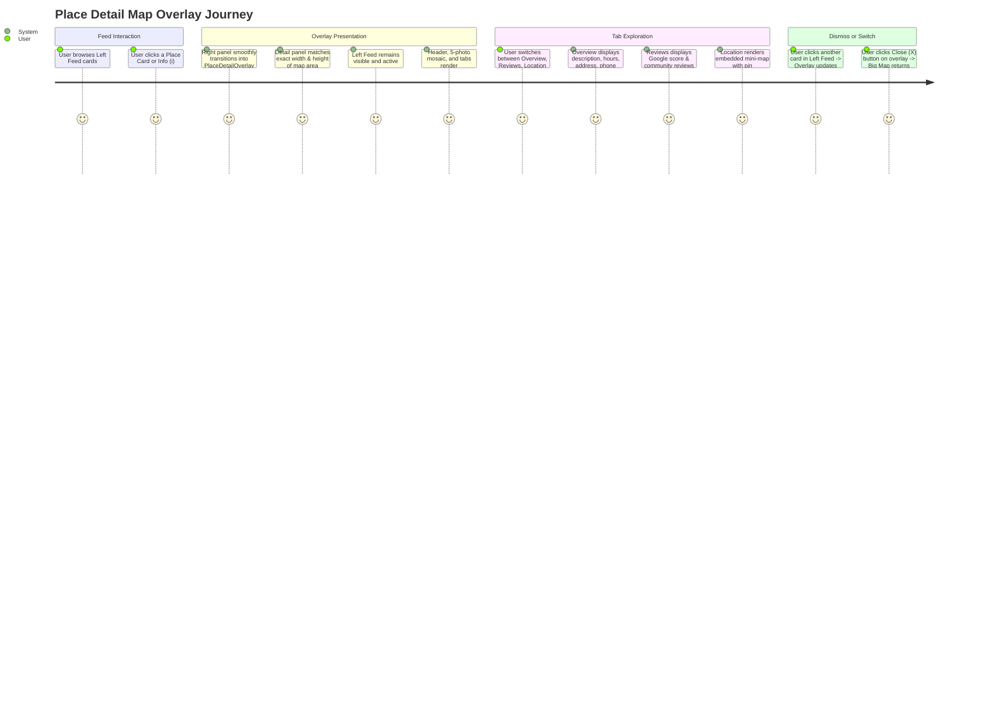

# Place Detail Map Overlay — Specification & Implementation Plan

`STATUS: DONE`

- **Owner Service**: `apps/web/tripsense`
- **Affected Components**: `apps/web/tripsense/src/features/places/components/place-detail-overlay.tsx`, `apps/web/tripsense/src/features/places/components/place-discovery-view.tsx`, `apps/web/tripsense/src/features/places/components/place-detail-modal.tsx`
- **Downstream Services**: `services/place-service`, `services/api-gateway` (All existing API contracts preserved)
- **Created Date**: 2026-09-28
- **Target PR Boundaries**: [Phase 1 (Right Panel Overlay Architecture), Phase 2 (5-Photo Mosaic & Tabs Navigation), Phase 3 (Overview, Reviews & Mini-Map Sections), Phase 4 (Floating AI Bar & Responsive Layout)]

---

## 1. Goal & Requirements

### 1.1 Problem Statement & User Goal
Currently, clicking a place in the Explore Left Feed opens a full-screen center `<Dialog>` (`PlaceDetailModal`). This obscures both the feed and the map, preventing users from comparing places or maintaining context.

In **Mindtrip** (as demonstrated in the user's reference screenshots Images 1–5):
1. **Map Panel Overlay**: When a user clicks a place card in the left feed, the Place Detail view does NOT open as a blocking modal dialog. Instead, it renders as a **dedicated overlay panel directly occupying the Right Panel (with the exact same width, height, and boundaries as the map)**.
2. **Continuous Browsing**: The Left Feed remains fully visible and scrollable, allowing users to browse and click other places without having to reopen modals.
3. **Rich 1:1 Layout**:
   - **Header**: Place Title, Star rating `★ 4,9 · 3,1 n reviews · Phuoc My, Đà Nẵng`, Category `🍴 Steakhouse`.
   - **Photo Mosaic**: 5-photo grid layout: 1 large featured photo on the left (~50% width), and 4 photos arranged in a 2x2 grid on the right (~50% width).
   - **Navigation Tabs**: `Overview`, `Reviews`, `Location` with active indicator.
   - **Overview Section**:
     - Formatted description paragraph with "Read more" toggle.
     - Structured metadata: Address (with "Get directions >"), Website, Phone, Opening Hours (with daily hours expander).
   - **Reviews Section**:
     - Overall score badge (`4,9 Excellent`, `★ 3,1 n reviews`) + "+ Add review" button.
     - Google Review card (`Google [↗] 4,9/5 · 3,1 n reviews`).
     - Community reviews section ("From our community" + user reviews + "+ Add review").
   - **Location Section**:
     - Address line.
     - Embedded interactive Mini-Map with pin, "Get directions" button, fullscreen expand, and zoom controls.
   - **Floating Bottom Pill**:
     - Floating rounded input bar: `Ask TripSense` with microphone / AI assistant trigger.
   - **Dismiss Controls**:
     - Floating `(X)` close button at the top of the overlay to return to the interactive map.

### 1.2 User Flows & Journey



### 1.3 Scope Boundaries

- **In-Scope**:
  - Create `PlaceDetailOverlay` component inside `apps/web/tripsense/src/features/places/components/place-detail-overlay.tsx`.
  - Update `place-discovery-view.tsx` to render `PlaceDetailOverlay` inside the Right Panel (`relative flex-1 h-full min-w-0`), overlaying the map with smooth enter animation when `detailedPlace` is set.
  - Implement 5-photo mosaic grid (1 large left + 4 right 2x2).
  - Implement 3 tabs: `Overview`, `Reviews`, `Location`.
  - Implement Overview details: Description with "Read more", Address, Website, Phone, Hours.
  - Implement Reviews section: Google score card, community review placeholder / list, "+ Add review".
  - Implement Location section: Embedded MapVina mini-map with center pin and controls.
  - Implement bottom floating `Ask TripSense` input bar.
  - Close button `(X)` restoring the map.
  - Maintain mobile responsiveness: On mobile (<1024px), opens as full-screen slide-over or sheet.

- **Out-of-Scope**:
  - Modifying backend APIs or database schemas (existing endpoints `/api/places/{id}` and `/api/places/search` provide all required data).
  - Modifying other pages (AI Planner, Chat).

### 1.4 Acceptance Criteria

- [x] **AC-1 (Right Panel Map Overlay)**: Clicking a card in the Left Feed opens the detail view directly inside the Right Panel matching the map's width, while the Left Feed remains visible and interactive.
- [x] **AC-2 (Close & Return to Map)**: Clicking the `(X)` button on the detail panel dismisses the overlay and immediately restores the interactive map canvas.
- [x] **AC-3 (5-Photo Mosaic Layout)**: Photo section renders 1 large photo on the left and a 2x2 grid of 4 photos on the right with smooth fallbacks if fewer than 5 photos exist.
- [x] **AC-4 (Tabs Navigation)**: `Overview`, `Reviews`, and `Location` tabs switch content cleanly or scroll to their respective sections.
- [x] **AC-5 (Overview Metadata)**: Displays description with "Read more", formatted Address, Website external link, Phone number, and Hours dropdown.
- [x] **AC-6 (Reviews & Google Card)**: Displays big rating score, review count, Google badge card, and community review section.
- [x] **AC-7 (Location Mini-Map)**: Location tab renders embedded mini-map with place pin and map controls.
- [x] **AC-8 (Zero Layout Bugs & Responsive Fit)**: Seamlessly fits container dimensions whether panel is split or expanded/collapsed.
- [x] **AC-9 (Zero Regressions)**: Preserves existing `getPlaceDetails` and `getPlaceReviews` contracts with zero memory leaks.

---

## 2. Architecture & Service Boundaries

```text
[PlaceDiscoveryView Layout]
┌──────────────────────────────┬─────────────────────────────────────────────────┐
│ Left Feed Panel (46-48%)     │ Right Panel (52-54% flex-1)                     │
│                              │                                                 │
│ • Destination Dropdown       │ ┌─────────────────────────────────────────────┐ │
│ • Autocomplete Search Bar    │ │ MapVinaContainer (Bản đồ)                  │ │
│ • Category Tabs              │ │ [Bị phủ lên khi detailedPlace != null]       │ │
│ • 2-Column Mindtrip Cards    │ └─────────────────────────────────────────────┘ │
│                              │ ┌─────────────────────────────────────────────┐ │
│                              │ │ PlaceDetailOverlay (Lớp phủ thông tin)      │ │
│                              │ │ • Nút Close (X) góc phải                    │ │
│                              │ │ • Tiêu đề, Rating, Category                 │ │
│                              │ │ • 5-Photo Mosaic (1 to + 4 nhỏ 2x2)         │ │
│                              │ │ • Tabs: Overview | Reviews | Location       │ │
│                              │ │ • Chi tiết: Description, Address, Phone...  │ │
│                              │ │ • Mini-map toạ độ địa điểm                  │ │
│                              │ └─────────────────────────────────────────────┘ │
└──────────────────────────────┴─────────────────────────────────────────────────┘
```

---

## 3. Implementation Plan

### Phase 1: PlaceDetailOverlay Scaffolding & Container
- [x] Created `PlaceDetailOverlay` in `src/features/places/components/place-detail-overlay.tsx`:
  - Positioned `absolute inset-0 z-30 bg-background overflow-y-auto scrollbar-thin flex flex-col`.
  - Floating circular Close button `(X)` at top-left, Back `(←)` button, and action buttons `Save`, `Add to trip`, `Share`.
- [x] Integrated into `PlaceDiscoveryView`:
  - Placed `PlaceDetailOverlay` inside the Right Panel (`<div className="h-full relative overflow-hidden flex-1 min-w-0 w-full">`).
  - Rendered conditionally when `isDetailOpen && detailPlace`.

### Phase 2: 5-Photo Mosaic & Header Typography
- [x] Header: Place name (`text-2xl sm:text-3xl font-bold text-foreground`), Rating `★ 4,8 · 1 n reviews · District, City`, Category `🍴 Cuisine · $$`.
- [x] Photo Mosaic Grid:
  - Container: `grid grid-cols-2 gap-2 h-[280px] sm:h-[340px] md:h-[380px] rounded-2xl overflow-hidden`.
  - Left column: 1 large photo (`h-full w-full relative object-cover`) with `(i)` info badge.
  - Right column: 4 photos in `grid grid-cols-2 grid-rows-2 gap-2 h-full`.
  - Clean fallbacks for places with fewer than 5 photos.

### Phase 3: Tabs Navigation & Content Sections
- [x] Sticky Tab Bar: `Overview`, `Reviews`, `Location` with active bottom border.
- [x] Section 1: Overview
  - Description paragraph + "Read more" toggle button.
  - Details grid: Address + "Get directions >", Website, Phone, Hours.
- [x] Section 2: Reviews
  - Large rating score (e.g. `4,8` + "Excellent" + `★ 1 n reviews`).
  - Google card badge (`Google [↗] 4,8/5 · 1 n reviews`).
  - Community reviews section with avatar and "+ Add review" button.
- [x] Section 3: Location
  - Address text.
  - Embedded Mini-Map canvas with center pin and directions button.

### Phase 4: Verification & Quality Gates
- [x] Verified:
  - TypeScript type-check (`tsc --noEmit` -> 0 errors).
  - Vitest unit tests for `PlaceDetailOverlay` (24/24 tests passed).
  - i18n schema check (`npm run i18n:check` -> 100% parity).

---

## 4. Human Approval Gate & Completion

```text
STATUS: DONE
```
Implementation complete and verified with TypeScript 0 errors, Vitest 24/24 tests passing, and i18n parity check passed. Matching Mindtrip reference screenshot 1:1.
