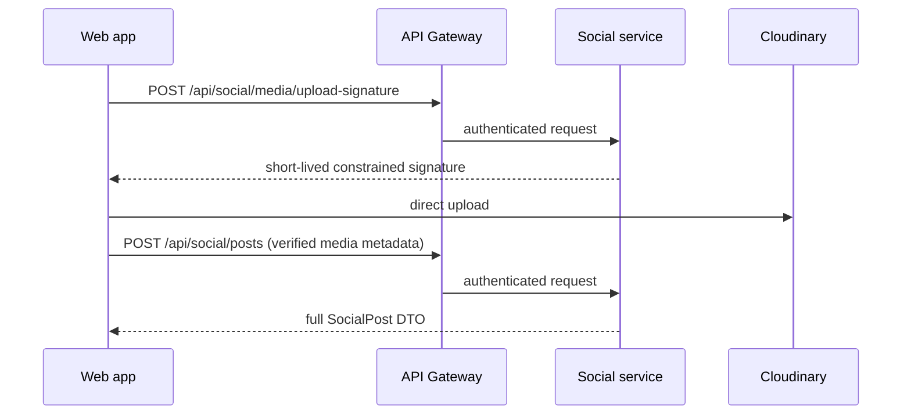

# Architecture

## Affected Services

- `apps/web/tripsense`: retain UI; replace base64 media submission with signed direct Cloudinary upload and correct state semantics.
- Proposed `services/social-service`: owns posts, media metadata, comments, likes, counters, and deletion state in a separate database.
- `services/api-gateway`: route `/api/social/**` to `lb://social-service`.
- `services/user-service`: no database access by social-service; only supplies an approved profile contract if selected.

## Service Ownership

`social-service` is proposed because a high-write social feed/thread/reaction aggregate is neither trip lifecycle nor identity/authentication. It has no cross-service JPA links or foreign keys; it persists author UUIDs and an approved read projection only.

## Flow

Feed is `Web -> Gateway -> Social service`; the service bulk-loads media/reactions and optionally enriches authors through the approved profile mechanism, never per-item database/service calls. Likes and comments are synchronous local transactions. No event is required for v1; profile-event projection is an optional selected solution.

## Read Policy (approval required)

Proposed default: feed, detail, and comments are public with optional valid JWT. Anonymous response has `isLiked: false`; mutations and upload signing require JWT. An invalid supplied bearer token returns `401`, not anonymous access. If private community is selected, the frontend must show an authentication state for share links.

## Rejected Alternatives

- Add social tables to user-service: mixes credentials/identity with social workload.
- Add them to trip-service: social content is not trip-owned.
- Direct frontend calls to a service: violates gateway architecture.
- Binary upload through backend: unnecessary and exposes resource pressure when Cloudinary direct upload is available.
