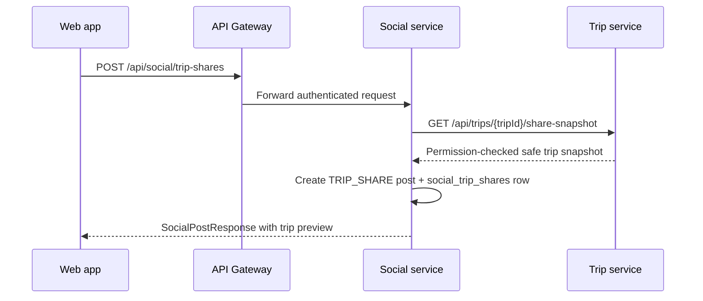

# Architecture

## Affected Services

- `apps/web/tripsense`: adds sharing entry points from trip detail, a share dialog, trip-share preview cards in Community, visibility controls, and remove affordances.
- `services/api-gateway`: existing `/api/social/**` and `/api/trips/**` routes are sufficient; no direct web-to-service calls.
- `services/social-service`: owns `TRIP_SHARE` posts, captions, visibility, social counters, comments, likes, and removal.
- `services/trip-service`: owns canonical trip state and exposes a permission-checked share snapshot endpoint.
- `services/user-service`: remains only a profile/author projection source if existing social author behavior needs it.

## Service Ownership

Trip sharing is modeled as a specialized social post. `social-service` stores the social representation and an embedded trip summary snapshot. `trip-service` remains authoritative for source trip ownership, archived/deleted state, and canonical trip details.

No service reads another service database. `social-service` stores `sourceTripId` as an external UUID only.

## Flow

Feed/detail reads use `social-service` data and the stored trip snapshot. They must not call `trip-service` for every post.

## Visibility Matrix

| Context | `PUBLIC` | `UNLISTED` | `PRIVATE` | Removed/deleted post | Archived/deleted source trip |
| --- | --- | --- | --- | --- | --- |
| Community feed | Visible to authenticated users | Hidden | Hidden | Hidden | Show only if stored share remains active, with no full-trip open action |
| Direct post detail | Visible to authenticated users | Visible to authenticated users with link | Owner only | `404` for non-admin viewers | Show safe unavailable state from stored snapshot |
| Shared trip view | Snapshot detail only | Snapshot detail only | Owner only | `404` for non-admin viewers | Snapshot may render, canonical trip open is disabled |
| Owner management | Visible/manageable | Visible/manageable | Visible/manageable | Hidden unless admin tooling later needs it | Show unavailable/source changed state |

## Sync Communication

`social-service -> trip-service` is synchronous only for share creation and optional future snapshot refresh. The user cannot complete a share action unless the source trip exists and the caller owns it.

The service call forwards the user's bearer token and uses a short timeout. Downstream `401`, `403`, `404`, `409`, timeout, and `5xx` responses are mapped to explicit social-service errors.

## Async Events

No event is required for MVP. Future events may be added:

- `TripUpdated`: refresh shared snapshots.
- `TripArchived`: mark shared trip access unavailable.
- `TripDeleted`: hide or mark shared posts unavailable.

## Rejected Alternatives

- Store shared posts in `trip-service`: rejected because feed ordering, visibility, likes, comments, and delete state are social concerns.
- Create a new `sharing-service`: rejected for MVP because `social-service` and `trip-service` already have clear ownership.
- Assemble trip shares in the frontend with separate trip/social calls: rejected because creation needs server-side ownership validation and all public traffic must go through Gateway.
- Store full itinerary in the social post snapshot: rejected for privacy and stale-data risk.
- Live-load trip data for every feed item: rejected because it creates N+1 service calls and couples feed availability to `trip-service`.
- Anonymous public links using raw `postId`: rejected for MVP. Future public sharing should introduce opaque share slugs/tokens.

## Related

- [TripSense Architecture](../../architecture/tripsense-architecture.md)
- [Service Boundaries](../../architecture/service-boundaries.md)
- [Social Post Management](../social-post-management/index.md)
- [Manage Trip/Itinerary](../manage-trip-itinerary/index.md)
