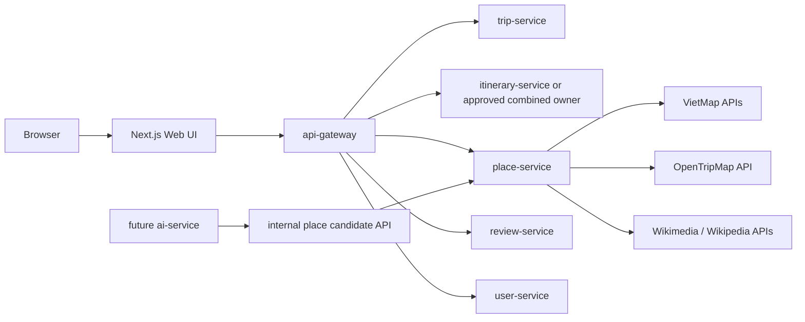

# Architecture

## Affected Services

- `apps/web/tripsense`: implemented starter Next.js app. It becomes the TripSense web UI and may include thin BFF/proxy route handlers if needed.
- `services/api-gateway`: implemented. It remains the public backend ingress and gains routes for approved backend services.
- `services/place-service`: implemented but skeletal. It owns places, provider integrations, place matching, external signals, and routing provider abstractions.
- `services/trip-service`: planned, not present. It owns trip lifecycle and may own itinerary for the MVP if approved.
- `services/itinerary-service`: planned, not present. It owns itinerary days/items, sequence ordering, moves, and schedule invariants if kept separate.
- `services/review-service`: planned, not present. It owns TripSense feedback and rating summaries.
- `services/user-service`: planned, not present. It owns favorites and collections.
- `services/context-service`: planned, not present. It is a candidate owner for `PlaceIntelligence`.
- `services/ai-service`: implemented but out of scope for this phase, except as a future consumer of candidate APIs.

## Service Ownership

The final architecture keeps durable state in service-owned databases behind the API Gateway. The web app does not become the system of record for TripSense domain data.

For approved Milestone 0, `place-service` owns the provider proof of concept. It calls VietMap, OpenTripMap, and Wikimedia with backend-owned provider logic and returns normalized DTOs to the web app through API Gateway. Trip and itinerary service work is explicitly deferred.

## Flow

## Sync Communication

- Browser/UI operations use synchronous HTTP for map search and enrichment POC calls.
- The web app calls the gateway or a thin BFF that forwards to the gateway.
- Backend services exchange IDs and DTOs only. They do not share entity classes or databases.
- `place-service` performs synchronous provider calls only when required by a user action and within timeout/rate-limit policies.
- The browser may use `NEXT_PUBLIC_VIETMAP_TILE_KEY` only for VietMap base map rendering.

## Async Events

No Kafka events are required for Milestone 0. Later milestones may add events for enrichment refresh, feedback summary updates, analytics, notifications, or AI candidate precomputation after explicit approval.

## Rejected Alternatives

- Use Next.js Route Handlers plus Prisma as the authoritative backend: rejected because it violates gateway-first public traffic and service-owned data rules.
- Store provider IDs as TripSense place primary keys: rejected because internal and external identity must remain separate.
- Begin with Trip and Itinerary CRUD before provider validation: rejected by the approved 2026-08-18 priority change.
- Build every planned service before Trip CRUD: rejected as too broad for the first implementation slice.

## Related

- [TripSense Architecture](../../architecture/tripsense-architecture.md)
- [Service Boundaries](../../architecture/service-boundaries.md)
