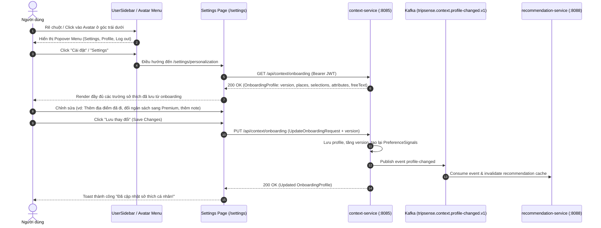

# User Personalization Settings — Specification & Implementation Plan

`STATUS: DONE`

- **Owner Service**: `services/context-service`
- **Affected Components**: `apps/web/tripsense`, `services/api-gateway`, `services/context-service`, `services/recommendation-service`
- **Created Date**: 2026-09-28
- **Target PR Boundaries**:
  - Phase 1: Sidebar Avatar Hover & Quick Action Menu (`UserSidebar` + `UserMenu`)
  - Phase 2: Mindtrip-style Settings Shell & Tab Navigation (`/settings`)
  - Phase 3: Personalization Editor View (`/settings/personalization` with exact onboarding data inputs)
  - Phase 4: Backend Contract Binding & Real-Time Sync (`context-service` REST + Kafka event propagation)
  - Phase 5: Verification & Automated Tests (Unit tests for components, state, and edge cases)

---

## 1. Goal & Requirements

### 1.1 Problem Statement & User Goal
Currently, users complete an onboarding questionnaire upon sign-up to capture travel styles, budget preferences, dietary habits, and destination affinities. However, once onboarding is completed, users have **no way to view or re-configure these preferences** without resetting their account.

The goal of this feature is:
1. Provide quick, seamless access to Settings directly when interacting with (hovering or clicking) the user's avatar in the sidebar footer and header.
2. Build a dedicated Mindtrip-inspired Settings page (`/settings`) with a **Personalization** tab.
3. Allow users to inspect and edit **the exact same information captured during onboarding** (Home City, Visited Destinations, Wishlist Destinations, Travel Party, Budget Tier, Accommodation Types, Food Styles, Activity Interests, Free-Text Notes, and AI assistance toggles).
4. Persist changes to `context-service`, automatically recalculate preference signals, and propagate preference updates via Kafka to `recommendation-service` and `ai-service` to immediately refresh recommendations.

---

### 1.2 User Flows & Journey



1. **Truy cập nhanh (Entry Point)**:
   - Khi rê chuột (hover) hoặc bấm vào hàng Profile/Avatar ở chân Sidebar trái (`UserSidebar`), một menu popover gọn gàng xuất hiện gồm các tùy chọn:
     - **Cá nhân hóa (Personalization)** (`/settings/personalization`)
     - **Cài đặt chung (Settings)** (`/settings`)
     - **Hồ sơ cá nhân (Profile)** (`/profile`)
     - **Đăng xuất (Log out)** (mở `LogoutModal`)
   - Khi Sidebar ở trạng thái thu nhỏ (collapsed), bấm vào avatar cũng mở popover tương tự.
   - Trên thanh header (`UserMenu`), mục **Settings** được mở rộng cho tất cả người dùng (không chỉ riêng Admin).
2. **Trang cài đặt Mindtrip (`/settings`)**:
   - Giao diện chia 2 cột chuẩn thiết kế Mindtrip:
     - **Cột trái (Settings Navigation)**: `Edit profile`, `Your account`, `Personalization` (mục chính), `Price alerts`, `Language & region`, `Notifications`, `Early access`, `Connected accounts`, `Cookie preferences`.
     - **Cột phải (Content Panel)**: Hiển thị nội dung tương ứng của tab `Personalization`.
3. **Chỉnh sửa sở thích (Personalization Editor)**:
   - Tải dữ liệu hiện tại từ `GET /api/context/onboarding`.
   - Hiển thị trực quan theo từng phân vùng (giống hệt dữ liệu đã nhập ở Onboarding):
     - **Experiences / Destinations**: Tag danh sách *Địa điểm đã đến (`VISITED`)* và *Địa điểm mơ ước (`WANT_TO_VISIT`)*, có nút xóa `(X)` và nút `+ Thêm địa điểm` mở hộp thoại tìm kiếm nhanh.
     - **Thông tin cơ bản & Quê quán**: *Thành phố cư trú (`HOME_CITY`)* chọn nhanh từ danh sách tỉnh thành Việt Nam hoặc nhập tự do.
     - **Phong cách & Ngân sách**: *Bạn đồng hành (`TRAVEL_PARTY`)* (Solo, Couple, Friends, Family) và *Hạng ngân sách (`BUDGET_TIER`)* (Budget, Mid-Range, Premium).
     - **Lưu trú & Ăn uống**: *Hình thức lưu trú (`STAY_STYLE`)* (Hotel, Homestay, Resort, Hostel) và *Khẩu vị ẩm thực (`FOOD_STYLE`)* (Local food, Street food, Fine dining, Cafe).
     - **Hoạt động & Ghi chú tự do**: *Sở thích hoạt động (`ACTIVITY_INTEREST`)* (Nature, Hiking, Culture, Beach, Nightlife) và ô văn bản *Ghi chú du lịch (`freeText`)* kèm các tag gợi ý nhanh (📸 Chụp ảnh đẹp, ☕ Cà phê chill, 🌲 Thiên nhiên, 🏖️ Bãi biển, 🥾 Trekking, 🥗 Ăn chay).
     - **Điều khiển AI (Mindtrip-inspired)**: Lựa chọn giọng nói (Marin, Shimmer, Echo, Cedar), phong cách giao tiếp (Casual, Formal), và nút bật/tắt *Ghi nhớ dài hạn (Long-term memory)*.
4. **Lưu & Phản hồi**:
   - Bấm nút "Lưu thay đổi", hệ thống gửi `PUT /api/context/onboarding` kèm `version` kiểm soát xung đột (optimistic locking).
   - Hiển thị toast thông báo thành công. `recommendation-service` và `ai-service` nhận Kafka event để cập nhật ngay lập tức các gợi ý thông minh cho người dùng.

---

### 1.3 Scope Boundaries

- **In-Scope**:
  - Popover / Dropdown menu avatar tại `UserSidebar` (hỗ trợ cả expanded và collapsed) và `UserMenu` ở `UserHeader`.
  - Layout trang cài đặt người dùng `/settings` với thanh điều hướng các tab theo phong cách Mindtrip.
  - Form chỉnh sửa `Personalization` phản ánh 100% các dữ liệu của Onboarding:
    - `HOME_CITY`
    - `places.VISITED`
    - `places.WANT_TO_VISIT`
    - `TRAVEL_PARTY`
    - `BUDGET_TIER`
    - `STAY_STYLE`
    - `FOOD_STYLE`
    - `ACTIVITY_INTEREST`
    - `freeText`
    - Mindtrip AI preferences (Voice, Communication Style, Long-term memory toggle).
  - Tích hợp gọi API `GET /api/context/onboarding` và `PUT /api/context/onboarding`.
  - Hỗ trợ đầy đủ song ngữ tiếng Việt (`vi.json`) và tiếng Anh (`en.json`).
  - Unit tests cho component và store.
- **Out-of-Scope**:
  - Không thay đổi nghiệp vụ thanh toán, đổi mật khẩu OAuth hoặc tích hợp calendar bên thứ ba trong phạm vi PR này.
  - Giữ nguyên cấu hình Admin Settings tại `/admin/settings` (tách biệt rõ ràng giữa User Settings và Admin Data Enrichment Settings).

---

### 1.4 Acceptance Criteria

- [ ] **AC-1**: Khi người dùng authenticated rê chuột hoặc click vào Avatar ở chân sidebar trái (`UserSidebar`), một menu hành động xuất hiện có mục "Settings" / "Cài đặt".
- [ ] **AC-2**: Click vào "Settings" chuyển hướng mượt mà đến trang `/settings` (mặc định tab `Personalization`).
- [ ] **AC-3**: Trang `/settings` có đầy đủ sidebar các tab phụ trợ theo thiết kế Mindtrip, hỗ trợ responsive trên cả mobile và desktop.
- [ ] **AC-4**: Form Personalization tự động load chính xác toàn bộ dữ liệu người dùng đã thiết lập từ Onboarding qua `GET /api/context/onboarding`.
- [ ] **AC-5**: Người dùng có thể thêm/xóa địa điểm đã đi (`VISITED`) và địa điểm mong muốn (`WANT_TO_VISIT`), thay đổi thành phố nhà (`HOME_CITY`), đổi nhóm bạn đồng hành, ngân sách, nơi ở, ăn uống, hoạt động và ghi chú tự do.
- [ ] **AC-6**: Nhấn "Lưu thay đổi" gọi `PUT /api/context/onboarding` với payload chuẩn `UpdateOnboardingRequest`, xử lý lỗi 409 conflict nếu có version sai lệch, hiển thị toast thông báo thành công và không reload lại toàn trang.
- [ ] **AC-7**: Sau khi lưu thành công, `context-service` tính toán lại `PreferenceSignals` và đẩy event Kafka `tripsense.context.profile-changed.v1`.
- [ ] **AC-8**: Tuân thủ 100% Typography Contract (không dùng `text-[10px]` hay `font-extrabold`) và đạt 100% test coverage qua Vitest.

---

## 2. Architecture & Service Boundaries

### 2.1 Interaction Diagram / Data Flow
```text
[Browser / Next.js Web]
       |
       | 1. GET /api/context/onboarding (Fetch current preferences)
       | 2. PUT /api/context/onboarding (Save modified preferences)
       v
[API Gateway (:8080)]
       | (Route: /api/context/** -> context-service)
       v
[context-service (:8085)]
       |-- Reads & Writes `context_onboarding_profiles`
       |-- Regenerates `context_preference_signals`
       |-- Records Outbox event
       v
[Kafka Topic: tripsense.context.profile-changed.v1]
       |
       +--> [recommendation-service (:8088)] -> Evicts user cache & recalculates features
       +--> [ai-service]                     -> Updates AI system prompt context
```

### 2.2 Service Ownership & Communication
| Component | Trách nhiệm | Giao tiếp |
| --- | --- | --- |
| `apps/web/tripsense` | Giao diện Avatar Popover, Trang `/settings`, Form Personalization | REST Client via Gateway |
| `services/api-gateway` | Xác thực JWT Bearer, forward request sang `context-service` | Spring Cloud Gateway |
| `services/context-service` | Quản lý vòng đời Onboarding & Lưu trữ sở thích người dùng | Synchronous Spring Boot |
| `services/recommendation-service` | Lắng nghe event `profile-changed` để cập nhật gợi ý | Kafka Consumer |

### 2.3 Architecture Guardrails Verification
- [x] **Gateway Routing**: Mọi traffic từ web đều đi qua Gateway (`/api/context/**`).
- [x] **Data Ownership**: `context-service` là nguồn chân lý duy nhất (Source of Truth) cho bảng `context_onboarding_profiles` và `context_preference_signals`. Không có service nào khác truy vấn trực tiếp DB của `context-service`.
- [x] **No Cross-Service JPA**: Dữ liệu trao đổi qua DTOs và Kafka Events; không tồn tại quan hệ JPA chéo database.
- [x] **Async Consistency**: Cập nhật sở thích ở frontend là đồng bộ (REST), việc lan truyền đến `recommendation-service` là bất đồng bộ (Kafka Eventual Consistency) qua Outbox Pattern.

---

## 3. API & Event Contracts

### 3.1 REST Endpoints

#### 1. Lấy thông tin Onboarding / Personalization hiện tại
- **Method**: `GET`
- **Path**: `/api/context/onboarding`
- **Auth**: `Bearer JWT` (Bắt buộc)
- **Response DTO (200 OK)**:
```json
{
  "version": 2,
  "status": "COMPLETED",
  "selections": {
    "TRAVEL_PARTY": ["COUPLE"],
    "BUDGET_TIER": ["MID_RANGE"],
    "STAY_STYLE": ["HOTEL", "RESORT"],
    "FOOD_STYLE": ["LOCAL_FOOD", "CAFE"],
    "ACTIVITY_INTEREST": ["NATURE", "BEACH"]
  },
  "places": {
    "VISITED": ["da-nang", "hoi-an", "bangkok"],
    "WANT_TO_VISIT": ["tokyo", "seoul"]
  },
  "attributes": {
    "HOME_CITY": "da-nang"
  },
  "freeText": "Thích chụp ảnh cảnh đẹp và các quán cà phê có không gian yên tĩnh."
}
```

#### 2. Cập nhật thông tin Personalization
- **Method**: `PUT`
- **Path**: `/api/context/onboarding`
- **Auth**: `Bearer JWT` (Bắt buộc)
- **Request DTO**:
```json
{
  "version": 2,
  "selections": {
    "TRAVEL_PARTY": ["SOLO"],
    "BUDGET_TIER": ["PREMIUM"],
    "STAY_STYLE": ["RESORT"],
    "FOOD_STYLE": ["FINE_DINING", "CAFE"],
    "ACTIVITY_INTEREST": ["CULTURE", "NIGHTLIFE"]
  },
  "places": {
    "VISITED": ["da-nang", "tokyo"],
    "WANT_TO_VISIT": ["paris", "rome"]
  },
  "attributes": {
    "HOME_CITY": "ho-chi-minh"
  },
  "freeText": "Muốn trải nghiệm văn hóa bản địa và ẩm thực cao cấp."
}
```
- **Response DTO (200 OK)**: `OnboardingResponse` với `version` mới (ví dụ: `3`).
- **Error Responses**:
  - `400 Bad Request`: Giá trị enum không hợp lệ hoặc vượt quá 20 địa điểm.
  - `409 Conflict`: `version` không khớp (Optimistic Lock Exception khi có session khác đã sửa đổi trước).

---

### 3.2 Kafka Event Contract
- **Topic**: `tripsense.context.profile-changed.v1`
- **Key**: `userId` (UUID dạng chuỗi)
- **Schema**:
```json
{
  "eventId": "b7899532-6a84-486d-b87d-bf609b5526cb",
  "eventType": "CONTEXT_PROFILE_CHANGED",
  "timestamp": 1727518500000,
  "userId": "e6695230-b782-4402-beab-2451326465e6",
  "payload": {
    "version": 3,
    "status": "COMPLETED",
    "updatedAt": "2026-09-28T16:30:00Z"
  }
}
```

---

## 4. Data Model & Migrations

Cơ sở dữ liệu của `context-service` đã có sẵn bảng lưu trữ (được tạo từ Flyway migration `V1__init_context_schema.sql`):
```sql
CREATE TABLE IF NOT EXISTS context_onboarding_profiles (
    user_id UUID PRIMARY KEY,
    version BIGINT NOT NULL DEFAULT 0,
    status VARCHAR(32) NOT NULL,
    answers_json JSONB NOT NULL,
    completed_at TIMESTAMP WITH TIME ZONE,
    created_at TIMESTAMP WITH TIME ZONE NOT NULL DEFAULT NOW(),
    updated_at TIMESTAMP WITH TIME ZONE NOT NULL DEFAULT NOW()
);

CREATE TABLE IF NOT EXISTS context_preference_signals (
    id UUID PRIMARY KEY,
    user_id UUID NOT NULL,
    dimension_code VARCHAR(64) NOT NULL,
    signal_value VARCHAR(128) NOT NULL,
    weight DOUBLE PRECISION NOT NULL DEFAULT 1.0,
    source VARCHAR(32) NOT NULL,
    updated_at TIMESTAMP WITH TIME ZONE NOT NULL DEFAULT NOW()
);

CREATE INDEX IF NOT EXISTS idx_context_signals_user ON context_preference_signals(user_id);
```
*Không cần thêm migration mới vì schema hiện tại lưu trữ đầy đủ toàn bộ `answers_json` (bao gồm `selections`, `places`, `attributes`, `freeText`) với version optimistic locking.*

---

## 5. Security & Trust Boundaries

| Khu vực rủi ro | Chiến lược kiểm soát & Giảm thiểu |
| --- | --- |
| **Xác thực (Authentication)** | Mọi request tới `/api/context/onboarding` bắt buộc có JWT Bearer hợp lệ. Gateway kiểm tra token trước khi forward. |
| **Phân quyền & IDOR Prevention** | `context-service` lấy `userId` trực tiếp từ `SecurityContext` (`CurrentUserProvider.requiredUser().id()`), người dùng chỉ có thể đọc và sửa dữ liệu của chính mình. |
| **Kiểm tra dữ liệu đầu vào (Input Validation)** | Giới hạn tối đa 20 items cho mỗi danh mục, độ dài text tự do tối đa 2000 ký tự, enum dimension được kiểm tra qua `PreferenceDimensionCatalog`. XSS được sanitize trước khi render. |
| **Bảo mật vị trí & Dữ liệu nhạy cảm** | `HOME_CITY` chỉ lưu tên định danh thành phố (canonical placeRef), không lưu tọa độ GPS thời gian thực. |

---

## 6. Devil's Advocate & Technical Trade-offs

| Khía cạnh | Thách thức / Rủi ro | Giải pháp & Đánh đổi (Trade-off) |
| --- | --- | --- |
| **Đụng độ dữ liệu (Concurrency Conflict)** | Người dùng mở nhiều tab hoặc sửa đồng thời | Sử dụng `version` (optimistic locking). Nếu server trả về `409 Conflict`, web app hiển thị thông báo "Dữ liệu đã được cập nhật ở nơi khác, đang tải lại phiên bản mới nhất" và tự động fetch lại. |
| **Form phức tạp vs Trải nghiệm người dùng** | Quá nhiều trường thông tin trên một trang | Nhóm thành các card phân vùng rõ ràng (Experiences, Basics, Style & Budget, Stay & Food, Activities & Note) với toggle switch và pill button dễ bấm, lưu bằng một nút chính duy nhất với sticky footer. |
| **Tách biệt Admin Settings vs User Settings** | Trùng đường dẫn `/settings` | Chuyển Admin Data Enrichment sang `/admin/settings` (đã có sẵn), nhường route `/settings` cho User Settings đúng với chuẩn sản phẩm thương mại. |

---

## 7. Phased Implementation Tasks & Verification

### Phase 1: Sidebar Avatar Quick Menu & Navigation Trigger
- [ ] Cập nhật `UserSidebar`:
  - Thêm popover/dropdown menu khi hover hoặc click vào khu vực avatar/profile của user ở footer.
  - Bao gồm nút `...` (Three Dots) như thiết kế Mindtrip.
  - Tùy chọn menu: "Cá nhân hóa" (`/settings/personalization`), "Cài đặt" (`/settings`), "Hồ sơ" (`/profile`), "Đăng xuất" (`LogoutModal`).
  - Hỗ trợ cả trạng thái sidebar collapsed (hiển thị tooltip popover với các nút hành động nhanh).
- [ ] Cập nhật `UserMenu` trong `UserHeader`: Mở quyền truy cập mục "Settings" cho mọi user đăng nhập.

### Phase 2: Mindtrip Settings Shell & Tab Layout
- [ ] Xây dựng layout `/settings` (`src/app/(main)/settings/layout.tsx` và `src/app/(main)/settings/page.tsx`):
  - Sidebar danh sách tabs bên trái: `Edit profile`, `Your account`, `Personalization` (active), `Price alerts`, `Language & region`, `Notifications`, `Early access`, `Connected accounts`, `Cookie preferences`.
  - Khung nội dung chính bên phải với thiết kế bo góc, viền nhẹ, responsive trên tablet/mobile.

### Phase 3: Personalization Editor Component
- [ ] Tạo `src/features/settings/components/personalization-editor.tsx`:
  - **Phần 1: Experiences (Điểm đến)**:
    - Hiển thị danh sách badge địa điểm đã đến (`VISITED`) có nút `x`.
    - Hiển thị danh sách badge địa điểm muốn đến (`WANT_TO_VISIT`) có nút `x`.
    - Nút `+ Thêm địa điểm` với modal/popover tìm kiếm nhanh từ `POPULAR_DESTINATIONS`.
  - **Phần 2: Basics & Home City**:
    - Chọn thành phố quê hương / cư trú (`HOME_CITY`) từ danh sách phổ biến hoặc nhập tùy ý.
  - **Phần 3: Travel Style & Budget**:
    - Nhóm bạn đồng hành (`TRAVEL_PARTY`): Solo, Couple, Friends, Family (chọn 1).
    - Hạng ngân sách (`BUDGET_TIER`): Budget, Mid-Range, Premium (chọn 1).
  - **Phần 4: Stay & Food Preferences**:
    - Kiểu lưu trú (`STAY_STYLE`): Hotel, Homestay, Resort, Hostel (chọn nhiều).
    - Phong cách ẩm thực (`FOOD_STYLE`): Local food, Street food, Fine dining, Cafe (chọn nhiều).
  - **Phần 5: Activity Interests & Travel Notes**:
    - Hoạt động yêu thích (`ACTIVITY_INTEREST`): Nature, Hiking, Culture, Beach, Nightlife (chọn nhiều).
    - Ghi chú tự do (`freeText`) kèm các tag gợi ý (📸 Chụp ảnh, ☕ Cà phê, 🌲 Thiên nhiên, 🏖️ Biển, 🥾 Trekking, 🥗 Ăn chay).
  - **Phần 6: Mindtrip AI Controls**:
    - Lựa chọn Voice (Marin, Shimmer, Echo, Cedar) kèm nút nghe thử.
    - Dropdown phong cách giao tiếp (Casual, Enthusiastic, Concise, Detailed).
    - Toggle Long-term memory.
  - **Thanh tác vụ (Sticky Action Bar)**:
    - Nút "Hủy thay đổi" (Reset về trạng thái server).
    - Nút "Lưu thay đổi" (Save Changes) với hiệu ứng loading và toast thông báo.

### Phase 4: State Management & API Integration
- [ ] Tạo hook `usePersonalizationSettings` kết nối với `onboardingApi.get` và `onboardingApi.save`.
- [ ] Bổ sung key bản dịch tiếng Việt (`src/locales/vi.json`) và tiếng Anh (`src/locales/en.json`).

### Phase 5: Automated Testing & Verification
- [ ] Viết unit tests cho `PersonalizationEditor`:
  - Kiểm tra render dữ liệu hiện tại khi load trang.
  - Kiểm tra thêm/xóa tag địa điểm.
  - Kiểm tra chọn radio và checkbox.
  - Kiểm tra gọi API `PUT` khi nhấn Lưu.
- [ ] Chạy kiểm thử toàn diện `npm test` và `npx tsc --noEmit` để đảm bảo 100% test green và không vi phạm Typography Contract.

---

## 8. Human Approval Gate

Chờ người dùng review bản kế hoạch chi tiết này.
Sau khi người dùng đồng ý (`Approved`, `Tiến hành`, `Implement`), sẽ chuyển trạng thái sang `STATUS: APPROVED` và bắt đầu triển khai code.

`STATUS: WAITING_FOR_HUMAN_APPROVAL`
