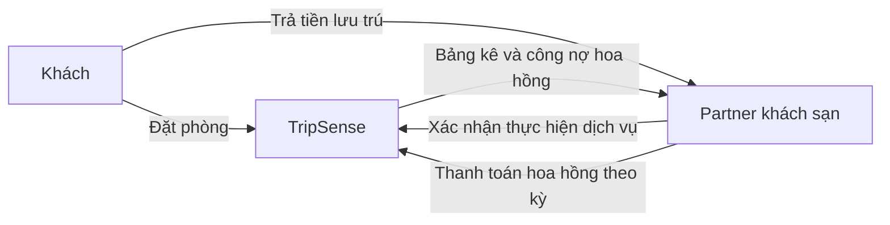
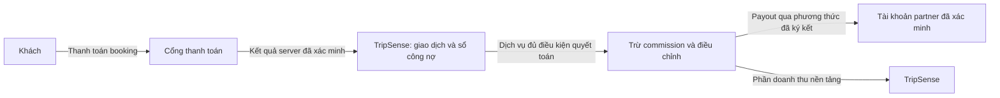

# Review PR #66 và nghiên cứu dòng tiền booking

Ngày: 2026-09-30. PR: https://github.com/tripsense-team/tripsense-platform/pull/66.

Head được review: `355a12a08be072247f54ee5ba22419319169e644`; base `dev`: `c3c3ba6c75856d5fe020a1bf74fe45046baccff9`. Diff gồm 355 file, +30.617/-191 dòng. Review tập trung vào onboarding/approval, hotel booking, guide contact, frontend integration và dòng tiền; không khẳng định đã kiểm chứng mọi nhánh trong toàn bộ diff.

**Kết luận: cần sửa trước khi merge/release.** Tài liệu ghi `DONE`, nhưng các luồng quan trọng còn lỗi và phần tiền chưa nằm trong implementation. Báo cáo này là nghiên cứu và đề xuất, chưa phải feature specification được duyệt. Không thay đổi application code hoặc đăng review lên GitHub.

## 1. Findings theo mức độ

### F1 — BLOCKER: hotel API cũ bỏ qua quy trình duyệt partner

Vị trí: [HotelService.java](../../services/trip-service/src/main/java/fu/tripsense/tripservice/hotel/HotelService.java), dòng 88–89, 180–200, 239–251; migration `V20260928173000__hotel_fulfilment_and_restaurant_menu.sql`, dòng 22.

`saveProperty` tạo hotel mà không gán `business_id`; migration cho phép null. `hold`/`confirm` chỉ kiểm tra partner/capability nếu `business_id != null`. User tạo property qua `/api/hotels/properties`, Admin đặt property thành ACTIVE qua endpoint cũ, rồi user có thể giữ/xác nhận phòng mà không có hồ sơ partner đã duyệt. Approval, capability hoặc suspension của partner không bảo vệ được property không liên kết. Với property đã liên kết, hold còn thiếu kiểm tra `accepting_new`, publication và approval validity.

Đặc tả yêu cầu một nguồn approval và `hotel_property.business_id UNIQUE NOT NULL` (§4/§6 và dòng 415, 578, 589). Cần nối property vào business đã xác minh, đóng đường approval cũ, dùng predicate eligibility đầy đủ; đồng bộ transaction/locking với suspension và revocation. Regression phải thử cả legacy property chưa liên kết và business đã pause intake.

### F2 — BLOCKER: hoàn tất upload tự đánh dấu giấy tờ CLEAN

Vị trí: [PartnerDocumentService.java](../../services/trip-service/src/main/java/fu/tripsense/tripservice/partner/service/PartnerDocumentService.java), dòng 95–96 và 185–186.

Sau upload intent, chủ hồ sơ có thể gọi complete mà chưa upload object. Service lập tức chuyển sang CLEAN và tính hash từ `objectKey + fileSizeBytes`; không đọc object, xác minh metadata hoặc nhận kết quả scanner. Hash này không chứng minh nội dung tài liệu. Cả business evidence và claim evidence đều bị ảnh hưởng. Cần lưu object version/hash nội dung do storage xác minh và chỉ chuyển CLEAN từ kết quả scan tin cậy; object chưa có hoặc chưa scan phải bị chặn.

### F3 — BLOCKER: frontend không vượt qua type-check

Vị trí: [partner-location-autocomplete.test.tsx](../../apps/web/tripsense/src/features/partner/__tests__/partner-location-autocomplete.test.tsx), dòng 61.

`item()` trả `Element`, sau đó gọi `.click()` gây TS2339. Đã tái hiện bằng `npm run type-check`; cùng lỗi trong [CI Verify Frontend](https://github.com/tripsense-team/tripsense-platform/actions/runs/36689780138/job/109804060722). Cần query/narrow đúng HTMLElement; Vitest pass không thay thế type-check.

### F4 — HIGH: Admin có thể duyệt hồ sơ thiếu hoặc trượt checklist bắt buộc

Vị trí: [PartnerAdminService.java](../../services/trip-service/src/main/java/fu/tripsense/tripservice/partner/service/PartnerAdminService.java), dòng 82–112; [admin-partners-view.tsx](../../apps/web/tripsense/src/features/partner/components/admin-partners-view.tsx), dòng 88–96.

Backend chỉ lưu `checklistResults` nếu có, rồi APPROVE mà không tải checklist phiên bản của application và kiểm tra các mục required PASS. UI hiện không gửi checklistResults. Vì vậy hồ sơ có thể được gắn VALID/grant capability khi chưa đối soát các mục bắt buộc, thậm chí khi đã ghi FAIL. Cần enforce ở backend và cung cấp checklist/evidence đúng revision trên UI. Đặc tả dòng 221 quy định thiếu mục bắt buộc không được approve.

### F5 — HIGH: URL giấy tờ dùng token không có chữ ký bí mật

Vị trí: [PartnerDocumentService.java](../../services/trip-service/src/main/java/fu/tripsense/tripservice/partner/service/PartnerDocumentService.java), dòng 283–285.

`generateSignedToken` chỉ Base64 của SHA-256 trên object key và expiry. Hai giá trị này không phải secret, nên đây không phải signed URL chống giả mạo. Hiện URL mặc định còn trỏ vào `storage.tripsense.local`; chưa xác minh có storage verifier hoạt động. Không kết luận đã truy cập được dữ liệu thật, nhưng cơ chế hiện tại không đáp ứng bảo vệ tài liệu private. Cần SDK presign của storage hoặc chữ ký có secret, ràng buộc method/object/version/expiry và kiểm tra phía phục vụ file.

### F6 — HIGH: ngày hiển thị được gửi thẳng vào API booking

Vị trí: [mindtrip-hotel-detail-overlay.tsx](../../apps/web/tripsense/src/features/hotels/components/mindtrip-hotel-detail-overlay.tsx), dòng 77–93, 157–158; [mindtrip-available-rooms-view.tsx](../../apps/web/tripsense/src/features/hotels/components/mindtrip-available-rooms-view.tsx), dòng 100–105.

Discovery không truyền ngày; overlay mặc định dùng Intl tạo `Oct 1` hoặc `1 thg 10`. Các chuỗi này được gửi vào `/holds`, trong khi `HoldInput` dùng Java `LocalDate` cần ISO `YYYY-MM-DD`. Luồng Book mặc định sẽ lỗi bind request. Đồng thời search mặc định 2 khách, overlay mặc định 1 khách, UI chưa có form chọn đầy đủ ngày/khách/phòng. Cần một bộ criteria canonical dùng xuyên search → offer → hold; định dạng chỉ ở phần hiển thị.

### F7 — HIGH: ghép inventory bằng tên có thể đặt nhầm cơ sở

Vị trí: [hotel-service-adapter.ts](../../apps/web/tripsense/src/features/hotels/services/hotel-service-adapter.ts), dòng 23–28.

Adapter chỉ so sánh tên trim/lowercase, không kiểm tra `property_id` hoặc mapping canonical đã xác minh. Hai khách sạn cùng tên trong một destination sẽ bị trộn room ID; màn hình hiển thị địa chỉ/ảnh của Place A nhưng đặt phòng thuộc property B. Đã tái hiện bằng chính hàm adapter với hai cơ sở cùng tên, địa chỉ và ID khác nhau. Cần lấy hotel bookable từ Trip và chỉ enrich Place qua mapping ID tin cậy.

### F8 — HIGH: mất phản hồi confirm rồi retry có thể tạo hai booking

Vị trí: [hotel-service-adapter.ts](../../apps/web/tripsense/src/features/hotels/services/hotel-service-adapter.ts), dòng 204, 213–225.

Mỗi lần `executeDirectBooking` chạy tạo UUID mới. Nếu server đã confirm nhưng response bị mất, UI báo lỗi; bấm lại tạo hold mới thay vì tìm lại booking trước. Khi inventory còn, có thể phát sinh hai đơn xác nhận cho một ý định đặt phòng. Đã tái hiện việc retry tạo key mới và hold thứ hai qua mock transport; chưa chạy fault injection trên server thật. Cần giữ checkout intent/key/held booking ID và reconcile trạng thái trước khi tạo đơn tiếp.

### F9 — HIGH: confirm giá mới mà không cho khách duyệt snapshot

Vị trí: [hotel-service-adapter.ts](../../apps/web/tripsense/src/features/hotels/services/hotel-service-adapter.ts), dòng 213–225.

Giá được backend tính lại khi hold. Adapter lập tức confirm mà không đưa `heldBooking.total`, điều kiện hủy và phương thức trả tiền cho khách kiểm tra. Nếu partner đổi giá giữa search và hold, đơn được xác nhận ở giá khách chưa nhìn thấy. Cần tách hold → màn review snapshot → confirm có chủ đích; hiển thị rõ thanh toán tại cơ sở.

### F10 — HIGH: guide contact trả thông tin giả sau khi hai bên đồng ý

Vị trí: [GuideInquiryService.java](../../services/trip-service/src/main/java/fu/tripsense/tripservice/partner/service/GuideInquiryService.java), dòng 661–667.

Khi có consent, API dựng email từ UUID và trả hai số điện thoại cố định. Khách/guide không nhận thông tin thật để trao đổi tiếp, dù UI báo contact exchange active. Cần dùng verified contact snapshot lấy qua contract User, chỉ trả đúng channel/recipient có consent hiện hành; thiếu contact thật phải báo unavailable, không dựng dữ liệu.

### F11 — MEDIUM: thông tin phòng và chính sách bị tự tạo

Vị trí: [hotel-service-adapter.ts](../../apps/web/tripsense/src/features/hotels/services/hotel-service-adapter.ts), dòng 44–46 và 54.

Adapter gán `Non-refundable`, sleeps=2 theo available_rooms, và tiện nghi cố định; backend lại có capacity và thời hạn hủy miễn phí. Khách có thể bỏ quyền hủy vì thông tin UI sai. Cần render contract authoritative, đưa capacity/policy vào DTO và không khẳng định tiện nghi chưa có nguồn. Không suy ra hoàn tiền hoặc đã thanh toán chỉ từ booking status.

### F12 — MEDIUM: có inventory trực tiếp nhưng search trả rỗng

Vị trí: [hotel-service-adapter.ts](../../apps/web/tripsense/src/features/hotels/services/hotel-service-adapter.ts), dòng 163–190.

Kết quả chỉ được dựng từ danh sách Place. Nếu Place trả rỗng, lỗi hoặc không chứa partner trong 24 kết quả đầu, direct offers hợp lệ bị mất. Đã tái hiện một direct offer + Place rỗng → 0 hotel. Cần giữ các property trực tiếp độc lập với enrichment Place, và phân biệt lỗi provider với hết phòng.

### F13 — MEDIUM: reload làm partner mất workspace trên giao diện

Vị trí: [partner-dashboard-view.tsx](../../apps/web/tripsense/src/features/partner/components/partner-dashboard-view.tsx), dòng 15, 35–40; [auth-context.tsx](../../apps/web/tripsense/src/features/auth/context/auth-context.tsx), dòng 96–105.

Dashboard chỉ coi user là partner khi `user.roles` chứa ROLE_PARTNER. Bootstrap refresh tạo `recoveredUser` không có roles/partnerEnrolled, nên sau F5 dashboard hiển thị enrollment và không gọi getPartnerContext cho partner đang tồn tại. Cần khôi phục roles từ nguồn auth đã xác minh/context, không dựa vào chỉnh state tạm thời sau enrollment. Đây là lỗi UI; không khẳng định backend mất quyền.

## 2. Đã xác minh và giới hạn

- `npm run type-check`: FAIL, TS2339 nêu ở F3.
- Vitest chọn các test hotel components, partner, auth navigation: 4 file, **28/28 pass**.
- `npm run i18n:check`: PASS schema/parity. Không chứng minh mọi chuỗi UI đã được dịch.
- JDK 21, Maven chọn `PartnerAdminServiceTest,PartnerDocumentServiceTest,GuideInquiryServiceTest`: **23/23 pass**. Lần thử đầu dùng JDK 17 không chạy được; đã chạy lại thành công với JDK 21 có sẵn.
- Node harness chạy trực tiếp adapter đã transpile, với API mocks: tái hiện name collision, inventory bị bỏ, capacity sai và key đổi khi retry. Harness không sửa file code/test trong repo.
- CI backend báo SUCCESS; CI frontend FAIL. Chưa chạy lại toàn bộ integration tests/Testcontainers hoặc browser E2E trong lượt này.
- AI pytest chưa chạy được vì không tìm thấy Python/py/uv trên PATH đã kiểm tra.

Các test hiện pass chưa bảo vệ những invariant trên. Cần bổ sung regression cho từng tình huống, đặc biệt hotel tạo ngoài partner, pause/suspension, tài liệu chưa upload, checklist FAIL, ngày ISO, timeout sau confirm và contact thật.

## 3. Nghiệp vụ hiện có thực sự làm gì?

Nguồn: [partner specification](../features/partner-onboarding-and-business-approval.md), dòng 81–82, 131, 279–288; [hotel specification](../features/hotel-management-and-booking.md), dòng 17.

| Loại dịch vụ | Luồng trong scope hiện tại | Tiền hiện tại |
| --- | --- | --- |
| Hotel trực tiếp | Tồn phòng → hold 10 phút → confirm → check-in/check-out/hủy | PAY_AT_PROPERTY: khách trả cơ sở; không có thu online/payout |
| Guide | Profile/promotion → inquiry → proposal → CONTACT_AGREED | Chưa có booking, giữ lịch, đặt cọc hoặc hoa hồng |
| Restaurant | Listing/menu/liên hệ | Chưa có đặt bàn hoặc thanh toán |
| OTA bên ngoài | Kế hoạch redirect đã SUPERSEDED | Chưa có bằng chứng integration affiliate/commission hoạt động |

`CONFIRMED` nghĩa là xác nhận giữ dịch vụ, không đồng nghĩa `PAID`. Đặc tả chủ động để online payment/payout/commission ngoài scope; thiếu chúng là khoảng trống kinh doanh cần kế hoạch riêng, không phải tự động là lỗi scope của PR.

## 4. Hai mô hình tiền cần phân biệt

### A. Khách trả partner, TripSense thu hoa hồng sau — đề xuất cho MVP

Partner nhận toàn bộ tiền phòng trực tiếp từ khách, rồi trả phần commission đã thỏa thuận cho TripSense. **Trong mô hình này TripSense không có khoản payout tiền phòng cho partner.** Đây là hướng gần nhất với PAY_AT_PROPERTY của repo.

Tham chiếu thực tế: Booking.com công bố tỷ lệ commission tại bước thỏa thuận và gửi invoice theo tháng; hủy miễn phí không thu commission, no-show phụ thuộc việc có thu phí. Tỷ lệ và quy tắc của TripSense vẫn phải được chốt riêng. [Booking.com partner FAQ](https://join.booking.com/faq.html).

Nghiệp vụ đề xuất:

1. Partner chấp nhận hợp đồng commission theo business; lưu version, ngày hiệu lực, tỷ lệ và cơ sở tính phí. Snapshot các điều khoản vào đơn để thay tỷ lệ không hồi tố đơn cũ.
2. Khi confirm, ghi nhận giá trị dự kiến. Chỉ đưa vào đối soát sau khi hoàn thành lưu trú và xử lý các điều chỉnh/hủy/no-show theo hợp đồng.
3. Cuối kỳ tạo statement gồm booking ID, số đêm/phòng, doanh số đủ điều kiện, khoản loại trừ/giảm giá, commission và điều chỉnh. Có thời hạn partner phản hồi và quy trình tranh chấp.
4. Partner chuyển khoản với reference duy nhất hoặc thanh toán invoice commission qua cổng được tích hợp. Admin/provider đối soát giao dịch; chỉ đánh PAID sau khi xác minh đã nhận tiền.
5. Quá hạn: nhắc nợ, xử lý tranh chấp, giới hạn nhận đơn mới theo hợp đồng; vẫn cho thực hiện/hỗ trợ các booking cũ.

Rủi ro chính là khai no-show/hủy sai để né commission. Cần lịch sử bất biến, bằng chứng fulfilment, xác nhận/thông báo cho khách và xử lý ngoại lệ; không lấy một nút partner bấm làm bằng chứng duy nhất. Không tự động tính commission cho inquiry/contact click.

### B. Khách trả online, sau đó quyết toán tiền partner — giai đoạn tiếp theo

Phải chốt bằng hợp đồng bên nào thu hộ, bên nào bán dịch vụ, phí cổng do ai chịu, nơi tiền được giữ/đối soát và cơ chế hoàn tiền. Không mặc định tích hợp checkout là đã được cấp tính năng chia tiền/chi hộ.

MoMo có tài liệu disbursement qua ví/ngân hàng, request idempotency và IPN. Đây là ứng viên để khảo sát cho Việt Nam, **chưa phải xác nhận tài khoản TripSense đã được mở quyền hoặc đã biết biểu phí**. Quy trình production có bước xác minh merchant, test và UAT. [Disbursement API](https://developers.momo.vn/v3/docs/payment/api/disbursement-v2/), [onboarding](https://developers.momo.vn/v3/docs/payment/onboarding/integration-process/).

Stripe mô tả mô hình thu trên platform rồi transfer sang connected accounts, hữu ích làm tham chiếu kiến trúc; báo cáo không chọn Stripe làm provider Việt Nam hoặc xác nhận eligibility. [Separate charges and transfers](https://docs.stripe.com/connect/separate-charges-and-transfers).

Luồng cần có:

1. Server tạo hold và snapshot tổng tiền/chính sách; khách duyệt rồi mới tạo payment intent.
2. Webhook/IPN có chữ ký + amount/currency/order match là nguồn cập nhật payment, không tin URL redirect về browser.
3. Payment success và booking confirmation phải phối hợp với thời hạn hold. Tiền về sau khi hold hết hạn phải chuyển sang xử lý ngoại lệ/hoàn tiền, không tự xác nhận đơn đã hết inventory.
4. Hoàn thành dịch vụ → đóng đối soát/ngoại lệ theo kỳ → khoản phải trả đủ điều kiện → payout. Mốc như sau checkout một số ngày/chu kỳ tuần là quyết định cần chốt, không phải khả năng đã có của provider.
5. Đổi tài khoản nhận tiền phải xác minh lại. Timeout payout phải truy vấn trạng thái giao dịch cũ trước khi gửi lại; trạng thái không rõ không được coi là thất bại chắc chắn.
6. Refund và thu hồi/điều chỉnh tiền partner là hai luồng liên quan. Nếu đã payout, phải có quy tắc bù trừ/thu hồi và bên chịu rủi ro; không xóa lịch sử hoặc sửa số dư trực tiếp.

## 5. Partner và TripSense có lợi nhuận như thế nào?

Ví dụ minh họa, **không phải tỷ lệ đã duyệt hoặc báo giá provider**: đơn đủ điều kiện 2.000.000đ, commission 10%; bỏ qua thuế/giảm giá để dễ so sánh.

| Khoản | A: trả tại cơ sở | B: trả online; giả định TripSense chịu phí cổng 2% |
| --- | ---: | ---: |
| Khách trả | 2.000.000đ cho partner | 2.000.000đ qua cổng |
| Commission TripSense | 200.000đ | 200.000đ |
| Partner giữ/được quyết toán | 1.800.000đ sau trả commission | 1.800.000đ payout |
| Phí cổng tiền booking trong ví dụ | Không đi qua cổng TripSense | 40.000đ |
| Phần còn lại phía TripSense trước chi phí khác | 200.000đ | 160.000đ |

Nếu chi phí cung cấp dịch vụ của partner là 1.300.000đ, phần còn lại là 500.000đ trước chi phí cố định và thuế. Partner có động lực tham gia khi khách mới/tỷ lệ lấp đầy tăng đủ bù commission và chi phí phục vụ. Không thể bảo đảm mọi booking đều có lãi.

`Lợi nhuận partner = doanh thu được hưởng − commission − phí partner chịu − giảm giá partner tài trợ − chi phí phục vụ/vận hành − thuế và điều chỉnh liên quan`.

`Lợi nhuận TripSense = commission + phí dịch vụ công bố − phí thanh toán/payout − khuyến mại TripSense tài trợ − support/AI/hạ tầng/marketing − tổn thất/thuế liên quan`.

2.000.000đ là tổng giá trị booking trong ví dụ, không được trình bày là doanh thu commission của TripSense. Phần phải trả partner phải được theo dõi riêng. Cách hạch toán và hóa đơn thực tế còn phụ thuộc mô hình hợp đồng được chốt.

## 6. User nên booking như thế nào?

Luồng hotel đề xuất: chọn điểm đến → ngày đến/ngày đi/số khách/số phòng → chọn cơ sở đủ điều kiện mở bán → xem phòng và tổng giá có nguồn → giữ phòng 10 phút → xem lại snapshot giá, chính sách hủy, số khách và nơi trả tiền → xác nhận → nhận booking ID/voucher → quản lý đơn/hủy/hỗ trợ → nhận/trả phòng.

Với A, màn confirm ghi rõ **“Trả tại khách sạn; TripSense chưa thu tiền phòng”**. Với B, sau bước review là checkout và trạng thái chờ xác minh thanh toán; chỉ hiển thị đã thanh toán khi server xác nhận.

Guide hiện chỉ đi đến đồng ý trao đổi tiếp. Muốn thu commission booking guide phải có bước chuyển proposal còn hiệu lực thành order với scope dịch vụ, ngày/giờ, số khách, giá, giữ lịch, chính sách hủy, bằng chứng hoàn thành. Restaurant cũng cần feature đặt bàn/order riêng trước khi áp dụng hoa hồng giao dịch.

## 7. Phần cần bổ sung sau khi chốt mô hình

Ưu tiên: sửa các lỗi release nêu trên → chốt mô hình A cho pilot nếu phù hợp → lập feature spec commission/đối soát → sau đó mới payment/payout online. Mô hình A và B có thể tồn tại cùng hệ thống nhưng payment method và đơn vị thu tiền phải được ghi rõ trên từng booking.

Trong MVP có thể đặt module thương mại trong `trip-service`, nơi hiện sở hữu booking/partner, tránh tạo service mới chỉ để thêm vài API. User giữ identity; Place giữ metadata; Gateway nhận public traffic. Nếu tách payment service sau này, trao đổi booking ID/contract/event, không truy vấn chéo database. Dùng transactional outbox hiện có; Kafka chỉ khi thực sự triển khai hạ tầng/nhu cầu tương ứng.

Các khái niệm còn thiếu: commercial agreement/version; commission snapshot; statement/statement line; invoice commission và receipt đối soát; payment attempt; refund; immutable ledger; partner payout account và verification; settlement/payout attempt; dispute và adjustment. Không dùng một trường booking status hoặc một cột balance để thay tất cả.

Những quyết định cần chốt trước specification triển khai: dịch vụ pilot; model thu tiền A/B; cơ sở tính commission và tỷ lệ theo hợp đồng; ai chịu phí/khuyến mại; kỳ đối soát/payout; quy tắc hủy/no-show/tranh chấp; provider có khả năng và hợp đồng phù hợp. Báo cáo này chưa cấp phê duyệt triển khai những phần mới.
