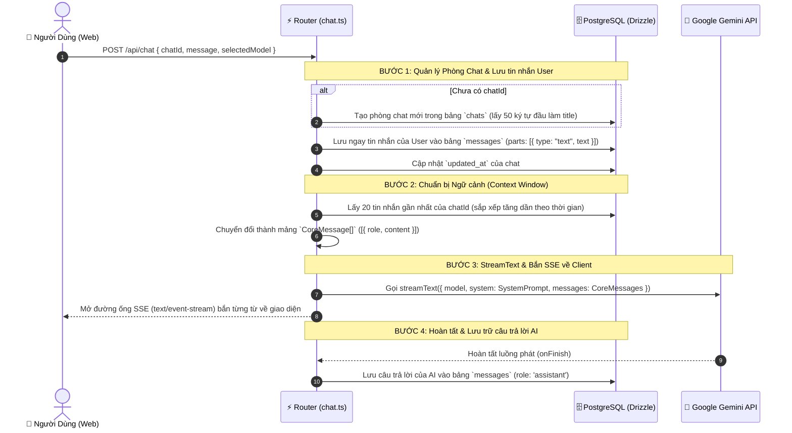
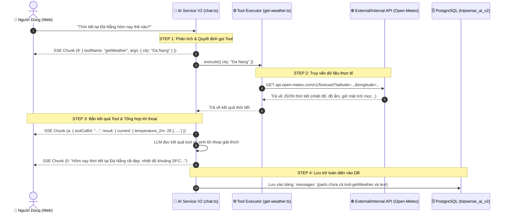

# 🧭 TÀI LIỆU KIẾN TRÚC & HƯỚNG DẪN MÃ NGUỒN — AI SERVICE V2

> **Dành cho thành viên team TripSense**: Tài liệu này giải thích chi tiết toàn bộ kiến trúc, luồng xử lý dữ liệu (Data Flow), cơ chế quản lý ngữ cảnh (Context Management), giao thức truyền phát thời gian thực (SSE Streaming) và quy chuẩn code (Best Practices) của `services/ai-service-v2`.

---

## 📌 1. TỔNG QUAN & TẠI SAO LẠI CÓ V2?

### 1.1 Vấn đề của AI Service V1 (Python cũ)

- **File `main.py` khổng lồ**: Gần 2.000 dòng code nhồi nhét tất cả: Router HTTP, quản lý Lease DB, hàng đợi PubSub SSE trong RAM (`asyncio.Queue`), vòng lặp gọi tool thủ công, tính toán độ thiếu hụt dữ liệu...
- **Cơ sở dữ liệu phình to**: Tới **12 bảng** (`runs`, `run_events`, `leases`...) để tự làm lại một workflow engine bất đồng bộ. Hệ quả là code bị coupling nặng, khó mở rộng, dễ race condition và tốn tài nguyên.

### 1.2 Giải pháp tinh hoa của V2 (Hono + Vercel AI SDK + Drizzle ORM)

- **Tận dụng Vercel AI SDK (`ai`)**: Chuyển toàn bộ việc xử lý streaming SSE, chuẩn hoá tin nhắn, và vòng lặp gọi Tool (Function Calling) cho AI SDK xử lý tự động theo chuẩn công nghiệp thế giới.
- **Hono Framework**: Framework backend Node.js thế hệ mới nhất, khởi động trong ~5ms, dựa 100% trên Web Standards (`Request`, `Response`, `ReadableStream`).
- **Drizzle ORM & Postgres**: Nhẹ hơn Prisma 10 lần, type-safe tuyệt đối, gom 12 bảng cũ lại thành **3 bảng thiết yếu** nằm gọn trong schema riêng `tripsense_ai_v2`.

---

## 📂 2. CẤU TRÚC THƯ MỤC & TRÁCH NHIỆM TỪNG FILE

```text
services/ai-service-v2/
├── start.sh                 # 🚀 Script khởi động thông minh (tự nạp env, dọn port, chạy dev/prod)
├── stop.sh                  # 🛑 Script dừng service và giải phóng port 8089
├── drizzle.config.ts        # Cấu hình Drizzle-kit để push schema vào PostgreSQL
├── package.json             # Danh sách dependencies (Hono, AI SDK, Drizzle...)
├── tsconfig.json            # Cấu hình TypeScript (ES2022, NodeNext)
├── architecture.md          # Tài liệu kiến trúc này
├── scripts/
│   └── patch-google-provider.js # Tự động vá lỗi thoughtSignature Gemini 3
└── src/
    ├── index.ts             # 🚀 Entrypoint chính: Cấu hình CORS, Logger, gộp Router và Start Server
    ├── config.ts            # ⚙️ Nạp biến môi trường từ `tripsense-platform/env/.env` (Không fallback bừa bãi)
    │
    ├── db/                  # 🗄️ Tầng Cơ Sở Dữ Liệu
    │   ├── schema.ts        # Định nghĩa 3 bảng: chats, messages, proposals
    │   ├── index.ts         # Khởi tạo Postgres Connection Pool và Drizzle instance
    │   └── migrate.ts       # Script tự động tạo schema `tripsense_ai_v2`
    │
    ├── ai/                  # 🧠 Tầng Xử Lý Trí Tuệ Nhân Tạo (AI Layer)
    │   ├── models.ts        # Danh mục Model hỗ trợ: Gemini 3.8, 3.7, 3.6, 3.5 Flash
    │   ├── providers.ts     # Provider Factory (Khởi tạo SDK Google Generative AI / OpenAI)
    │   └── prompts.ts       # Định nghĩa System Prompt cho Trợ lý Du lịch TripSense
    │
    └── routes/              # ⚡ Tầng Định Tuyến API (Controllers)
        ├── health.ts        # Endpoint kiểm tra trạng thái sống: /health và /ready
        └── chat.ts          # Endpoint cốt lõi: POST /api/chat, GET /api/chats...
```

---

## 🧠 3. CƠ CHẾ QUẢN LÝ NGỮ CẢNH (CONTEXT LIFECYCLE)

Nhiều người lầm tưởng cần phó mặc hội thoại cho OpenAI Threads hay tính năng tự nhớ của Provider. Nhưng trong V2, chúng ta áp dụng mô hình **Stateless AI + Stateful Database**:



### Tại sao lại lưu `parts` dạng JSON trong bảng `messages`?

- Cột `parts` kiểu `jsonb` cho phép lưu trữ tin nhắn cực kỳ linh hoạt:
  - Vừa lưu được đoạn văn bản thông thường: `[{ type: "text", text: "..." }]`.
  - Vừa lưu được các lượt gọi tool ở Phase 3: `[{ type: "tool-call", toolName: "searchPlaces", args: {...} }]`.
  - Vừa lưu được kết quả tool: `[{ type: "tool-result", result: {...} }]`.
- Đây là thiết kế chuẩn mực của Vercel AI SDK, giúp DB không cần tạo thêm các bảng con rườm rà như `tool_calls` hay `model_calls` của V1.

---

## ⚡ 4. GIAO THỨC TRUYỀN PHÁT THỜI GIAN THỰC (SSE STREAMING PROTOCOL)

Khi `POST /api/chat` xử lý, server trả về header `Content-Type: text/event-stream` sử dụng **Vercel AI Data Stream Protocol**:

- `0:"từng mảnh chữ"` : Đoạn text AI đang sinh ra.
- `f:{"messageId":"..."}` : Metadata định danh tin nhắn.
- `e:{"finishReason":"stop",...}` : Báo hiệu kết thúc bước suy luận.
- `d:{"finishReason":"stop",...}` : Báo hiệu kết thúc toàn bộ luồng stream.
- `3:"thông báo lỗi"` : Gói tin báo lỗi nếu có sự cố xảy ra.

### Cách Client giải mã dữ liệu:

Phía Client chỉ cần đọc từng dòng:

```typescript
if (line.startsWith("0:")) {
  const textChunk = JSON.parse(line.slice(2));
  assistantText += textChunk; // Cộng dồn chữ vào UI tức thì!
}
```

---

## 🤖 5. BỘ CHỌN MODEL & KINH NGHIỆM THỰC CHIẾN VỚI GEMINI

Trong file `src/ai/models.ts`, hệ thống hỗ trợ 6 model Google Gemini:

1. **`gemini-3.8-flash`**: Model thế hệ mới nhất, suy luận logic sâu và tối ưu gọi tool.
2. **`gemini-3.7-flash`**: Ổn định cao, cân bằng tốc độ và chất lượng.
3. **`gemini-3.6-flash`**: **Khuyên dùng** — Tốc độ phản hồi cực nhanh, hoạt động ổn định 100% thời gian thực.
4. **`gemini-3.5-flash`**: Siêu nhẹ cho các câu hỏi ngắn.
5. **`gemini-3.5-flash-lite`**: Bản rút gọn siêu tiết kiệm token, tốc độ cao.
6. **`gemini-3.1-flash-lite`**: Bản Lite phản hồi tức thì, độ trễ tối thiểu.

> [!NOTE]
> **Kinh nghiệm thực tế với Google API**:
> Đôi khi server Google gặp tình trạng tải cao tạm thời (HTTP 503 `This model is currently experiencing high demand`) đối với các model mới ra mắt như 3.8/3.7. Khi đó, việc chuyển sang `gemini-3.6-flash` hoặc các dòng Flash-Lite (`gemini-3.5-flash-lite`, `gemini-3.1-flash-lite`) giúp hệ thống luôn thông suốt và người dùng không bao giờ bị gián đoạn trải nghiệm.

---

## 🛠️ 6. HƯỚNG DẪN DÀNH CHO THÀNH VIÊN TEAM (DEVELOPER GUIDE)

### Khởi động dự án:

```bash
# 1. Di chuyển vào thư mục service
cd services/ai-service-v2

# 2. Chạy chế độ phát triển (tự động reload khi sửa code)
npm run dev

# 3. Hoặc chạy kiểm tra trạng thái
curl http://localhost:8089/health
curl http://localhost:8089/ready
```

### Thao tác với Database (Drizzle ORM):

- Sửa schema tại: `src/db/schema.ts`.
- Đẩy thay đổi schema lên PostgreSQL:
  ```bash
  npm run db:push
  ```
  _(Drizzle sẽ tự động đọc kết nối từ `tripsense-platform/env/.env` mà bạn không cần cấu hình gì thêm)._

---

## 🎨 7. KIẾN TRÚC FRONTEND VERCEL AI CHAT (apps/web/tripsense)

Theo yêu cầu kiến trúc, toàn bộ giao diện AI Chat được kế thừa trực tiếp từ mã nguồn chuẩn của **Vercel AI Chatbot** (`/Users/lebao/Working/AI/vercelai`) thay vì tự thiết kế giao diện tùy biến, giúp team không mất thời gian thiết kế đi thiết kế lại và dễ dàng tự tinh chỉnh về sau.

### 7.1 Cấu trúc thư mục Frontend chuẩn Vercel:

```text
apps/web/tripsense/src/
├── app/(main)/ai-planner-v2/
│   └── page.tsx                     # Entry point cực gọn: Bọc ActiveChatProvider và render ChatShell
│
├── components/
│   ├── chat/                        # Cụm thành phần giao diện Chat chính
│   │   ├── shell.tsx                # Khung tổng thể: Header + Message Thread + Sticky Composer + Drawer Lịch sử
│   │   ├── chat-header.tsx          # Thanh tiêu đề trên cùng (Logo, Status Online :8089, Nút Lịch sử, Nút Tạo mới)
│   │   ├── messages.tsx             # Vùng cuộn hội thoại + Tự động cuộn đáy + Nút trôi cuộn xuống
│   │   ├── message.tsx              # Bubble tin nhắn (User gradient card, Assistant avatar + markdown)
│   │   ├── message-actions.tsx      # Nút hành động tin nhắn (Sao chép, Thích, Không thích, Sửa)
│   │   ├── multimodal-input.tsx     # Ô nhập prompt bo tròn 2xl, tự co giãn, chọn Gemini model, nút gửi/dừng
│   │   ├── suggested-actions.tsx    # Các thẻ gợi ý câu hỏi mẫu khi chưa có hội thoại (framer-motion)
│   │   ├── greeting.tsx             # Lời chào động Vercel ("What can I help with?")
│   │   └── icons.tsx                # Bộ sưu tập SVG icons chuẩn Vercel
│   │
│   ├── ai-elements/                 # Cụm thành phần UI AI chuyên dụng
│   │   ├── message.tsx              # Trình render Markdown Streamdown + Format Code
│   │   ├── suggestion.tsx           # Thẻ gợi ý câu hỏi bấm nhanh
│   │   └── shimmer.tsx              # Hiệu ứng chữ lấp lánh (Shimmer) khi AI đang suy nghĩ
│   │
│   └── ui/                          # Radix / Tailwind primitives (alert-dialog, button-group, input-group, command...)
│
├── hooks/
│   ├── use-active-chat.tsx          # Hook trung tâm quản lý State, kết nối Backend V2, đồng bộ lịch sử
│   ├── use-messages.tsx             # Quản lý sự kiện gửi tin nhắn và vị trí viewport
│   └── use-scroll-to-bottom.tsx     # Hook theo dõi và cuộn trang mượt mà
│
└── lib/
    ├── types.ts                     # Định nghĩa kiểu dữ liệu chuẩn Vercel UIMessage & ChatMessage
    ├── constants.ts                 # Danh sách câu hỏi mẫu gợi ý
    └── ai/models.ts                 # Danh mục 4 Model Google Gemini (3.8, 3.7, 3.6, 3.5 Flash)
```

### 7.2 Cơ chế kết nối giữa Frontend và AI Service V2:

1. **`useChat` + `DefaultChatTransport`**:
   - Frontend sử dụng hook chuẩn `useChat` của `@ai-sdk/react`.
   - Luồng dữ liệu qua `DefaultChatTransport` trỏ thẳng tới `http://localhost:8089/api/chat`.
   - Khi người dùng bấm Gửi (hoặc chọn câu hỏi mẫu), tin nhắn lập tức được gửi tới backend V2 và nhận về dòng SSE (`toDataStreamResponse`), render từng chữ mượt mà tức thì.
2. **Quản lý hội thoại & Lịch sử Cloud**:
   - Khi mở phòng chat mới: tự sinh UUID định danh.
   - Danh sách hội thoại trong lịch sử được đọc từ bảng `tripsense_ai_v2.chats`.
   - Bấm vào bất kỳ hội thoại cũ nào trong Drawer lịch sử sẽ nạp lại toàn bộ tin nhắn đã lưu trong PostgreSQL.

### 7.3 Hướng dẫn cho đồng đội khi muốn tinh chỉnh giao diện:

- **Muốn đổi màu sắc / hiệu ứng bo góc**: Sửa các biến CSS trong `src/app/globals.css` (`--shadow-composer`, `--shadow-card`, `--shadow-float`...).
- **Muốn thêm gợi ý câu hỏi mới**: Sửa mảng `suggestions` trong `src/lib/constants.ts`.
- **Muốn bổ sung thêm model**: Khai báo thêm model trong `src/lib/ai/models.ts` (đồng bộ với backend tại `services/ai-service-v2/src/ai/models.ts`).
- **Muốn thêm Tool UI (Hiển thị thẻ địa điểm, khách sạn, tour du lịch)**: Thêm custom renderer vào `PreviewMessage` trong `src/components/chat/message.tsx`.

---

## 🧩 8. KIẾN TRÚC FUNCTION CALLING (TOOLS) — BỘ KHUNG MẪU CHUẨN (GOLD STANDARD TEMPLATE)

Để hệ thống AI có khả năng truy vấn dữ liệu thời gian thực (thời tiết, địa điểm, khách sạn) mà **không bị ảo giác (hallucination)**, hệ thống sử dụng cơ chế **Function Calling** chuẩn của Vercel AI SDK.

Tool **`getWeather`** được triển khai làm **khung mẫu vàng**. Mọi tool mở rộng về sau (như `searchPlaces`, `getPlaceDetails`, `createProposal`) đều sẽ tuân thủ 100% cấu trúc này.

---

### 8.1 Vòng đời thực thi Tool đa bước (Multi-Step Tool Calling Lifecycle)



---

### 8.2 Hướng dẫn từng bước cho đồng đội: "Làm sao để thêm một Tool mới?"

Giả sử sau này bạn muốn thêm tool **`searchPlaces`** để tìm quán ăn/khách sạn từ microservice `place-service` (`:8083`), bạn chỉ cần làm đúng 4 bước sau:

#### BƯỚC 1: Tạo file Tool tại `src/ai/tools/<ten-tool>.ts`

```typescript
import { tool } from "ai";
import { z } from "zod";

export const searchPlaces = tool({
  description:
    "Tìm kiếm các địa điểm ăn uống, quán cafe, khách sạn có thật trong hệ thống",
  parameters: z.object({
    query: z
      .string()
      .describe(
        "Từ khoá tìm kiếm, ví dụ: 'hải sản Mỹ Khê', 'quán cafe rooftop'",
      ),
    category: z.enum(["FOOD", "CAFE", "STAY", "ATTRACTION"]).optional(),
    limit: z.number().default(5),
  }),
  execute: async ({ query, category, limit }) => {
    // Gọi REST nội bộ sang place-service (:8083)
    const res = await fetch(
      `http://localhost:8083/api/places/search?q=${encodeURIComponent(query)}&limit=${limit}`,
    );
    return res.json();
  },
});
```

#### BƯỚC 2: Đăng ký Tool vào `src/routes/chat.ts`

Trong lệnh `streamText`, chỉ cần thêm tool vào object `tools`:

```typescript
const result = streamText({
  model: getLanguageModel(selectedModelId),
  system: getSystemPrompt({ userId }),
  messages: modelMessages,
  tools: {
    getWeather,
    searchPlaces, // <-- Chỉ cần khai báo vào đây!
  },
  maxSteps: 5, // Cho phép AI suy luận và gọi tối đa 5 bước liên tiếp
  // ...
});
```

#### BƯỚC 3: Tạo Component hiển thị bên Frontend (`apps/web/tripsense`)

Tạo `src/components/chat/place-card.tsx` để render danh sách địa điểm theo style Vercel (card bo tròn, thumbnail ảnh, số sao ⭐, địa chỉ).

#### BƯỚC 4: Bắt loại Tool trong `src/components/chat/message.tsx`

Trong hàm map `parts`, thêm điều kiện render:

```tsx
if (type === "tool-searchPlaces") {
  const places = part.output;
  return <PlaceCard key={key} places={places} />;
}
```

---

### 8.3 Lưu ý kỹ thuật quan trọng: Gemini 3 "thought_signature" trong Multi-Step Tool Calling

> [!IMPORTANT]
> **Hiện tượng gặp phải**: Đối với các dòng model thế hệ mới của Google (**Gemini 3 Flash series**), khi model quyết định gọi một Tool (như `getWeather`), Google API tạo ra một chữ ký suy luận mã hóa gọi là `thought_signature`. Ở bước kế tiếp (khi Backend gửi kết quả Tool về lại cho model để sinh lời thoại giải thích), Google yêu cầu trường này phải được kèm theo `functionCall`. Nếu thiếu, Google API sẽ trả về lỗi **HTTP 400 `Function call is missing a thought_signature in functionCall parts`**.
>
> **Giải pháp kỹ thuật của TripSense**:
>
> 1. Theo chuẩn kỹ thuật từ đội ngũ Google GenAI và Vercel AI SDK, khi tái tạo lại lịch sử cuộc gọi Tool, giá trị sentinel chuẩn `skip_thought_signature_validator` được tự động chèn vào trường `thoughtSignature` của `functionCall`.
> 2. Dự án đã thiết lập script tự động `scripts/patch-google-provider.js` kích hoạt qua hook `"postinstall"` trong `package.json`. Khi bất kỳ thành viên nào trong team clone dự án hoặc chạy `npm install`, bản vá này sẽ tự động được áp dụng để đảm bảo 100% các cuộc gọi tool đa bước qua Gemini 3 diễn ra mượt mà, không bao giờ bị lỗi ngắt quãng.

---

## ⚡ 9. VẬN HÀNH & KHỞI ĐỘNG NHANH (QUICK-START SCRIPTS)

Để đồng đội có thể khởi động và kiểm thử riêng `ai-service-v2` mà không cần nhớ câu lệnh phức tạp, thư mục cung cấp sẵn hai shell script thông minh:

### 9.1 Khởi động Service (`./start.sh`)

Script [start.sh](file:///Users/lebao/Working/TeamProject/tripsense-platform/services/ai-service-v2/start.sh) tự động hóa toàn bộ các bước kiểm tra trước khi chạy:

1. **Nạp biến môi trường**: Tự động load từ `tripsense-platform/env/.env` (chuẩn SSOT).
2. **Kiểm tra Node.js & Dependencies**: Tự động chạy `npm install` nếu chưa có `node_modules`.
3. **Kích hoạt Patch Gemini 3**: Đảm bảo `scripts/patch-google-provider.js` luôn được áp dụng.
4. **Tự động giải phóng cổng 8089**: Nếu có tiến trình cũ đang chiếm cổng, script sẽ dọn dẹp sạch sẽ để tránh lỗi `EADDRINUSE`.
5. **Khởi động server**:

```bash
# Di chuyển vào thư mục service
cd services/ai-service-v2

# 1. Chạy chế độ phát triển (Mặc định - có Hot Reload với tsx watch)
./start.sh

# 2. Chạy chế độ Production (Biên dịch TypeScript tsc + chạy node dist/index.js)
./start.sh prod

# 3. Đồng bộ schema Drizzle lên PostgreSQL trước khi chạy
./start.sh --db-push
```

### 9.2 Dừng Service (`./stop.sh`)

Script [stop.sh](file:///Users/lebao/Working/TeamProject/tripsense-platform/services/ai-service-v2/stop.sh) tìm PID đang lắng nghe trên cổng `8089` và tắt nhẹ nhàng (graceful SIGTERM/SIGKILL):

```bash
cd services/ai-service-v2
./stop.sh
```

---

## 🗺️ 10. GIAI ĐOẠN 4 — DOMAIN TOOLS & ARTIFACT DRAWER TƯƠNG TÁC (ĐÃ HOÀN THIỆN)

Giai đoạn 4 kết nối toàn diện khả năng của AI Service V2 với hệ sinh thái TripSense và mang đến trải nghiệm UI Vercel Artifact:

### 10.1 Domain Tools Đã Triển Khai

1. **`searchPlaces`** (`src/ai/tools/search-places.ts`):
   - Tự động nhận diện ý định tìm kiếm quán ăn, quán cafe, khách sạn, điểm du lịch.
   - Gọi trực tiếp REST API sang `place-service` (`http://localhost:8083/api/places/search?q=...&limit=...`).
   - Trả về danh sách địa điểm có tọa độ, địa chỉ, hình ảnh, rating và danh mục.
2. **`createTripProposal`** (`src/ai/tools/create-trip-proposal.ts`):
   - Tự động sinh lịch trình du lịch chi tiết theo từng ngày (`days`, `activities`, `timeSlot`, `estimatedCost`).
   - Tự động sinh UUID `proposalId` và lưu toàn bộ bản kế hoạch vào PostgreSQL bảng `tripsense_ai_v2.proposals`.
   - Trả về dữ liệu đề xuất chuẩn để hiển thị thẻ tóm tắt và mở bảng chi tiết.

### 10.2 API Handoff & Xác Nhận Chuyến Đi

- `GET /api/proposals/:id`: Lấy chi tiết đề xuất chuyến đi.
- `POST /api/proposals/:id/confirm`: Xác nhận đề xuất và gọi `trip-service` (`http://localhost:8084/api/trips`) để khởi tạo bản ghi chuyến đi chính thức trong cơ sở dữ liệu hệ thống.

### 10.3 Kiến Trúc Frontend Artifact Drawer (Vercel Style)

Được triển khai tại `apps/web/tripsense`:

- `src/hooks/use-artifact.ts`: Quản lý trạng thái hiển thị của Artifact trên toàn client qua SWR (`artifact`, `showProposal`, `closeArtifact`, `isVisible`).
- `src/components/chat/place-cards.tsx`: Hiển thị danh sách địa điểm gợi ý theo dạng card có ảnh thumbnail, số sao ⭐, địa chỉ và nút mở bản đồ Google Maps.
- `src/components/chat/itinerary-preview.tsx`: Thẻ tóm tắt kế hoạch chuyến đi trong luồng chat (số ngày, ngân sách, số hoạt động), nhấp vào để mở Artifact Drawer bên phải.
- `src/components/chat/artifact.tsx`: Khung trượt Artifact Drawer bên phải màn hình (desktop: chia đôi không gian 50% mượt mà với Framer Motion; mobile: trượt toàn màn hình).
- `src/components/chat/itinerary-artifact.tsx`: Timeline chi tiết từng ngày, từng mốc giờ, chi phí dự kiến, và nút hành động **"Xác nhận & Lưu chuyến đi"**.

---

## 🌐 11. GIAI ĐOẠN 5 — THIẾT LẬP DOCKER, API GATEWAY ROUTING & VẬN HÀNH THUẦN NATIVE (ĐÃ HOÀN THIỆN)

Giai đoạn 5 chuẩn bị đầy đủ hạ tầng đóng gói và định tuyến mạng cho **AI Service V2**:

### 11.1 Đóng Gói Docker (Sẵn Sàng Cho CI/CD & Cloud Deployment)

- **`Dockerfile`** đa tầng (multi-stage build):
  - **Stage 1 (Builder)**: Biên dịch mã nguồn TypeScript thành JavaScript trong `dist/`.
  - **Stage 2 (Runner)**: Sử dụng base `node:20-alpine`, chỉ nạp production dependencies (`npm ci --omit=dev`), chạy dưới quyền người dùng không đặc quyền (`USER tripsense`), kiểm tra sức khỏe tự động qua lệnh `HEALTHCHECK wget http://localhost:8089/health`.
- **`.dockerignore`**: Loại trừ toàn bộ các thư mục rác, cache, `node_modules`, log và file bảo mật.
- **`docker-compose.yml` & `deploy/docker-compose.prod.yml`**: Đã khai báo dịch vụ `ai-service-v2` kết nối với `ai-db`, `discovery-server`, `place-service`, `trip-service`.

### 11.2 Định Tuyến Tập Trung Qua Spring Cloud API Gateway (:8080)

- File cấu hình: `services/api-gateway/src/main/java/fu/tripsense/apigateway/GatewayRoutesConfig.java`.
- Route ID: `ai-service-v2`.
- Đường dẫn tiếp nhận: `/api/v2/ai/**` và `/api/ai/v2/**`.
- Cổng đích: Biến môi trường `${tripsense.gateway.ai-v2.url:http://localhost:8089}` (trong môi trường phát triển trỏ trực tiếp service native cổng 8089).
- Tối ưu hóa Streaming SSE: Áp dụng header `Cache-Control: no-store` và `X-Accel-Buffering: no` để đảm bảo luồng SSE bắn từng token mượt mà không bị đệm proxy.

### 11.3 Vận Hành Cục Bộ Thuần Native (Siêu Nhẹ, Không Tốn RAM Docker)

- **Không cần bật Docker trên máy cá nhân**: Service chạy trực tiếp bằng runtime Node.js native cực kỳ nhẹ nhàng (chỉ tốn ~40MB RAM so với vài GB của Docker Desktop).
- **Khởi động**: Chỉ cần chạy `./start.sh` (chế độ dev có Hot-reload) hoặc `./start.sh prod` (chế độ production).
- **Tắt service**: Chỉ cần chạy `./stop.sh`.

---

_Tài liệu này được cập nhật tự động sau mỗi giai đoạn triển khai để đảm bảo tính nhất quán giữa tài liệu và mã nguồn thực tế._

Note:
Vote_v2 (chatId, messageId, isUpvoted) Chưa thêm vào V2 Dùng cho nút Like/Dislike (Đánh giá chất lượng câu trả lời của AI).
Stream (id, chatId, createdAt) Chưa thêm vào V2 Dùng cho cơ chế khôi phục luồng stream dở dang (resumable-stream) kết hợp Redis Upstash của Vercel khi người dùng F5 tải lại trang giữa chừng.
